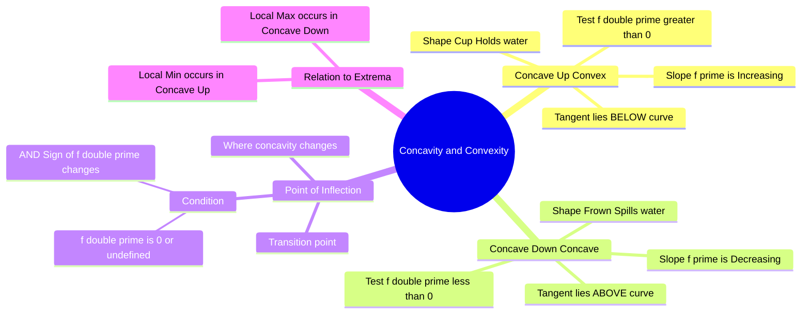

---
tags:
  - mathematics
  - calculus
  - differential-calculus
  - optimization
  - gate
aliases:
  - Concave Up
  - Concave Down
  - Convex Function
  - Point of Inflection
subject: "[[Mathematics]]"
parent:
  - Differential Calculs
confidence: 10
---
###### Mind Map

---
### Concavity and Convexity
#calculus/concavity #optimization

> **Concavity** describes the curvature of a function's graph—whether it bends upwards or downwards. This property is determined by the rate of change of the slope (the second derivative). In optimization, identifying the concavity is crucial for determining whether a stationary point is a maximum or a minimum.

#### Concave Up (Convex Function)
#concavity/convex

A function $f(x)$ is **Concave Up** (or simply **Convex**) on an interval if the graph lies *above* any of its tangent lines on that interval.

*   **Visual:** Shaped like a "Cup" ($\cup$). It can "hold water".
*   **Behavior:** As $x$ increases, the slope $f'(x)$ is **increasing** (getting less negative or more positive).
*   **Second Derivative Test:**
    $$\boxed{\quad f''(x) > 0 \quad}$$
*   **Geometric Definition:** The line segment (chord) connecting any two points on the graph lies **above** the graph.

---
#### Concave Down (Concave Function)
#concavity/concave

A function $f(x)$ is **Concave Down** (or simply **Concave**) on an interval if the graph lies *below* any of its tangent lines.

*   **Visual:** Shaped like a "Frown" or an "Umbrella" ($\cap$). It "spills water".
*   **Behavior:** As $x$ increases, the slope $f'(x)$ is **decreasing** (getting less positive or more negative).
*   **Second Derivative Test:**
    $$\boxed{\quad f''(x) < 0 \quad}$$
*   **Geometric Definition:** The line segment (chord) connecting any two points on the graph lies **below** the graph.

---
#### Point of Inflection
#concavity/inflection-point

A **Point of Inflection** is a point on the curve where the concavity changes (from Up to Down, or Down to Up).

**Conditions for Inflection Point at $x = c$:**
1.  **Necessary Condition:**
    $$f''(c) = 0 \quad \text{OR} \quad f''(c) \text{ is undefined}$$
2.  **Sufficient Condition (The Sign Check):**
    The sign of $f''(x)$ must **change** as $x$ passes through $c$.
    *   Change from $(+) \to (-)$ or $(-) \to (+)$.

> [!warning] GATE Trap
> $f''(c) = 0$ is NOT sufficient to guarantee an inflection point.
> * *Example:* $f(x) = x^4$.
> * $f'(x) = 4x^3$, $f''(x) = 12x^2$.
> * At $x=0$, $f''(0) = 0$. However, $12x^2$ is positive for both $x<0$ and $x>0$. No sign change.
> * Therefore, $x=0$ is **not** an inflection point (it is a local minimum).

---
#### Relationship with Maxima and Minima
#optimization

Concavity is the basis of the **Second Derivative Test** for local extrema.

| Stationary Point ($f'(c)=0$) | Concavity ($f''(c)$) | Nature of Point |
| :--- | :--- | :--- |
| Tangent is Horizontal | **Positive ($>0$)** | **Local Minimum** (Bottom of a Convex shape) |
| Tangent is Horizontal | **Negative ($<0$)** | **Local Maximum** (Top of a Concave shape) |
| Tangent is Horizontal | **Zero ($=0$)** | **Test Fails** (Check higher derivatives or sign of $f'$) |

---
#### Example

**Function:** $f(x) = x^3 - 3x^2$.
1.  **Derivatives:**
    *   $f'(x) = 3x^2 - 6x$
    *   $f''(x) = 6x - 6$
2.  **Concavity:**
    *   Set $f''(x) = 0 \implies 6x - 6 = 0 \implies x = 1$.
    *   For $x < 1$: $f''(x)$ is Negative $\implies$ **Concave Down**.
    *   For $x > 1$: $f''(x)$ is Positive $\implies$ **Concave Up**.
3.  **Inflection Point:**
    *   Since sign changes at $x=1$, $(1, -2)$ is a Point of Inflection.

---
### Related Concepts
#topic/related-concepts

> [[Maxima and Minima (Single Variable)]] (Direct application of concavity)

[[Monotonicity]] (Relates to the first derivative $f'$)
[[Differentiation]]
[[Hessian Matrix]] (Generalization of concavity to multivariable functions)
[[Taylor Series]] (Concavity is determined by the 2nd order term)
