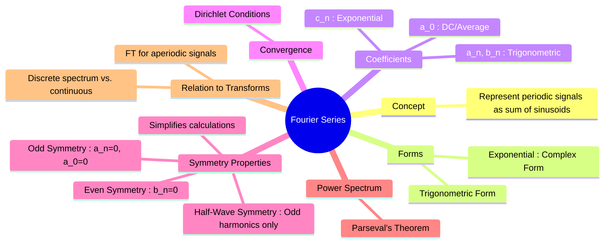

---
tags:
  - mathematics
  - signal-processing
  - periodic-signals
  - fourier-analysis
aliases:
  - Fourier Series
  - Parseval's Theorem
  - Parseval's Theorem for Power
  - Power Spectrum
  - Symmetry Properties of Fourier Series
  - "Video : Fourier Series ⭐ (3Blue1Brown)"
  - "Video : Euler's Formula 🌟 (3Blue1Brown)"
created: 2025-09-12
subject: "[[Mathematics]]"
parent: Calculus
confidence: 9
youtube:
  - r6sGWTCMz2k
  - -j8PzkZ70Lg
formula:
  - "Trigonometric Fourier Series : $$f(t) = a_0 + \\sum_{n=1}^{\\infty} [a_n \\cos(n\\omega_0 t) + b_n \\sin(n\\omega_0 t)]$$"
  - "Exponential (Complex) Fourier Series : $$f(t) = \\sum_{n=-\\infty}^{\\infty} c_n e^{jn\\omega_0 t}$$"
  - "Exponential (Complex) Fourier Coefficient : $$c_n = \\frac{1}{T} \\int_{T} f(t) e^{-jn\\omega_0 t} dt$$"
  - "Parseval's Theorem for Power : $$P_{avg} = \\frac{1}{T} \\int_T |f(t)|^2 dt$$"
  - "Trigonometric form Parseval's Theorem for Power : $$P_{avg} = a_0^2 + \\frac{1}{2} \\sum_{n=1}^{\\infty} (a_n^2 + b_n^2)$$"
  - "Exponential form Parseval's Theorem for Power : $$P_{avg} = \\sum_{n=-\\infty}^{\\infty} |c_n|^2$$"
  - "DC Component (Trigonometric Fourier Series) : $$a_0 = \\frac{1}{T} \\int_{T} f(t) dt$$"
  - "Cosine Coefficients (Trigonometric Fourier Series) : $$a_n = \\frac{2}{T} \\int_{T} f(t) \\cos(n\\omega_0 t) dt \\quad (n \\ge 1)$$"
  - "Sine Coefficients (Trigonometric Fourier Series) : $$b_n = \\frac{2}{T} \\int_{T} f(t) \\sin(n\\omega_0 t) dt \\quad (n \\ge 1)$$"
---
### Fourier Series
#fourier-series #periodic-signals

> The **Fourier Series** is a mathematical tool that ==decomposes any periodic function or signal into the sum of a (possibly infinite) set of simple oscillating functions, namely sines and cosines (or complex exponentials)==. It expresses a periodic signal in the frequency domain as a series of harmonic components.

> [!memory]
> ==For a periodic signal $f(t)$ with period $T$, the fundamental angular frequency is $\omega_0 = 2\pi/T$.==

---
#### Trigonometric Fourier Series
#fourier-series/trigonometric

This is the most common representation, expressed as a sum of a DC component, cosine terms, and sine terms.
$$\boxed{\quad f(t) = a_0 + \sum_{n=1}^{\infty} [a_n \cos(n\omega_0 t) + b_n \sin(n\omega_0 t)] \quad}$$
The coefficients are calculated by the Euler formulas:
*   **DC Component ($a_0$)**: The average value of the function over one period.
    $$\boxed{\quad a_0 = \frac{1}{T} \int_{T} f(t) dt \quad}$$
*   **Cosine Coefficients ($a_n$)**:
    $$\boxed{\quad a_n = \frac{2}{T} \int_{T} f(t) \cos(n\omega_0 t) dt \quad (n \ge 1) \quad}$$
*   **Sine Coefficients ($b_n$)**:
    $$\boxed{\quad b_n = \frac{2}{T} \int_{T} f(t) \sin(n\omega_0 t) dt \quad (n \ge 1) \quad}$$
The term for $n=1$ is the **fundamental**, and terms for $n > 1$ are the **harmonics**.

> [!warning]- Orthogonality ==Important==
> > [!definition]
> > [[Orthogonality]]
> 
> ##### 1. Orthogonality of DC term with cosine terms
> $$\int_0^T 1 \cdot \cos(n\omega t)\, dt \implies\int_0^T \cos(n\omega t)\,dt= \left[\frac{\sin(n\omega t)}{n\omega}\right]_0^T$$
> $$\sin(n\omega T) = \sin(n\cdot 2\pi)=0,\quad \sin(0)=0$$
> $$\boxed{\quad \int_0^T 1\cdot \cos(n\omega t)\,dt=0\quad}$$
> So **DC is orthogonal to every cosine term** : $1 \perp \cos(n\omega t)$.
> 
> ---
> ##### 2. Orthogonality between different cosine harmonics
> > Use the [[Trigonometric Identities#^451d6e|identity]] $\cos A \cos B = \frac{1}{2}[\cos(A-B) + \cos(A+B)]$
> 
> $$\int_0^T \cos(m\omega t)\cos(n\omega t)\,dt=\frac12\int_0^T \cos((m-n)\omega t)\,dt+\frac12\int_0^T \cos((m+n)\omega t)\,dt$$
> 
> *Both integrals become zero because each results in a sine term evaluated over a full period.*
> Thus $$\cos(m\omega t)\perp \cos(n\omega t)\quad (m\neq n)$$

---
#### Exponential (Complex) Fourier Series
#fourier-series/exponential

Using Euler's identity ($e^{j\theta} = \cos\theta + j\sin\theta$), the series can be written in a more compact form.
$$\boxed{\quad f(t) = \sum_{n=-\infty}^{\infty} c_n e^{jn\omega_0 t} \quad}$$
The complex Fourier coefficient $c_n$ is calculated as:
$$\boxed{\quad c_n = \frac{1}{T} \int_{T} f(t) e^{-jn\omega_0 t} dt \quad}$$
The relationship between the coefficients is:
$c_0 = a_0$
$c_n = \frac{1}{2}(a_n - jb_n)$ for $n>0$
$c_{-n} = c_n^* = \frac{1}{2}(a_n + jb_n)$ for $n>0$

---
#### Dirichlet Conditions for Convergence
#dirichlet-conditions

For the Fourier series to converge, the periodic function $f(t)$ must satisfy the following conditions over any period:
1.  **Absolutely Integrable**: $\int_T |f(t)| dt < \infty$.
2.  **Finite Minima/Maxima**: The function must have a finite number of maxima and minima (bounded variation).
3.  **Finite Discontinuities**: The function must have a finite number of finite discontinuities.
At a point of discontinuity, the series converges to the average of the left-hand and right-hand limits.

---
#### Symmetry Properties (Important for GATE)
#fourier-series/symmetry

Using symmetry can significantly simplify the calculation of coefficients.
1.  **Even Symmetry ($f(t) = f(-t)$)**: The function is symmetric about the vertical axis.
    *   $\boxed{b_n = 0}$ for all $n$.
    *   The series contains only DC and cosine terms.
2.  **Odd Symmetry ($f(t) = -f(-t)$)**: The function is anti-symmetric about the vertical axis.
    *   $\boxed{a_0 = 0, a_n = 0}$ for all $n$.
    *   The series contains only sine terms.
3.  **Half-Wave Symmetry ($f(t) = -f(t \pm T/2)$)**: The shape of the negative half-cycle is the inverted shape of the positive half-cycle.
    *   $\boxed{a_0 = 0}$.
    *   The series contains **only odd harmonics** (n = 1, 3, 5, ...). Both $a_n$ and $b_n$ are zero for all even values of $n$.

---
#### Parseval's Theorem for Power
#parsevals-theorem

Parseval's theorem relates the average power of a periodic signal to the sum of the powers of its harmonic components. The average power of a signal $f(t)$ across a 1$\Omega$ resistor is:
$$P_{avg} = \frac{1}{T} \int_T |f(t)|^2 dt$$
In terms of Fourier coefficients:
*   **Trigonometric form**:
    $$\boxed{\quad P_{avg} = a_0^2 + \frac{1}{2} \sum_{n=1}^{\infty} (a_n^2 + b_n^2) \quad}$$
*   **Exponential form**:
    $$\boxed{\quad P_{avg} = \sum_{n=-\infty}^{\infty} |c_n|^2 \quad}$$
The plot of $|c_n|^2$ vs. $n\omega_0$ is called the **power spectrum** of the signal.

---
### Related Concepts
#related-concepts

> [[Fourier Transforms]] (For aperiodic signals, resulting in a continuous spectrum)
> [[Signals & Systems]] (The primary application domain)
> [[Harmonic Analysis|Harmonics]] (The individual frequency components in power systems)

[[The Laplace Transform]]
[[Power Quality]]
