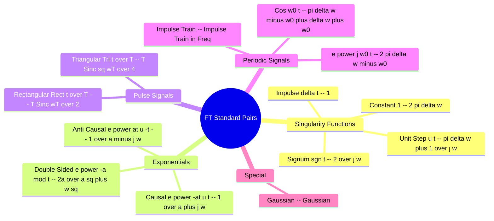

---
tags:
  - signals-and-systems
  - fourier-transform
  - formulas
  - gate
  - cheat-sheet
aliases:
  - FT Pairs
  - Fourier Transform Table
  - Rect and Sinc Pairs
  - Fourier Transform Pairs
subject:
  - "[[Signals & Systems]]"
  - "[[Mathematics]]"
parent: "[[Fourier Transforms]]"
confidence: 10
---
###### Mind Map

---
### Fourier Transform Standard Pairs Table
#fourier-transform/formulas

> This table summarizes the most critical [[Fourier Transforms|Fourier Transform]] pairs required for GATE. Mastery of these pairs, combined with the **Properties of Fourier Transforms**, allows for the solution of almost any signal analysis problem without performing integration.

**Notation:**
*   $\omega$: Angular frequency (rad/s).
*   $\text{Sa}(\lambda) = \frac{\sin \lambda}{\lambda}$: Sampling function (Unnormalized Sinc).
*   $\delta(t)$: Dirac Delta Impulse.

#### 1. Basic Singularity and Elementary Signals
#fourier-transform/singularity

| Signal $x(t)$ | Fourier Transform $X(\omega)$ | Condition |
| :--- | :--- | :--- |
| $\delta(t)$ (Impulse) | $\boxed{1}$ | All $\omega$ |
| $\delta(t - t_0)$ | $e^{-j\omega t_0}$ | Time Shift |
| $1$ (DC Constant) | $\boxed{2\pi \delta(\omega)}$ | Energy concentrated at $\omega=0$ |
| $\text{sgn}(t)$ (Signum) | $\frac{2}{j\omega}$ | Odd Function |
| $u(t)$ (Unit Step) | $\boxed{\pi \delta(\omega) + \frac{1}{j\omega}}$ | Includes DC + AC parts |

---
#### 2. Exponential Signals
#fourier-transform/exponential

| Signal $x(t)$ | Fourier Transform $X(\omega)$ | Note |
| :--- | :--- | :--- |
| $e^{-at} u(t)$ | $\boxed{\frac{1}{a + j\omega}}$ | Causal, Stable if $a>0$ |
| $e^{at} u(-t)$ | $\frac{1}{a - j\omega}$ | Anti-Causal |
| $e^{-a\|t\|}$ (Two-sided) | $\boxed{\frac{2a}{a^2 + \omega^2}}$ | Real & Even (Lorentzian) |
| $t e^{-at} u(t)$ | $\frac{1}{(a + j\omega)^2}$ | Differentiation in Freq |
| $\frac{t^{n-1}}{(n-1)!} e^{-at} u(t)$ | $\frac{1}{(a + j\omega)^n}$ | General Order |

> [!pyq]- PYQ : 2018
> ![[ee_2018#^q40]]

---
#### 3. Gate and Pulse Signals (Crucial for Duality)
#fourier-transform/pulses

##### A. Rectangular Pulse

> $\text{rect}$ or $\Pi$

Let $x(t)$ be a rectangular pulse of width $T$ (from $-T/2$ to $T/2$) and height $1$.
$$x(t) = \text{rect}(t/T)$$
$$\boxed{\quad \text{rect}(t/T) \longleftrightarrow T \cdot \text{Sa}\left(\frac{\omega T}{2}\right) = T \frac{\sin(\omega T/2)}{\omega T/2} \quad}$$
* **Key Concept:** Rectangular in Time $\iff$ Sinc in Frequency.

##### B. Triangular Pulse

> $\Lambda$

Let $x(t)$ be a triangular pulse of total width $2T$ (from $-T$ to $T$) and peak height $1$. This is the convolution of two rects of width $T$.
$$x(t) = \Delta(t/T) = \text{rect}(t/T) * \text{rect}(t/T) \text{ (scaled)}$$
$$\boxed{\quad \Delta(t/T) \longleftrightarrow T \cdot \text{Sa}^2\left(\frac{\omega T}{2}\right) \quad}$$
* **Key Concept:** Triangular in Time $\iff$ Sinc-Squared in Frequency.

##### C. Sinc Pulse (Duality Application)

If $x(t) = \frac{W}{\pi} \text{Sa}(Wt) = \frac{\sin(Wt)}{\pi t}$:
$$X(\omega) = \text{rect}\left(\frac{\omega}{2W}\right)$$
* **Key Concept:** Sinc in Time $\iff$ Rectangular in Frequency (Ideal Low Pass Filter).

---
#### 4. Periodic and Trigonometric Signals
#fourier-transform/periodic

Since periodic signals have infinite energy, their transforms contain Impulses.

| Signal $x(t)$ | Fourier Transform $X(\omega)$ |
| :--- | :--- |
| $e^{j\omega_0 t}$ | $2\pi \delta(\omega - \omega_0)$ |
| $\cos(\omega_0 t)$ | $\pi [\delta(\omega - \omega_0) + \delta(\omega + \omega_0)]$ |
| $\sin(\omega_0 t)$ | $\frac{\pi}{j} [\delta(\omega - \omega_0) - \delta(\omega + \omega_0)]$ |
| $\sum_{n=-\infty}^{\infty} \delta(t - nT_s)$ | $\omega_s \sum_{k=-\infty}^{\infty} \delta(\omega - k\omega_s)$ |
| *(Impulse Train)* | where $\omega_s = 2\pi/T_s$ |

---
#### 5. The Gaussian Pulse
#fourier-transform/gaussian

The Gaussian function is its own Fourier Transform (Self-Reciprocal).

If $x(t) = e^{-at^2}$ (where $a > 0$):
$$\boxed{\quad X(\omega) = \sqrt{\frac{\pi}{a}} e^{-\frac{\omega^2}{4a}} \quad}$$

* **Standard Form:** If $a = 1/2$, then $e^{-t^2/2} \longleftrightarrow \sqrt{2\pi} e^{-\omega^2/2}$.

---
### Related Concepts
#topic/related-concepts

> [[Fourier Transforms]] (Properties like Duality, Scaling, Shifting)
> [[Properties of the CTFT]]

[[Laplace Transform Standard Pairs Table]]
[[The Laplace Transform]] (Compare regions of convergence)
[[The Sampling Theorem (Nyquist-Shannon Theorem)]] (Uses the Impulse Train pair)
[[Distortionless Transmission]] (Uses Time Shift pair)
[[Properties of Continuous-Time Fourier Series|Parseval's Theorem for Fourier Series]] (Relates energy in time and freq for these pairs)
