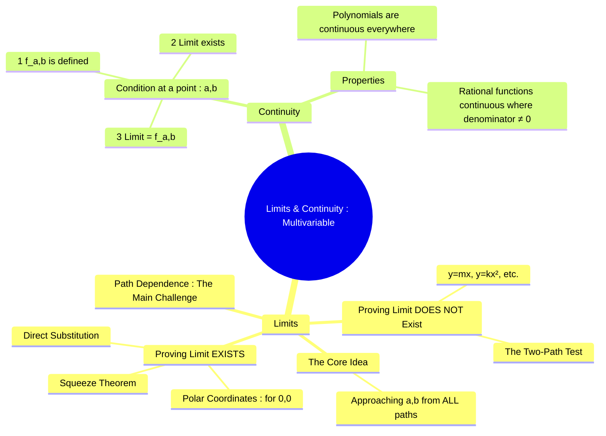

---
tags:
  - calculus
  - multivariable-calculus
  - limits
  - continuity
  - analysis
  - engineering-math
created: 2025-09-09
aliases:
  - Multivariable Limits
  - Multivariable Continuity
  - Limits of Functions of Several Variables
subject: "[[Mathematics]]"
parent:
  - Calculus
confidence: 9
---
###### Mind Map

---
### Limits and Continuity of Multivariable Functions
#multivariable-calculus #limits #continuity

> In multivariable calculus, the concepts of limit and continuity are more complex than their single-variable counterparts. In one dimension, we only need to check the approach from the left and right. In two or more dimensions, a point can be approached from **infinitely many paths** (lines, parabolas, spirals, etc.). This concept of **path dependence** is the crucial difference and the primary challenge in evaluating multivariable limits.

---
#### Limits of Multivariable Functions
#multivariable-limits #path-dependence

The limit of a function $f(x,y)$ as $(x,y)$ approaches a point $(a,b)$ is $L$, written as:
$$ \lim_{(x,y) \to (a,b)} f(x,y) = L $$
This means that $f(x,y)$ gets arbitrarily close to $L$ for all points $(x,y)$ sufficiently close to $(a,b)$, regardless of the path of approach.

**The Golden Rule**: For a limit to exist, the function must approach the same value along *every possible path*.

#### Strategy for Evaluating Limits
#two-path-test #polar-coordinates

##### Step 1: Try Direct Substitution

If the function is a polynomial, or a rational function where the denominator is not zero at the point, or a composition of other continuous functions, you can find the limit by simply substituting the coordinates. If you get a determinate value, that is the limit.

##### Step 2: If Indeterminate, Test for Non-Existence using the Two-Path Test

This is the most common technique for GATE problems. If you can find two different paths of approach that yield two different limit values, the limit does not exist.
$$\boxed{\quad \text{If the limit value depends on the path, the limit Does Not Exist.} \quad}$$
Common paths to test when approaching the origin $(0,0)$:
1.  **Along the x-axis**: Let $y=0$, then find $\lim_{x \to 0} f(x,0)$.
2.  **Along the y-axis**: Let $x=0$, then find $\lim_{y \to 0} f(0,y)$.
3.  **Along a line**: Let $y=mx$. Substitute this into the function and find the limit as $x \to 0$. If the resulting limit contains $m$, it depends on the path, so the limit does not exist.
4.  **Along a parabola**: Let $y=kx^2$ or $x=ky^2$. Substitute and find the limit.

**Step 3: To Prove a Limit Exists**
If several paths yield the same value, the limit may exist. To prove it:
*   **Polar Coordinates**: For limits approaching the origin $(0,0)$, substitute $x=r\cos\theta$ and $y=r\sin\theta$. Then evaluate the limit as $r \to 0^+$.
    *   If the resulting limit is a constant value **independent of $\theta$**, then the limit exists.
    *   If the result depends on $\theta$, the limit does not exist.
*   **Squeeze Theorem**: Find functions $g(x,y)$ and $h(x,y)$ such that $g(x,y) \le f(x,y) \le h(x,y)$ and $\lim g(x,y) = \lim h(x,y) = L$.

---
#### Continuity of Multivariable Functions
#multivariable-continuity

A function $f(x,y)$ is continuous at a point $(a,b)$ if its limit at that point is equal to the function's value at that point.

**Condition for Continuity at a Point $(a,b)$**:
A function $f(x,y)$ is continuous at $(a,b)$ if all three conditions are met:
$$\boxed{\begin{align}
1. \quad &f(a,b) \text{ must be defined.} \\
2. \quad &\lim_{(x,y) \to (a,b)} f(x,y) \text{ must exist.} \\
3. \quad &\lim_{(x,y) \to (a,b)} f(x,y) = f(a,b)
\end{align}}$$
In essence, a function is continuous if you can evaluate its limit by direct substitution. Polynomials in multiple variables are continuous everywhere. Rational functions are continuous everywhere in their domain (i.e., where the denominator is not zero).

---
### Related Concepts
#related-concepts

> [[Partial Derivatives]] (Continuity is a prerequisite for differentiability)

[[Limits, Continuity, and Differentiability]] (The single-variable foundation)
[[Double Integrals]] (Continuity over a region is generally required for integrability)
[[Vector Calculus]]
