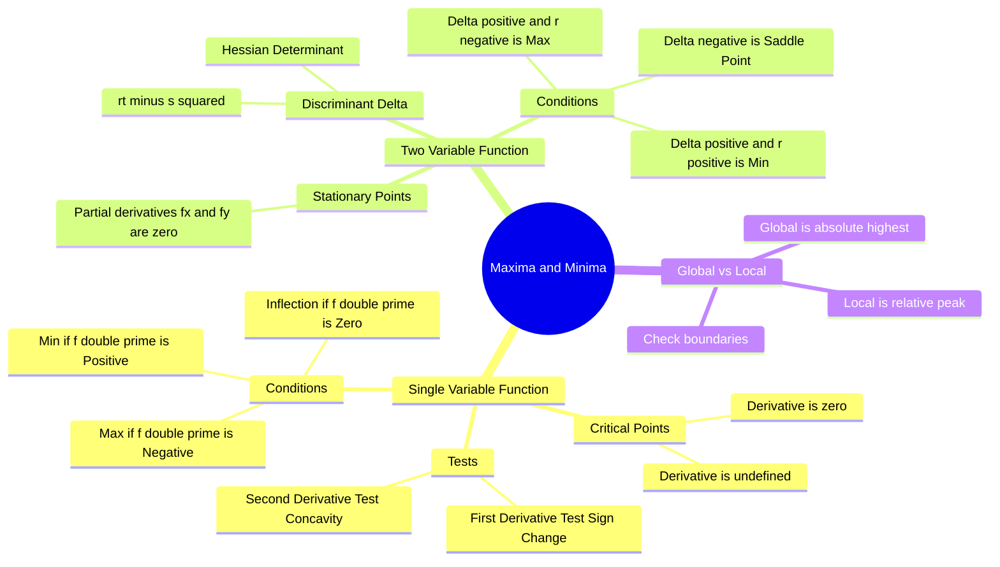

---
tags:
  - mathematics
  - calculus
  - optimization
  - gate
  - differential-calculus
aliases:
  - Optimization
  - Stationary Points
  - Saddle Points
  - Second Derivative Test
  - Functions of a Single Variable
subject: "[[Mathematics]]"
parent:
  - Differential Calculus
confidence: 10
---
###### Mind Map

---
### Maxima and Minima
#calculus/optimization #differential-calculus

> **Maxima and Minima** refer to the largest and smallest values of a function, respectively, either within a given range (local) or over the entire domain (global). Finding these points is the core of **Optimization** problems in engineering.

#### Functions of a Single Variable ($y = f(x)$)
#calculus/single-variable

To find the local maxima and minima of a function $y=f(x)$:

**Step 1: Find Stationary (Critical) Points**
Calculate the first derivative and set it to zero. The roots of this equation are the stationary points.
$$\boxed{\quad f'(x) = \frac{dy}{dx} = 0 \quad}$$

**Step 2: Second Derivative Test**
Calculate the second derivative $f''(x)$ and evaluate it at the stationary points found in Step 1.

1.  **Maxima:** The curve is concave down.
    $$\boxed{\quad f''(x) < 0 \quad}$$
2.  **Minima:** The curve is concave up.
    $$\boxed{\quad f''(x) > 0 \quad}$$
3.  **Test Fails:** If $f''(x) = 0$, the second derivative test is inconclusive. You must use the **[[Monotonicity|First Derivative Test]]** (checking the sign change of $f'(x)$ around the point) or higher-order derivatives.

**Point of Inflection:**
A point where the concavity of the function changes (e.g., from concave up to concave down).
Condition: $f''(x) = 0$ AND $f''(x)$ changes sign passing through the point. (Usually, the lowest order non-zero derivative is of odd order, e.g., $f'''(x) \neq 0$).

---

#### Functions of Two Variables ($z = f(x, y)$)
#calculus/multivariable

For a surface defined by $z = f(x, y)$, we use partial derivatives.

**Step 1: Find Stationary Points**
Solve the system of simultaneous equations:
$$\boxed{\quad p = \frac{\partial f}{\partial x} = 0 \quad \text{and} \quad q = \frac{\partial f}{\partial y} = 0 \quad}$$
Let $(a, b)$ be a stationary point.

**Step 2: Second Order Derivatives (Notation)**
Calculate the second-order partial derivatives at $(a, b)$:
$$r = \frac{\partial^2 f}{\partial x^2}, \qquad s = \frac{\partial^2 f}{\partial x \partial y}, \qquad t = \frac{\partial^2 f}{\partial y^2}$$

**Step 3: Discriminant Test (Hessian Determinant)**
Calculate $\Delta = rt - s^2$ (This is the determinant of the Hessian Matrix).

$$\begin{align}
\text{Condition} \quad & \quad \text{Conclusion} \\
\hline
\Delta > 0 \text{ and } r < 0 \quad & \implies \text{Local Maximum} \\
\Delta > 0 \text{ and } r > 0 \quad & \implies \text{Local Minimum} \\
\Delta < 0 \quad & \implies \text{Saddle Point} \\
\Delta = 0 \quad & \implies \text{Inconclusive (Further investigation needed)}
\end{align}$$

> [!warning] Saddle Point
> A point which is a minimum along one slice of the surface and a maximum along another slice (like a horse saddle or a mountain pass). It is not a local extremum.

---

#### Global (Absolute) Maxima and Minima
#calculus/global-extrema

To find the absolute maximum or minimum of $f(x)$ on a closed interval $[a, b]$:
1.  Find all local maxima and minima inside $(a, b)$ using derivatives.
2.  Evaluate the function $f(x)$ at the **endpoints** $x=a$ and $x=b$.
3.  Compare all values. The largest is the Global Max, the smallest is the Global Min.

---

### Related Concepts
#topic/related-concepts

> [[Lagrange Multipliers]] (For finding maxima/minima with constraints)

[[Monotonicity|First Derivative Test]]
[[Differentiation]]
[[Partial Derivatives|Partial Differentiation]]
[[Taylor Series]] (Basis for derivative tests)
[[Mean Value Theorems]]
[[Maxima and Minima of Multivariable Functions]]
[[Concavity and Convexity]]

