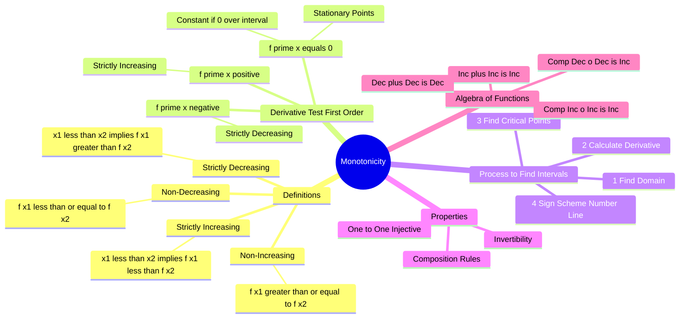

---
tags:
  - mathematics
  - calculus
  - differential-calculus
  - functions
  - gate
aliases:
  - Increasing and Decreasing Functions
  - Monotonic Functions
  - Strict Monotonicity
  - First Derivative Test
subject: "[[Mathematics]]"
parent: Differential Calculus
confidence: 10
---
###### Mind Map

---
### Monotonicity
#calculus/monotonicity #functions

> **Monotonicity** refers to the property of a function to maintain a consistent non-increasing or non-decreasing order throughout its domain or a specific interval. A monotonic function does not "oscillate" or turn back on itself; it either climbs, falls, or stays flat.

#### Definitions and Types
#monotonicity/definitions

Let $f(x)$ be defined on an interval $I$, and let $x_1, x_2 \in I$ such that $x_1 < x_2$.

1.  **Strictly Increasing:**
    The function value strictly rises as $x$ increases.
    $$x_1 < x_2 \implies f(x_1) < f(x_2)$$
    *Graph:* Moves upwards from left to right without flattening.

2.  **Strictly Decreasing:**
    The function value strictly falls as $x$ increases.
    $$x_1 < x_2 \implies f(x_1) > f(x_2)$$
    *Graph:* Moves downwards from left to right without flattening.

3.  **Monotonically Increasing (Non-Decreasing):**
    The function never decreases (it may rise or stay constant).
    $$x_1 < x_2 \implies f(x_1) \le f(x_2)$$

4.  **Monotonically Decreasing (Non-Increasing):**
    The function never increases (it may fall or stay constant).
    $$x_1 < x_2 \implies f(x_1) \ge f(x_2)$$

---
#### The First Derivative Test
#calculus/derivative-test

If $f(x)$ is differentiable on an interval $(a, b)$, monotonicity is determined by the sign of the first derivative $f'(x)$.

| Condition of $f'(x)$ | Behavior of $f(x)$ |
| :--- | :--- |
| **$f'(x) > 0$** for all $x \in (a, b)$ | **Strictly Increasing** |
| **$f'(x) < 0$** for all $x \in (a, b)$ | **Strictly Decreasing** |
| **$f'(x) \ge 0$** | **Non-Decreasing** (Increasing) |
| **$f'(x) \le 0$** | **Non-Increasing** (Decreasing) |
| **$f'(x) = 0$** for all $x \in (a, b)$ | **Constant Function** |

**Crucial Nuance for Strict Monotonicity:**

A function is **Strictly Increasing** even if $f'(x) = 0$ at **discrete points**, provided it does not stay zero over an interval.
* *Example:* $f(x) = x^3 \implies f'(x) = 3x^2$.
* $f'(0) = 0$, but $f'(x) > 0$ everywhere else.
* $x^3$ is Strictly Increasing on $\mathbb{R}$.

> [!pyq]- PYQ : 2018
> ![[ee_2018#^q43]]

---
#### Algorithm to Find Intervals of Monotonicity
#gate/problem-solving

To find the intervals where a function is increasing or decreasing:

1.  **Determine the Domain** of the function.
2.  **Differentiate:** Find $f'(x)$.
3.  **Find Critical Points:** Solve $f'(x) = 0$ and identify points where $f'(x)$ is undefined.
4.  **Plot on Number Line:** Mark these points on the real number line to divide the domain into disjoint open intervals.
5.  **Test Signs:** Pick a test point in each interval to determine the sign of $f'(x)$.
    *   (+) $\rightarrow$ Increasing $\nearrow$
    *   (-) $\rightarrow$ Decreasing $\searrow$

---
#### Properties and Algebra of Monotonic Functions
#functions/properties

1.  **Invertibility:**
    If a function is **Strictly Monotonic** on its entire domain, it is **One-to-One (Injective)** and therefore **Invertible**.
    *   (Note: The converse is not always true for discontinuous functions).

2.  **Arithmetic Operations:**
    Let $f$ and $g$ be increasing functions on an interval.
    *   $f(x) + g(x)$ is **Increasing**.
    *   $f(x) \cdot g(x)$ is **Increasing** (if $f, g > 0$).
    *   $-f(x)$ is **Decreasing**.
    *   $1/f(x)$ is **Decreasing** (if $f(x) \neq 0$ and doesn't change sign).

3.  **Composition of Functions ($h(x) = f(g(x))$):**
    The monotonicity of the composite function depends on the combination:

| $f(x)$ | $g(x)$ | Composition $f(g(x))$ |
| :--- | :--- | :--- |
| Increasing | Increasing | **Increasing** |
| Decreasing | Decreasing | **Increasing** |
| Increasing | Decreasing | **Decreasing** |
| Decreasing | Increasing | **Decreasing** |

> **Mnemonic:** Like signs result in Increasing; Unlike signs result in Decreasing. (Similar to multiplication of negative numbers).

---
#### GATE Special: Cubic Functions

For a cubic function $f(x) = ax^3 + bx^2 + cx + d$:
$f'(x) = 3ax^2 + 2bx + c$ (A Quadratic).

For $f(x)$ to be **Monotonic** (always increasing or always decreasing) on $\mathbb{R}$, the quadratic $f'(x)$ must not change sign. This requires the **Discriminant ($D$) of the derivative** to be non-positive.
$$\boxed{\quad D_{f'} \le 0 \implies (2b)^2 - 4(3a)(c) \le 0 \implies b^2 - 3ac \le 0 \quad}$$

---
### Related Concepts
#topic/related-concepts

> [[Maxima and Minima (Single Variable)]] (Critical points divide monotonic intervals)

[[Mean Value Theorems]] (Theoretical basis for the derivative test)
[[Critical Points]]
[[Invertible Functions]]
[[Concavity and Convexity]] ($f''$ relates to the rate of change of monotonicity)
[[Mean Value Theorems|Rolle's Theorem]]
