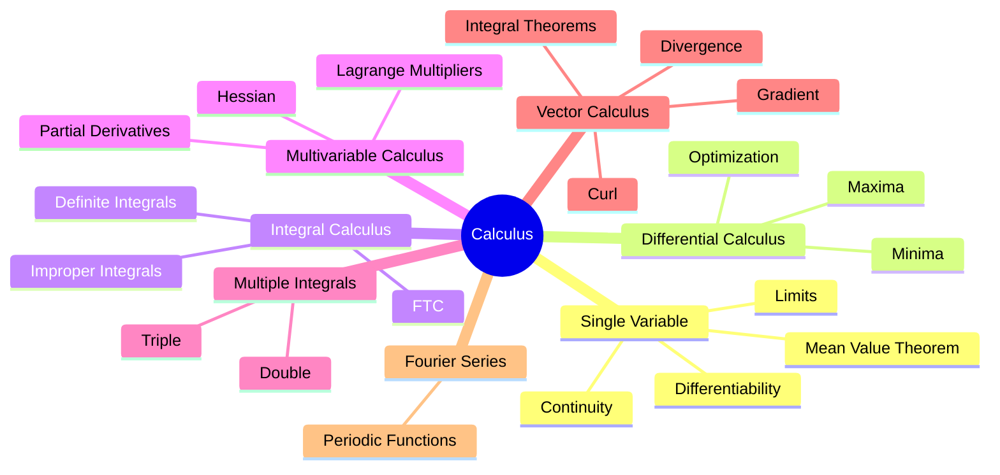

---
tags:
  - calculus
  - mathematics
  - gate
  - map-of-content
aliases:
  - Calculus MOC
created: 2026-07-13
subject:
  - "[[Mathematics]]"
parent: "[[Mathematics]]"
updated: 2026-07-13
---

### Calculus
#calculus #mathematics #gate #map-of-content

> ==**Calculus** is the mathematical study of **change, accumulation, approximation, and optimization**. It provides the language for describing continuous physical systems and forms the backbone of Differential Equations, Signals & Systems, Control Systems, Electromagnetics, and Machine Learning.==
>
> Every topic in Calculus ultimately answers four fundamental questions:
>
> - **How does a quantity change?**
> - **How much has it accumulated?**
> - **How do functions behave in higher dimensions?**
> - **How can continuous systems be modeled mathematically?**



---

#### 1. Single Variable Calculus

Calculus begins with understanding how a function behaves locally. Before differentiation or integration, we must establish whether a function is continuous and differentiable.

##### Fundamental Concepts

- [[Limits, Continuity, and Differentiability]]
- [[Intermediate Value Theorem]]
- [[Mean Value Theorems]]
- [[Indeterminate Forms (L'Hôpital's Rule)]]

---

#### 2. Differential Calculus

Differentiation measures the instantaneous rate of change of a function and provides powerful tools for optimization.

$$
\frac{dy}{dx}
$$

##### Topics

- [[Concavity and Convexity]]
- [[Monotonicity]]
- [[Maxima and Minima (Single Variable)]]

---

#### 3. Integral Calculus

Integration measures accumulation and provides the inverse operation of differentiation.

$$
\int_a^b f(x)\,dx
$$

##### Topics

- [[Fundamental Theorem of Calculus]]
- [[By-Parts Integration]]
- [[Definite and Improper Integrals]]
- [[Evaluation of Definite Integrals]]
- [[Evaluation of Improper Integrals]]
- [[Area in Polar Coordinates]]

---

#### 4. Multivariable Calculus

Engineering systems rarely depend on one variable. Multivariable Calculus extends differentiation and optimization into higher dimensions.

##### Topics

- [[Partial Derivatives]]
- [[Total Derivative]]
- [[Limits and Continuity of Multivariable Functions]]
- [[Hessian Matrix]]
- [[Maxima and Minima (Multivariable)]]
- [[Saddle Points]]
- [[Lagrange Multipliers]]
- [[Method of Lagrange Multipliers]]

---

#### 5. Multiple Integrals

Multiple Integrals generalize integration to two- and three-dimensional regions.

##### Topics

- [[Double Integrals]]
- [[Triple Integrals]]
- [[Applications of Multiple Integrals (Area, Volume)]]

---

#### 6. Vector Calculus

Vector Calculus studies scalar and vector fields and provides mathematical tools for electromagnetics, fluid mechanics, and control theory.

##### Vector Differential Operators

- [[Gradient]]
- [[Divergence]]
- [[Curl]]
- [[Vector Differential Operators]]

##### Vector Fields

- [[Vector Fields]]
- [[Vector Analysis and Coordinate Systems]]
- [[Directional Derivatives]]
- [[Equation of a Plane]]
- [[Normal Vector]]

##### Vector Integration

- [[Line Integrals]]
- [[Surface Integrals]]
- [[Volume Integrals]]

##### Fundamental Theorems

- [[Green's Theorem]]
- [[Stokes' Theorem]]
- [[Gauss's Divergence Theorem]]

##### Vector Identities

- [[Vector Identities]]

---

#### 7. Fourier Series

Fourier Series decomposes periodic functions into sums of sinusoids and forms the bridge between Calculus and Signals & Systems.

##### Topics

- [[Fourier Series]]
- [[Dirichlet's Conditions]]
- [[Euler's Formulae for Fourier Coefficients]]
- [[Fourier Series Representation of Periodic Functions]]

---

#### 8. Supplementary Topics

These notes extend the core syllabus and are frequently useful across engineering mathematics.

- [[Fourier Transforms]]
- [[Fourier Transform Standard Pairs Table]]
- [[Linearization]]

---

#### Learning Progression

```text
Limits
      ↓
Continuity
      ↓
Differentiability
      ↓
Mean Value Theorem
      ↓
Differentiation
      ↓
Optimization
      ↓
Integration
      ↓
Multiple Integrals
      ↓
Partial Derivatives
      ↓
Vector Calculus
      ↓
Fourier Series
```

> [!success] Study Strategy
>
> Learn Calculus in this order:
>
> 1. Limits & Continuity
> 2. Differentiation
> 3. Optimization
> 4. Integration
> 5. Partial Derivatives
> 6. Multiple Integrals
> 7. Vector Calculus
> 8. Fourier Series
>
> Each topic builds naturally upon the previous one.

> [!examtip] GATE Strategy
>
> GATE typically emphasizes:
>
> - Limits and continuity
> - Differentiation and optimization
> - Definite and improper integrals
> - Partial derivatives
> - Maxima & Minima
> - Multiple integrals
> - Gradient, Divergence & Curl
> - Green's, Stokes' and Gauss' theorems
> - Fourier Series
>
> Many questions combine **Partial Derivatives → Optimization → Hessian** or **Gradient → Divergence → Integral Theorems**.

---

### Related Concepts

> [[Linear Algebra]]

[[Differential Equations]]
[[Complex Variables]]
[[Probability & Statistics]]
[[Numerical Methods]]
[[Signals & Systems]]
[[Control Systems]]
[[Electromagnetic Theory]]
