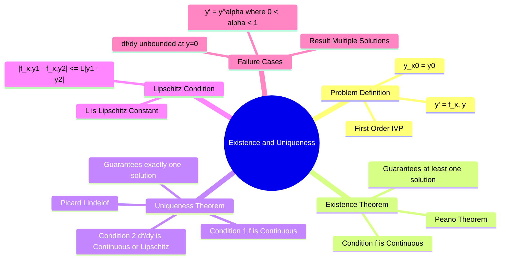

---
tags:
  - mathematics
  - differential-equations
  - calculus
  - gate
  - theorems
aliases:
  - Picard-Lindelöf Theorem
  - Uniqueness Theorem
  - Lipschitz Condition
subject: "[[Mathematics]]"
parent: "Differential Equations"
confidence: 10
---
###### Mind Map

---
### Existence and Uniqueness Theorem (First Order ODEs)
#differential-equations/theorems #calculus

> The **Existence and Uniqueness Theorem** (often called the **Picard-Lindelöf Theorem**) provides the mathematical justification for why differential equations are useful models of reality. It tells us under what conditions an Initial Value Problem (IVP) has a solution, and crucially, if that solution is the **only** one (deterministic).

#### The Initial Value Problem (IVP)
Consider the first-order ODE with an initial condition:
$$\boxed{\quad \frac{dy}{dx} = f(x, y), \quad y(x_0) = y_0 \quad}$$
We define a rectangular region $R$ in the $xy$-plane containing the point $(x_0, y_0)$:
$R = \{ (x, y) : |x - x_0| \le a, |y - y_0| \le b \}$

---
#### The Theorem Statement
#gate/formulas

**A. Existence (Peano's Theorem):**
If $f(x, y)$ is **continuous** in the region $R$, then there exists **at least one** solution $y(x)$ defined on some interval $|x - x_0| \le h$ (where $h \le a$).

**B. Uniqueness (Picard-Lindelöf Theorem):**
If $f(x, y)$ satisfies the following two conditions in $R$:
1.  $f(x, y)$ is **continuous**.
2.  $\frac{\partial f}{\partial y}$ is **continuous** (or bounded).

Then, there exists a **unique** solution $y(x)$ in some interval around $x_0$.

> [!warning] Summary for GATE
> * Check continuity of $f \to$ Existence.
> * Check continuity/boundedness of $\frac{\partial f}{\partial y} \to$ Uniqueness.

> [!success] Exam Rule (GATE / MCQ)
> For existence–uniqueness questions, **do NOT solve the differential equation**.  
> Only check **continuity of coefficients** and choose the **largest interval containing the initial point**.

> [!example] Linear ODE Shortcut
> Any first-order linear ODE  
> $$y' + P(x)y = Q(x)$$  
> has a **unique solution** on any interval where $P(x)$ and $Q(x)$ are **continuous**.

---
#### The Lipschitz Condition
#calculus/lipschitz

The strict mathematical condition for uniqueness is that $f(x, y)$ must be **Lipschitz continuous** with respect to $y$.
A function $f(x, y)$ satisfies a Lipschitz condition in a region if there exists a constant $L > 0$ such that:
$$\boxed{\quad |f(x, y_1) - f(x, y_2)| \le L |y_1 - y_2| \quad}$$
for all $(x, y_1)$ and $(x, y_2)$ in the region.

*   **Relation to Derivative:** If $\frac{\partial f}{\partial y}$ exists and is continuous, then $f$ is Lipschitz, and the Lipschitz constant $L$ is the maximum value of the partial derivative:
    $$L = \max_{(x,y) \in R} \left| \frac{\partial f}{\partial y} \right|$$

---
#### Critical Example: Failure of Uniqueness
#gate/high-yield

This is a frequent GATE concept. Uniqueness fails when $\frac{\partial f}{\partial y}$ is unbounded (infinite) at the initial condition.

**Consider the IVP:**
$$\frac{dy}{dx} = y^{1/3}, \quad y(0) = 0$$

1.  **Check Existence:** $f(x, y) = y^{1/3}$. This is continuous at $(0, 0)$. **Solution Exists.**
2.  **Check Uniqueness:** Calculate partial derivative.
    $$\frac{\partial f}{\partial y} = \frac{1}{3} y^{-2/3} = \frac{1}{3 y^{2/3}}$$
    At $y=0$, $\frac{\partial f}{\partial y} \to \infty$. The derivative is unbounded.
    **Lipschitz condition fails.** Uniqueness is **not** guaranteed.

**The Solutions:**
Ideally, we find two valid solutions:
1.  **Trivial Solution:** $y(x) = 0$ (Satisfies $y'=0$ and $0^{1/3}=0$).
2.  **Non-Trivial Solution:**
    $$\int y^{-1/3} dy = \int dx \implies \frac{3}{2} y^{2/3} = x \implies y = \left(\frac{2}{3}x\right)^{3/2}$$
*   **Conclusion:** This IVP has **infinitely many solutions** (one can stay at $y=0$ for a while and then branch off along the curve).

---
#### General Rule for $y' = y^\alpha$
For the differential equation $\frac{dy}{dx} = k y^\alpha$ with $y(0)=0$:

| Condition on $\alpha$ | Outcome |
| :--- | :--- |
| $\alpha \ge 1$ | **Unique Solution** ($y=0$). |
| $0 < \alpha < 1$ | **Multiple (Infinite) Solutions**. |
| $\alpha \le 0$ | Solution does not exist at $y=0$ (Singularity). |

---
#### Global vs. Local Existence
The theorem only guarantees existence in a *small interval* (Local). It does not guarantee the solution exists for all $x$ (Global).
*   **Example of Finite Escape Time:** $y' = 1 + y^2, y(0)=0$.
    *   $f$ and $f_y$ are continuous everywhere. Solution is unique locally.
    *   Solution: $y = \tan(x)$.
    *   The solution blows up at $x = \pi/2$. It does not exist for all $x$.

---
### Related Concepts
#topic/related-concepts

> [[First-Order Differential Equations]]

[[Partial Derivatives|Partial Differentiation]] (Required to check the uniqueness condition)
[[Limits, Continuity, Differentiability]]
[[Linear Differential Equations]] (Linear ODEs always satisfy existence/uniqueness globally)
[[Boundary Value Problems (BVP)]] (Existence/Uniqueness rules are different and harder than IVP)
