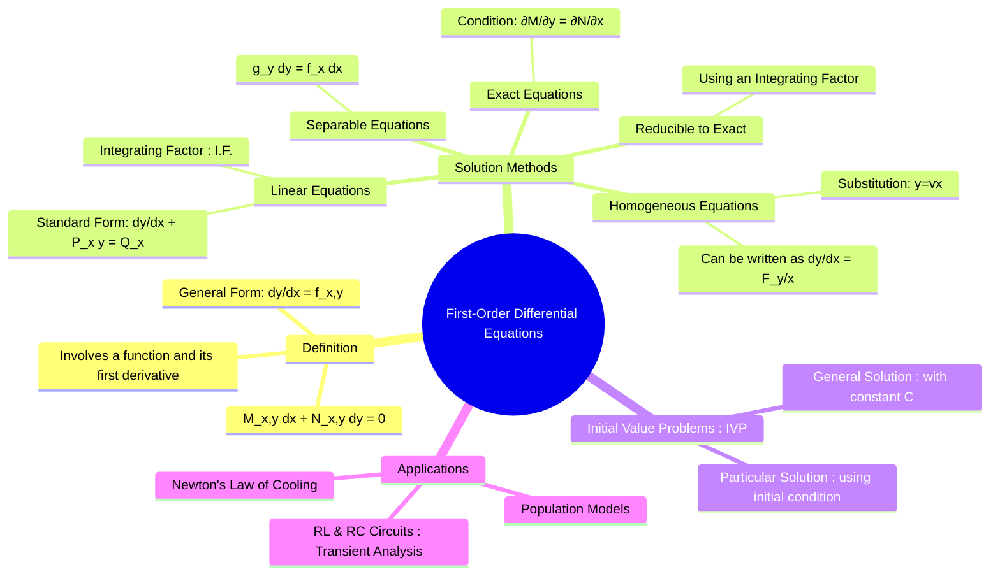

---
tags:
  - calculus
  - differential-equations
  - first-order
  - engineering-math
  - circuit-analysis
created: 2025-09-08
aliases:
  - First Order DE
  - 1st Order Differential Equations
  - Linear First-Order Equations
  - Separable Equations
  - Homogeneous Equations
  - Exact Equations
subject: "[[Mathematics]]"
parent:
  - Differential Equations
confidence: 9
youtube:
  - p_di4Zn4wz4
---
###### Mind Map

---
### First-Order Differential Equations
#differential-equations #first-order

> A first-order differential equation is an equation that contains only the first derivative of an unknown function, $y'(x)$, along with the function $y(x)$ and independent variable $x$. The goal is to find the function $y(x)$ that satisfies the equation.

The general form can be written as:
$$\frac{dy}{dx} = f(x,y) \quad \text{or} \quad M(x,y)dx + N(x,y)dy = 0$$

---
#### Types and Solution Methods

##### 1. Separable Equations
#separable-de

A differential equation is separable if it can be written in the form where all terms involving $y$ can be moved to one side and all terms involving $x$ to the other.
* **Form**: $g(y)dy = f(x)dx$
* **Solution**: Integrate both sides directly.
    $$\boxed{\quad \int g(y) dy = \int f(x) dx + C \quad}$$

##### 2. Linear First-Order Equations
#linear-de #integrating-factor

This is one of the most important types for circuit analysis.
* **Standard Form**:
    $$\boxed{\quad \frac{dy}{dx} + P(x)y = Q(x) \quad}$$
* **Solution Method**: Use an **Integrating Factor (I.F.)** to make the left side a perfect derivative.
    1. Calculate the Integrating Factor:
        $$\boxed{\quad \text{I.F.} = e^{\int P(x) dx} \quad}$$
    2. The solution is then given by:
        $$\boxed{\quad y \cdot (\text{I.F.}) = \int Q(x) \cdot (\text{I.F.}) dx + C \quad}$$

##### 3. Homogeneous Equations
#homogeneous-de

An equation is homogeneous if it can be written in the form $dy/dx = F(y/x)$.
* **Solution Method**: Use the substitution $y = vx$. This implies $\frac{dy}{dx} = v + x\frac{dv}{dx}$.
* The substitution transforms the homogeneous equation into a separable equation in terms of $v$ and $x$.

##### 4. Exact Equations
#exact-de

An equation of the form $M(x,y)dx + N(x,y)dy = 0$ is exact if and only if:
$$\boxed{\quad \frac{\partial M}{\partial y} = \frac{\partial N}{\partial x} \quad}$$
*   **Solution Method**: If the equation is exact, the solution $u(x,y) = C$ is found by:
    1. Integrating $M(x,y)$ with respect to $x$, treating $y$ as a constant: $\int M \, dx$.
    2. Integrating the terms in $N(x,y)$ that are free from $x$ with respect to $y$.
    3. The solution is the sum of these two integrations set equal to a constant $C$.
    $$\int M \, dx + \int (\text{terms of N not in } \int M \, dx) \, dy = C$$

---
#### [[Initial Value Problems (IVP)]]
#initial-value-problem

The general solution to a first-order DE contains an arbitrary constant, $C$. An **initial condition**, such as $y(x_0) = y_0$, is required to determine the unique **particular solution**. An equation supplied with an initial condition is called an Initial Value Problem.

---
#### Application in Electrical Engineering: RL and RC Circuits
#application/transient-analysis

First-order linear differential equations are fundamental to the **transient analysis** of first-order circuits.
* **Series RL Circuit**: Applying KVL gives $L\frac{di}{dt} + Ri = V(t)$.
    This can be rewritten in the standard linear form:
    $$\frac{di}{dt} + \left(\frac{R}{L}\right)i = \frac{V(t)}{L}$$
    Here, $P(t) = R/L$ and $Q(t) = V(t)/L$. This can be solved using the integrating factor method to find the current $i(t)$ as it changes over time.
* **Series RC Circuit**: Similarly, KVL gives a first-order DE for the charge $q(t)$, and differentiating gives one for the current $i(t)$.

---
### Related Concepts
#related-concepts

> [[Second-Order Differential Equations]]

[[The Laplace Transform]] (A powerful alternative method for solving linear DEs, especially in circuit analysis)
[[Transient Analysis]]
[[Electric Circuits]]
[[Differential Equations]]
