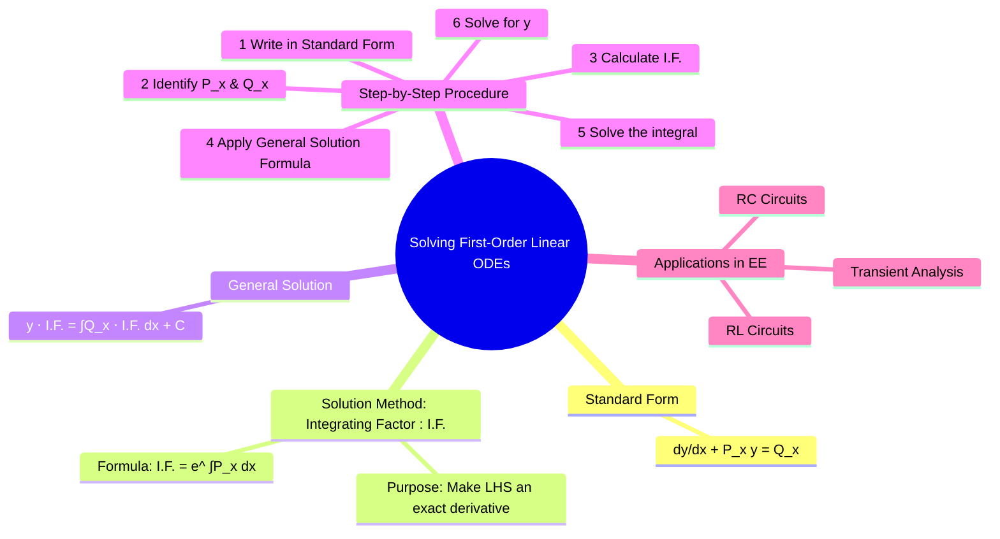

---
tags:
  - calculus
  - differential-equations
  - ode
  - engineering-math
created: 2025-09-15
aliases:
  - First-Order ODEs
  - Linear First-Order ODEs
  - 1st Order ODE
  - "Example : Solving First-Order Linear ODEs"
  - The Integrating Factor (I.F.) Method
subject: "[[Mathematics]]"
parent:
  - Differential Equations
confidence: 10
---
###### Mind Map

---
### Solving First-Order Linear Ordinary Differential Equations
#first-order-ode #linear-ode #integrating-factor

> A **first-order linear ordinary differential equation** is an equation involving a function and its first derivative. This type of ODE is crucial in engineering for modeling systems where the rate of change of a quantity is proportional to the quantity itself, plus some external input. The standard method for solving them is the **Integrating Factor (I.F.)** method, which is essential for analyzing the transient behavior of RL and RC circuits.

#### Standard Form
#standard-form #linear-ode

Before solving, a first-order linear ODE must be written in the following standard form:
$$\boxed{\quad \frac{dy}{dx} + P(x)y = Q(x) \quad}$$
where $P(x)$ and $Q(x)$ are functions of the independent variable $x$ only. The term $Q(x)$ is often called the forcing function or input.

*   If $Q(x)=0$, the equation is called **homogeneous**.
*   If $Q(x) \neq 0$, the equation is **non-homogeneous**.

---
#### The Integrating Factor (I.F.) Method
#integrating-factor #solution-method

The goal of this method is to find a special function, the **Integrating Factor (I.F.)**, which, when multiplied by the entire equation, turns the left-hand side into the derivative of a product. This allows us to solve the equation by simple integration.

The formula for the integrating factor is:
$$\boxed{\quad \text{I.F.} = e^{\int P(x)dx} \quad}$$

When we multiply the standard form by the I.F., the left side becomes:
$$ (\text{I.F.}) \frac{dy}{dx} + (\text{I.F.}) P(x) y = \frac{d}{dx} (y \cdot \text{I.F.}) $$

---
#### General Solution
#general-solution

By multiplying the standard form by the I.F. and integrating both sides, we arrive at the general solution:
$$\boxed{\quad y \cdot (\text{I.F.}) = \int \left( Q(x) \cdot \text{I.F.} \right) dx + C \quad}$$
where C is the constant of integration, determined by initial conditions.

##### Step-by-Step Procedure:
1.  **Standard Form**: Rearrange the given ODE into the form $\frac{dy}{dx} + P(x)y = Q(x)$.
2.  **Identify**: Find the functions $P(x)$ and $Q(x)$.
3.  **Calculate I.F.**: Compute the integrating factor, I.F. $= e^{\int P(x)dx}$.
4.  **Apply Formula**: Substitute I.F., $P(x)$, and $Q(x)$ into the general solution formula.
5.  **Integrate**: Solve the integral on the right-hand side.
6.  **Solve for y**: Isolate $y$ to get the final solution.
7.  **Apply Initial Conditions**: If an initial condition (e.g., $y(x_0) = y_0$) is given, use it to find the value of the constant $C$.

---
#### Example

Solve the ODE: $x \frac{dy}{dx} + 2y = x^2$ with $y(1)=1$.

1.  **Standard Form**: Divide by $x$ to get $\frac{dy}{dx} + \frac{2}{x}y = x$.
2.  **Identify**: $P(x) = \frac{2}{x}$ and $Q(x) = x$.
3.  **Calculate I.F.**:
    $$\text{I.F.} = e^{\int (2/x)dx} = e^{2\ln x} = e^{\ln(x^2)} = x^2$$
4.  **Apply Formula**:
    $$ y \cdot x^2 = \int (x \cdot x^2) \, dx + C $$
5.  **Integrate**:
    $$ y x^2 = \int x^3 \, dx + C = \frac{x^4}{4} + C $$
6.  **Solve for y**:
    $$ y = \frac{x^2}{4} + \frac{C}{x^2} $$
7.  **Apply Initial Condition** ($y(1)=1$):
    $$ 1 = \frac{1^2}{4} + \frac{C}{1^2} \implies 1 = \frac{1}{4} + C \implies C = \frac{3}{4} $$
    The particular solution is $y = \frac{x^2}{4} + \frac{3}{4x^2}$.

---
#### Applications in Electrical Engineering
#applications #rc-circuit #rl-circuit

First-order linear ODEs are fundamental for analyzing the transient response of circuits containing one energy storage element.

*   **Series RL Circuit**: Applying KVL gives $L\frac{di}{dt} + Ri = V(t)$. In standard form: $$\frac{di}{dt} + \frac{R}{L}i = \frac{V(t)}{L}$$
*   **Series RC Circuit**: Applying KVL gives $R\frac{dq}{dt} + \frac{1}{C}q = V(t)$. In standard form: $$\frac{dq}{dt} + \frac{1}{RC}q = \frac{V(t)}{R}$$

---
### Related Concepts
#calculus/related-concepts

> [[Differential Equations]]

[[Integration]]
[[Electric Circuits]]
[[Second-Order Linear ODEs]]
[[Bernoulli's Equation]]
[[The Laplace Transform]]