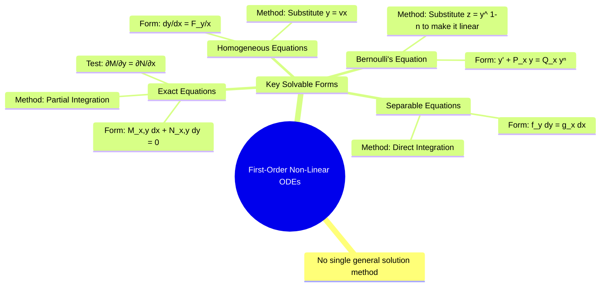

---
tags:
  - calculus
  - differential-equations
  - ode
  - non-linear-ode
  - engineering-math
created: 2025-09-15
aliases:
  - Non-Linear ODEs
  - 1st Order Non-Linear ODEs
subject: "[[Mathematics]]"
parent:
  - Differential Equations
---
### Solving First-Order Non-Linear Ordinary Differential Equations
#non-linear-ode #separable-equations #exact-equations #bernoulli-equation

> A **first-order non-linear ODE** is any first-order differential equation that is not linear (i.e., it cannot be written as $\frac{dy}{dx} + P(x)y = Q(x)$). Such equations may contain terms like $y^2$, $\sin(y)$, or products of $y$ and its derivative. Unlike linear ODEs, there is no universal method for solving them. Instead, we identify specific forms of non-linear equations and apply a corresponding solution technique.

###### Mind Map

---

#### 1. Separable Equations
#separable-equations

This is the simplest type of non-linear ODE. An equation is separable if it can be algebraically manipulated into a form where all terms involving $y$ and $dy$ are on one side, and all terms involving $x$ and $dx$ are on the other.

*   **Standard Form**:
    $$\boxed{\quad f(y) \, dy = g(x) \, dx \quad}$$
*   **Solution Method**: Integrate both sides of the equation.
    $$\int f(y) \, dy = \int g(x) \, dx + C$$

---
#### 2. Homogeneous Equations
#homogeneous-ode

A first-order ODE is homogeneous if it can be written in the form where the right side is a function of the ratio $y/x$.

*   **Standard Form**:
    $$\boxed{\quad \frac{dy}{dx} = F\left(\frac{y}{x}\right) \quad}$$
*   **Solution Method**: Use the substitution $\boxed{y = vx}$. This implies $\frac{dy}{dx} = v + x \frac{dv}{dx}$.
    1.  Substitute $y=vx$ into the standard form. The equation becomes:
        $$v + x \frac{dv}{dx} = F(v)$$
    2.  This new equation is always separable in variables $v$ and $x$:
        $$\frac{dv}{F(v) - v} = \frac{dx}{x}$$
    3.  Integrate to solve for $v$.
    4.  Substitute back $v = y/x$ to get the final solution in terms of $y$ and $x$.

---
#### 3. Exact Differential Equations
#exact-equations

An equation in the form $M(x, y) dx + N(x, y) dy = 0$ is exact if it corresponds to the total differential of some function $f(x, y) = C$.

*   **Standard Form**:
    $$M(x, y) dx + N(x, y) dy = 0$$
*   **Condition for Exactness**: The equation is exact if and only if:
    $$\boxed{\quad \frac{\partial M}{\partial y} = \frac{\partial N}{\partial x} \quad}$$
*   **Solution Method**: If the equation is exact, the solution is $f(x, y) = C$, which can be found using the formula:
    $$\boxed{\quad \int_{y=\text{const}} M \, dx + \int (\text{Terms in N not containing x}) \, dy = C \quad}$$

---
#### 4. Bernoulli's Equation
#bernoulli-equation

This is a special non-linear equation that can be transformed into a linear one with a suitable substitution.

*   **Standard Form**:
    $$\boxed{\quad \frac{dy}{dx} + P(x)y = Q(x)y^n \quad}$$
    Note: If $n=0$ or $n=1$, the equation is already linear.
*   **Solution Method**:
    1.  Divide the entire equation by $y^n$:
        $$y^{-n} \frac{dy}{dx} + P(x)y^{1-n} = Q(x)$$
    2.  Use the substitution $\boxed{z = y^{1-n}}$. This implies $\frac{dz}{dx} = (1-n)y^{-n}\frac{dy}{dx}$.
    3.  Substituting this into the equation transforms it into a **linear ODE** in the variable $z$:
        $$\boxed{\quad \frac{dz}{dx} + (1-n)P(x)z = (1-n)Q(x) \quad}$$
    4.  Solve this linear ODE for $z$ using the [[Solving First-Order Linear ODEs|Integrating Factor method]].
    5.  Substitute back $z=y^{1-n}$ to find the final solution for $y$.

---
### Related Concepts
#calculus/related-concepts

> [[Solving First-Order Linear ODEs]]

[[Differential Equations]]
[[Second-Order Linear ODEs]]
[[Integration]]
[[Partial Derivatives]]