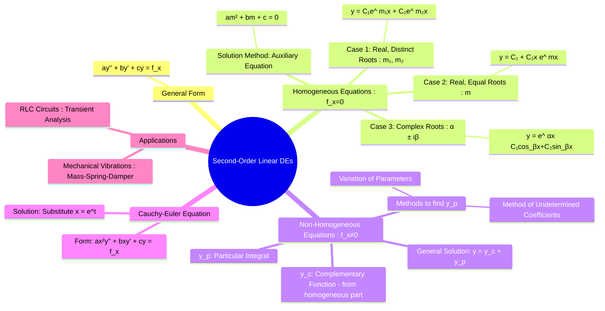

---
tags:
  - calculus
  - differential-equations
  - second-order
  - engineering-math
  - rlc-circuits
created: 2025-09-08
aliases:
  - Second Order DE
  - 2nd Order Differential Equations
  - Second-Order Linear Homogeneous DEs
subject: "[[Mathematics]]"
parent:
  - Differential Equations
trends:
  - "[[trends - Second-Order DEs]]"
---
### Second-Order Differential Equations
#differential-equations #second-order #linear-equations

> A second-order differential equation involves the second derivative of an unknown function. The most important type for engineering applications is the **linear, second-order differential equation with constant coefficients**, which is fundamental to modeling RLC circuits and mechanical systems.

The general form is:
$$a\frac{d^2y}{dx^2} + b\frac{dy}{dx} + cy = f(x)$$
where $a, b, c$ are constants.

---
#### Homogeneous Linear Equations
#homogeneous-de #auxiliary-equation

This is the case where $f(x) = 0$.
$$a y'' + b y' + c y = 0$$
To solve this, we assume a solution of the form $y=e^{mx}$, which leads to the **Auxiliary Equation** (or Characteristic Equation):
$$\boxed{\quad am^2 + bm + c = 0 \quad}$$
The general solution depends on the roots of this quadratic equation.

* **Case 1: Real and Distinct Roots ($m_1, m_2$)**
    * Condition: $b^2 - 4ac > 0$.
    * The general solution is a linear combination of two exponential terms.
        $$\boxed{\quad y_c(x) = C_1 e^{m_1 x} + C_2 e^{m_2 x} \quad}$$

* **Case 2: Real and Equal Roots ($m_1 = m_2 = m$)**
    * Condition: $b^2 - 4ac = 0$.
    * The solutions are not independent, so the second solution is multiplied by $x$.
        $$\boxed{\quad y_c(x) = (C_1 + C_2 x) e^{mx} \quad}$$

* **Case 3: Complex Conjugate Roots ($m = \alpha \pm i\beta$)**
    * Condition: $b^2 - 4ac < 0$.
    * The solution involves exponential and sinusoidal terms (derived from Euler's formula).
        $$\boxed{\quad y_c(x) = e^{\alpha x} (C_1 \cos(\beta x) + C_2 \sin(\beta x)) \quad}$$

---
#### Non-Homogeneous Linear Equations
#non-homogeneous-de #undetermined-coefficients

This is the case where $f(x) \neq 0$.
$$a y'' + b y' + c y = f(x)$$
The **General Solution** is the sum of two parts:
$$\boxed{\quad y(x) = y_c(x) + y_p(x) \quad}$$
* **$y_c(x)$ (Complementary Function)**: The solution to the corresponding homogeneous equation ($ay'' + by' + cy = 0$), found using the methods above.
* **$y_p(x)$ (Particular Integral)**: Any particular solution that satisfies the full non-homogeneous equation.

##### Method of Undetermined Coefficients
This is a "guesswork" method for finding $y_p$ when $f(x)$ has a specific form (polynomial, exponential, sine/cosine, or combinations).

| If $f(x)$ is...                    | Assume $y_p$ is...                                           |
| ---------------------------------- | ------------------------------------------------------------ |
| A constant, $k$                    | A constant, $A$                                              |
| A polynomial, $P_n(x)$             | A polynomial of the same degree, $A_n x^n + ... + A_0$      |
| An exponential, $ke^{ax}$          | $A e^{ax}$                                                   |
| Sine or Cosine, $k\sin(bx), k\cos(bx)$ | $A\sin(bx) + B\cos(bx)$                                    |

**Modification Rule**:

> If any term in the assumed form for $y_p$ is already part of the complementary function $y_c$, multiply the assumed $y_p$ by $x$. If it's still part of $y_c$, multiply by $x^2$.

---
#### Application: Series RLC Circuit
#application/rlc-circuits

> [!refer]
> [[Transient Analysis#Second-Order Circuits (RLC)]]

The KVL equation for a series RLC circuit is a second-order DE. For the charge $q(t)$:
$$L\frac{d^2q}{dt^2} + R\frac{dq}{dt} + \frac{1}{C}q = V(t)$$
The auxiliary equation is $Lm^2 + Rm + \frac{1}{C} = 0$. The roots determine the nature of the **transient (natural) response**:
1. **Overdamped ($R^2 > 4L/C$)**: Two distinct real roots. The response is a non-oscillatory decay.
2. **Critically Damped ($R^2 = 4L/C$)**: One real repeated root. The fastest possible non-oscillatory decay.
3. **Underdamped ($R^2 < 4L/C$)**: Complex conjugate roots. The response is a decaying oscillation.
The **Particular Integral** corresponds to the **steady-state (forced) response** of the circuit.

---
### Related Concepts
#related-concepts

> [[Differential Equations]] (Parent topic)

[[First-Order Differential Equations]]
[[The Laplace Transform]] (A powerful alternative for solving LCC DEs, especially with discontinuous inputs)
[[Transient Analysis]] and [[RLC Circuits]]
[[Algebra of Complex Numbers]] (Essential for the underdamped case)
