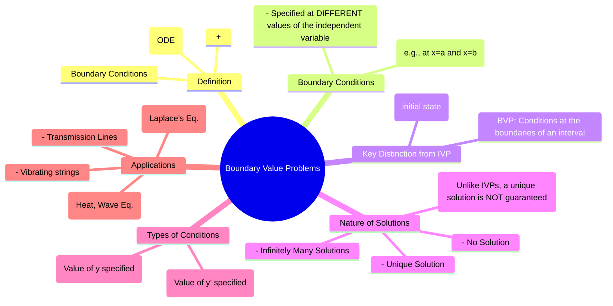

---
tags:
  - calculus
  - differential-equations
  - ode
  - pde
  - engineering-math
created: 2025-09-15
aliases:
  - BVP
  - Boundary Conditions
  - "Example : Boundary Value Problem (BVP)"
subject: "[[Mathematics]]"
parent: "[[Calculus - Differential Equations]]"
confidence: 9
---
###### Mind Map

---
### Boundary Value Problems (BVP)
#boundary-value-problem #bvp #pde-solver

> A **Boundary Value Problem (BVP)** consists of an ordinary differential equation (ODE) to be solved on a specified interval, along with a set of conditions that must be met at the **boundaries** (endpoints) of that interval. Unlike an [[Initial Value Problems (IVP)|Initial Value Problem]] which predicts the future from a known starting point, a BVP seeks a solution that fits a set of spatial constraints. This makes them essential for solving partial differential equations (PDEs) that model physical phenomena like heat distribution, wave propagation, and electrostatic potentials.

#### Key Distinction: BVP vs. IVP
The fundamental difference lies in where the conditions are specified.
*   **Initial Value Problem (IVP)**: All conditions—the function's value and its derivatives—are specified at a **single point** (e.g., $y(0)=y_0, y'(0)=y'_0$). It's about finding a trajectory from a known start.
*   **Boundary Value Problem (BVP)**: The conditions are specified at **different points**, typically the ends of an interval (e.g., $y(a)=y_0, y(b)=y_1$). It's about finding a function that connects two specified points.

---
#### Nature of Solutions
A critical feature of BVPs is that the existence and uniqueness of a solution are **not guaranteed**. A BVP can have:
1.  **A Unique Solution**: This is the most common case in well-posed physical problems.
2.  **No Solution**: It may be impossible for any solution of the ODE to satisfy the given boundary conditions.
3.  **Infinitely Many Solutions**: The boundary conditions might be satisfied by an entire family of solutions.

*   **Example**: Consider the ODE $y'' + y = 0$, which has the general solution $y(x) = c_1 \cos(x) + c_2 \sin(x)$.
    *   **BCs: $y(0)=0, y(\pi/2)=1$**:
        $y(0) = c_1 = 0$.
        $y(\pi/2) = c_2 \sin(\pi/2) = c_2 = 1$.
        This gives a **unique solution**: $y(x) = \sin(x)$.
    *   **BCs: $y(0)=0, y(\pi)=1$**:
        $y(0) = c_1 = 0$.
        $y(\pi) = c_2 \sin(\pi) = 0 \neq 1$.
        This is a contradiction. There is **no solution**.
    *   **BCs: $y(0)=0, y(\pi)=0$**:
        $y(0) = c_1 = 0$.
        $y(\pi) = c_2 \sin(\pi) = 0$.
        This equation is satisfied for **any** value of $c_2$. There are **infinitely many solutions**: $y(x) = c_2 \sin(x)$.

---
#### The Solution Procedure
1.  **Find the General Solution**: Solve the ODE to find the family of solutions with arbitrary constants ($c_1, c_2, \dots$).
2.  **Apply Boundary Conditions**: Substitute the boundary points into the general solution to create a system of algebraic equations for the constants.
3.  **Solve for Constants**: Solve the system. If a unique set of constants exists, there is a unique solution. If the system is inconsistent, there is no solution. If there are free variables, there are infinite solutions.
4.  **Write the Particular Solution**: If a unique solution exists, substitute the constants back into the general solution.

---
#### Applications in Electrical Engineering
BVPs are most prominent when solving PDEs using methods like Separation of Variables, which breaks a PDE down into several ODEs, at least one of which is a BVP.

*   **Electrostatics**: Solving Laplace's equation ($\nabla^2 V = 0$) or Poisson's equation ($\nabla^2 V = -\rho_v/\epsilon$) in a region where the potential $V$ is specified on the boundaries. For example, finding the potential between two parallel plates held at different voltages.
*   **Transmission Lines**: The voltage and current along a transmission line are described by the Telegrapher's equations. The behavior is constrained by the source impedance at one end and the load impedance at the other end—a classic BVP.
*   **Waveguides**: Determining the electromagnetic field modes that can propagate in a waveguide involves solving a BVP where field components must satisfy conditions at the conducting walls.
*   **Heat Conduction**: The one-dimensional steady-state heat equation is a second-order ODE, $T''(x)=0$. The temperatures specified at the ends of a rod form the boundary conditions.

---
### Related Concepts
#calculus/related-concepts

> [[Calculus - Differential Equations]]
> [[Initial Value Problems (IVP)]]
> [[Partial Differential Equations (PDEs)]]
> [[3. Electromagnetic Fields/1. Electrostatics/Electromagnetic Fields]]
> [[Transmission Lines]]
> [[Fourier Series Representation of Periodic Functions]] (Often used to construct solutions to BVPs)