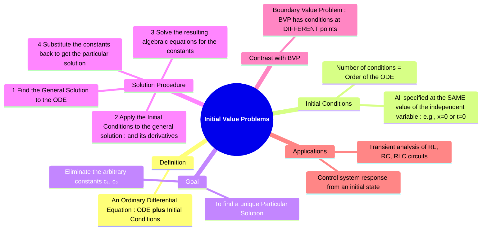

---
tags:
  - calculus
  - differential-equations
  - ode
  - particular-solution
  - engineering-math
created: 2025-09-15
aliases:
  - IVP
  - Initial Conditions
  - "Example : Initial Value Problems (IVP)"
subject: "[[Mathematics]]"
parent:
  - Differential Equations
confidence: 10
---
###### Mind Map

---
### Initial Value Problems (IVP)
#initial-value-problem #particular-solution #transient-analysis

> An **Initial Value Problem (IVP)** consists of an ordinary differential equation (ODE) combined with a set of **initial conditions** that specify the value of the function and its derivatives at a single point. The goal of an IVP is not just to find the general family of solutions to the ODE, but to pinpoint the one **particular solution** that passes through the specified initial state. This is fundamental to modeling physical systems, as it allows us to predict the future behavior of a system based on its state at a starting time.

#### Definition and Structure
An $n$-th order IVP takes the form:
*   **An n-th order ODE**: $F(x, y, y', \dots, y^{(n)}) = 0$
*   **n Initial Conditions**:
    $$ y(x_0)=y_0, \quad y'(x_0)=y'_0, \quad \dots, \quad y^{(n-1)}(x_0)=y_0^{(n-1)} $$
All conditions are specified at the same point, $x_0$, which is typically $x=0$ or $t=0$ in physical problems.

*   A first-order IVP requires one condition: $y(x_0)=y_0$.
*   A second-order IVP requires two conditions: $y(x_0)=y_0$ and $y'(x_0)=y'_0$.

---
#### The Solution Procedure
#ivp-solution-procedure

Solving an IVP is a systematic process to determine the arbitrary constants in the general solution.

1.  **Find the General Solution**: First, solve the differential equation completely, ignoring the initial conditions. This solution will contain $n$ arbitrary constants ($c_1, c_2, \dots, c_n$).
2.  **Apply Initial Conditions**:
    *   Substitute the initial point ($x_0, y_0$) into the general solution.
    *   If necessary, differentiate the general solution to find expressions for $y', y'', \dots$ and substitute the initial conditions for the derivatives.
3.  **Solve for the Constants**: This process creates a system of $n$ linear algebraic equations with $n$ unknown constants. Solve this system to find the unique values of $c_1, c_2, \dots, c_n$.
4.  **Write the Particular Solution**: Substitute the calculated values of the constants back into the general solution. This final expression is the unique solution to the IVP.

---
#### Example

Solve the IVP: $y'' + 4y = 0$, with initial conditions $y(0) = 2$ and $y'(0) = -2$.

1.  **General Solution**:
    *   The characteristic equation is $m^2 + 4 = 0 \implies m = \pm 2j$.
    *   These are complex roots ($\alpha \pm j\beta$) with $\alpha=0, \beta=2$.
    *   The general solution is $y(x) = c_1 \cos(2x) + c_2 \sin(2x)$.

2.  **Apply Conditions**:
    *   First, find the derivative: $y'(x) = -2c_1 \sin(2x) + 2c_2 \cos(2x)$.
    *   Apply $y(0)=2$:
        $y(0) = c_1 \cos(0) + c_2 \sin(0) = c_1 \cdot 1 + c_2 \cdot 0 = 2 \implies \boxed{c_1 = 2}$.
    *   Apply $y'(0)=-2$:
        $y'(0) = -2c_1 \sin(0) + 2c_2 \cos(0) = -2c_1 \cdot 0 + 2c_2 \cdot 1 = -2 \implies \boxed{2c_2 = -2 \implies c_2 = -1}$.

3.  **Solve for Constants**: We found $c_1 = 2$ and $c_2 = -1$.

4.  **Particular Solution**: Substitute the constants back into the general solution.
    $$ y(x) = 2\cos(2x) - \sin(2x) $$

---
#### Application in Electrical Circuits
#rc-circuit #rlc-circuits #initial-conditions

IVPs are the natural way to describe the transient behavior of circuits with energy storage elements (capacitors and inductors).
*   The voltage across a capacitor, $v_C(t)$, cannot change instantaneously. Therefore, $v_C(0^+)$ is a known initial condition.
*   The current through an inductor, $i_L(t)$, cannot change instantaneously. Therefore, $i_L(0^+)$ is a known initial condition.
*   For a second-order circuit (RLC), the KVL/KCL equation forms a second-order ODE. The initial conditions $v_C(0)$ and $i_L(0)$ are used to find the two arbitrary constants, thus defining the exact transient response (overdamped, underdamped, or critically damped) of the circuit from the moment a switch is thrown.

---
### Related Concepts
#calculus/related-concepts

> [[Differential Equations]]

[[Linear Homogeneous ODEs with Constant Coefficients]]
[[Linear Non-Homogeneous ODEs with Constant Coefficients]]
[[Solving First-Order Linear ODEs]]
[[The Laplace Transform]]
[[Transient Analysis]]
[[Control Systems]]
