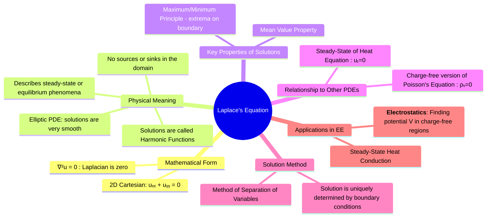

---
tags:
  - calculus
  - differential-equations
  - pde
  - electrostatics
  - steady-state
  - engineering-math
created: 2025-09-15
aliases:
  - Laplace Equation
  - Potential Theory
  - Harmonic Functions
subject: "[[Mathematics]]"
parent:
  - Partial Differential Equations (PDEs)
confidence: 10
formula:
  - "Laplace's Equation (2D Cartesian Coordinates) (PDEs) : $$\\frac{\\partial^2 u}{\\partial x^2} + \\frac{\\partial^2 u}{\\partial y^2} = 0$$"
  - "Laplace's Equation (PDEs) : $$\\nabla^2 u = 0$$"
---
###### Mind Map

---
### Laplace's Equation
#laplaces-equation #pde #steady-state #electrostatic-potential

> **Laplace's Equation** is a second-order linear partial differential equation that describes the behavior of a potential field in a region with no sources or sinks. It is the fundamental equation for modeling **steady-state** or **equilibrium** phenomena. In electrical engineering, its most important application is in **electrostatics** for calculating the electric potential in a charge-free region, where the potential is dictated solely by the values on the boundaries.

#### Mathematical Formulation
#laplaces-equation/formulation

Laplace's equation is defined as the case where the **Laplacian** of a function $u$ is zero.
$$\boxed{\quad \nabla^2 u = 0 \quad}$$
*   The function $u$ can be electric potential, temperature, etc.
*   $\nabla^2$ is the Laplacian operator, which is the divergence of the gradient ($\nabla \cdot \nabla$).

In **2D Cartesian Coordinates**, the equation is:
$$\boxed{\quad \frac{\partial^2 u}{\partial x^2} + \frac{\partial^2 u}{\partial y^2} = 0 \quad}$$

Solutions to Laplace's equation are called **Harmonic Functions**.

> [!pyq]- PYQ : 2019
> ![[ee_2019#^q3]]

---
#### Physical Interpretation and Properties
#harmonic-function #maximum-principle

Laplace's equation is an **Elliptic PDE**, which implies its solutions are exceptionally "smooth".
* **Physical Meaning**: It represents a state of equilibrium. For example, the steady-state temperature distribution in a plate with no heat sources or sinks is governed by Laplace's equation.
* **Mean Value Property**: The value of a harmonic function at any point is the average of its values over any circle (in 2D) or sphere (in 3D) centered at that point.
* **Maximum/Minimum Principle**: A direct consequence of the mean value property is that a harmonic function cannot have a local maximum or minimum inside its domain. The maximum and minimum values of the solution **must** occur on the boundaries of the region. This is physically intuitive: in a region without heat sources, the hottest spot must be on a boundary.

---
#### Relationship to Other Major PDEs

Laplace's equation is a simplified, steady-state version of other important PDEs.
1. **Relation to the Heat Equation**: It is the steady-state form of the [[The Heat Equation|Heat Equation]]. When a system reaches thermal equilibrium, its temperature no longer changes with time ($\partial u / \partial t = 0$), so the heat equation $u_t = k \nabla^2 u$ reduces to $\nabla^2 u = 0$.
2. **Relation to Poisson's Equation**: It is a special case of Poisson's equation, which describes a potential field in the presence of sources. Poisson's equation in electrostatics is $\nabla^2 V = -\rho_v / \epsilon$. When there is no charge in the region ($\rho_v = 0$), it simplifies to Laplace's equation, $\nabla^2 V = 0$.

---
#### Solution using Separation of Variables

For problems with simple geometries (rectangles, circles), Laplace's equation is solved using the [[Method of Separation of Variables|method of separation of variables]]. The process involves:
1. Assuming a product solution (e.g., $u(x,y) = X(x)Y(y)$).
2. Separating the PDE into two ODEs.
3. Solving the resulting [[Boundary Value Problems (BVP)|boundary value problems]] for the spatial components.
4. Using the Principle of Superposition and [[Fourier Series Representation of Periodic Functions|Fourier Series]] to construct a final solution that satisfies all the given boundary conditions.
The solution to a Laplace problem is **uniquely determined** by the values specified on its boundaries.

---
#### Applications in Electrical Engineering

* **Electrostatics**: This is the primary application. Finding the electric potential $V$ in a charge-free region between conductors held at fixed potentials is a classic Laplace problem. Examples include:
    * Finding the potential and electric field inside a coaxial cable or between parallel plates.
    * Analyzing the field distribution in waveguides.
* **Steady-State Heat Flow**: Determining the temperature distribution in a component (like a heatsink or chip) when it has reached thermal equilibrium.

---
### Related Concepts
#pde/related-concepts

> [[Partial Differential Equations (PDEs)]]

[[Method of Separation of Variables]]
[[The Heat Equation]] (Time-dependent version)
[[The Wave Equation]]
[[Electromagnetic Fields]]
[[Boundary Value Problems (BVP)]]
[[Fourier Series Representation of Periodic Functions]]