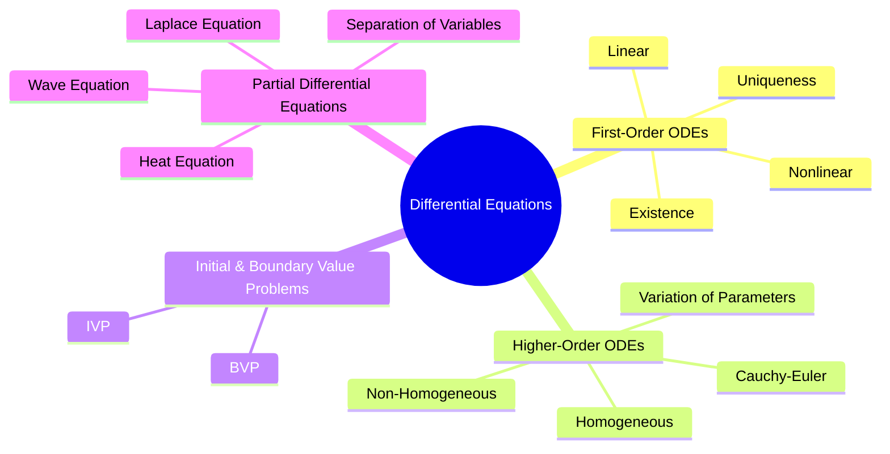

---
tags:
  - differential-equations
  - mathematics
  - gate
  - map-of-content
aliases:
  - Differential Equations MOC
subject:
  - "[[Mathematics]]"
parent: "[[Mathematics]]"
created: 2026-07-13
updated: 2026-07-13
---

### Differential Equations
#differential-equations #mathematics #gate #map-of-content

> ==A **Differential Equation** is an equation involving an unknown function and one or more of its derivatives. It provides the mathematical framework for modeling **dynamic systems** whose states change with time or space.==
>
> Differential Equations are the language of engineering, describing electrical circuits, control systems, heat transfer, wave propagation, population dynamics, and mechanical vibrations.
>
> Every Differential Equation attempts to answer four fundamental questions:
>
> - **How does a system evolve?**
> - **What governs its dynamics?**
> - **How do initial or boundary conditions determine its behavior?**
> - **Can an analytical solution be obtained?**



---

#### 1. First-Order Differential Equations

The simplest differential equations involve only the first derivative. They form the foundation for all higher-order equations.

##### Fundamental Concepts

- [[First-Order Differential Equations]]
- [[Existence and Uniqueness Theorem for ODEs]]

##### Solution Techniques

- [[Solving First-Order Linear ODEs]]
- [[Solving First-Order Non-Linear ODEs]]

---

#### 2. Linear Ordinary Differential Equations

Higher-order differential equations arise naturally in electrical and mechanical systems.

A general linear ODE can be written as

$$
a_n\frac{d^ny}{dx^n}
+a_{n-1}\frac{d^{n-1}y}{dx^{n-1}}
+\cdots
+a_1\frac{dy}{dx}
+a_0y=f(x)
$$

##### Topics

- [[Second-Order Differential Equations]]
- [[Linear Homogeneous ODEs with Constant Coefficients]]
- [[Linear Non-Homogeneous ODEs with Constant Coefficients]]
- [[Cauchy-Euler Equation]]
- [[Method of Variation of Parameters]]

---

#### 3. Initial & Boundary Value Problems

The same differential equation can produce completely different solutions depending on the prescribed conditions.

##### Initial Value Problems

- [[Initial Value Problems (IVP)]]

##### Boundary Value Problems

- [[Boundary Value Problems (BVP)]]

---

#### 4. Partial Differential Equations

Partial Differential Equations describe systems depending on two or more independent variables and form the basis of heat transfer, wave propagation, fluid mechanics, and electromagnetics.

##### Formation

- [[Formation of PDEs]]

##### Classical PDEs

- [[Laplace's Equation]]
- [[The Heat Equation]]
- [[The Wave Equation]]
- [[Common PDEs in Engineering (Heat, Wave, Laplace)]]

##### Solution Methods

- [[Method of Separation of Variables]]

---

#### Learning Progression

```text
Ordinary Differential Equations
            ↓
First-Order ODEs
            ↓
Linear First-Order ODEs
            ↓
Nonlinear First-Order ODEs
            ↓
Second-Order ODEs
            ↓
Higher-Order Linear ODEs
            ↓
Homogeneous & Non-Homogeneous ODEs
            ↓
Special Methods
            ↓
Initial & Boundary Value Problems
            ↓
Partial Differential Equations
            ↓
Heat • Wave • Laplace Equations
```

> [!success] Study Strategy
>
> Learn Differential Equations in the following order:
>
> 1. First-Order Differential Equations
> 2. Linear First-Order ODEs
> 3. Nonlinear First-Order ODEs
> 4. Second-Order Differential Equations
> 5. Higher-Order Linear ODEs
> 6. Special Solution Methods
> 7. Initial & Boundary Value Problems
> 8. Partial Differential Equations
> 9. Classical PDEs

> [!examtip] GATE Strategy
>
> GATE primarily tests:
>
> - First-order linear differential equations
> - Second-order linear ODEs
> - Characteristic equation method
> - Cauchy-Euler equations
> - Variation of Parameters
> - Initial and Boundary Value Problems
> - Heat, Wave and Laplace equations
> - Separation of Variables
>
> Most questions combine **Second-Order ODE → Characteristic Equation → Initial Conditions**.

---

#### Engineering Applications

Differential Equations form the mathematical foundation of:

- [[Signals & Systems]]
- [[Control Systems]]
- [[Electric Circuits|Network Theory]]
- [[Electromagnetic Fields]]
- [[Power System]]
- [[Electrical Machines]]

---

### Related Concepts

> [[Calculus]]

[[Linear Algebra]]
[[Complex Variables]]
[[Numerical Methods]]