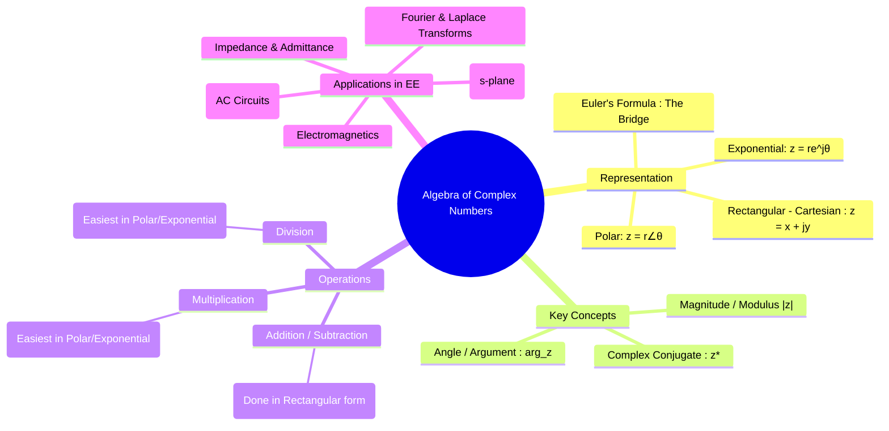

---
tags:
  - complex-numbers
  - complex-algebra
  - engineering-math
  - phasors
created: 2025-09-15
aliases:
  - Complex Numbers
  - Complex Algebra
  - Complex Conjugate
  - Euler's Formula & Conversions
  - Euler's identity
subject: "[[Mathematics]]"
parent:
  - Complex Analysis
importance:
  - very high
confidence: 80
formula:
  - "Complex Numbers (Rectangular (Cartesian) Form) : $$z = x + jy$$"
  - "Complex Numbers (Polar Form) : $$z = r\\angle\\theta$$"
  - "Complex Numbers (Exponential Form) : $$z = re^{j\\theta}$$"
  - "Rectangular to Polar/Exponential : $$r = \\sqrt{x^2 + y^2} \\quad \\qquad \\quad \\theta = \\tan^{-1}\\left(\\frac{y}{x}\\right)$$"
  - "Polar/Exponential to Rectangular : $$x = r\\cos(\\theta) \\quad \\qquad \\quad y = r\\sin(\\theta)$$"
  - "Euler's Formula : $$e^{i\\theta} = \\cos(\\theta) + i\\sin(\\theta)$$ "
  - "Cosine (Euler's Formula) : $$\\cos(\\theta) = \\frac{e^{i\\theta} + e^{-i\\theta}}{2}$$"
  - "Sine (Euler's Formula) : $$\\sin(\\theta) = \\frac{e^{i\\theta} - e^{-i\\theta}}{2i}$$"
---
### Algebra of Complex Numbers
#complex-numbers #phasor-algebra

> Complex numbers are an extension of real numbers that are indispensable in electrical engineering for analyzing alternating current (AC) circuits, [[control systems]], and [[electromagnetic fields]]. They provide a powerful mathematical tool to represent sinusoidal quantities ([[Phasors and Impedance Concept|phasors]]) in a way that simplifies calculations involving phase shifts. In engineering, the imaginary unit is denoted by $j$ to avoid confusion with current, $i$.

---
#### Representation of Complex Numbers
A complex number $z$ can be represented in three equivalent forms.

1.  **Rectangular (Cartesian) Form**:
    $$\boxed{\quad z = x + jy \quad}$$
    where $x = \text{Re}(z)$ is the real part, and $y = \text{Im}(z)$ is the imaginary part. $j$ is the imaginary unit, defined by $\boxed{j^2 = -1}$.
> [!concept] Important Notations 
> $\Re\{z\}$ and $\Im\{z\}$ denote the real and imaginary part operators; they extract physically meaningful quantities in engineering applications such as AC power.

2.  **Polar Form**:
    $$\boxed{\quad z = r\angle\theta \quad}$$
    where $r = |z|$ is the **magnitude** (or modulus) and $\theta = \arg(z)$ is the **angle** (or argument/phase) in degrees or radians.

3.  **Exponential Form**: This is the most elegant form, directly linking the polar and rectangular forms via Euler's formula.
    $$\boxed{\quad z = re^{j\theta} \quad}$$

---
#### Euler's Formula & Conversions
#eulers-formula #complex-conversion

**Euler's formula** provides the fundamental bridge between the exponential and trigonometric representations:
$$\boxed{\quad e^{j\theta} = \cos(\theta) + j\sin(\theta) \quad}$$

> [!concept] Exponential to Hyperbolic Relationship
> $$e^{\theta} = \cosh(\theta) + \sinh(\theta)$$
> $$\cosh(\theta) = \frac{e^{\theta} + e^{-\theta}}{2}$$
> 
> > [!related]
> > [[Ferranti Effect]]
> > [[Modeling of Long Transmission Lines]]

-   **Inverse Relations**: This allows us to express sinusoids as a sum of two complex exponentials.
    $$\boxed{\quad \cos(\theta) = \frac{e^{i\theta} + e^{-i\theta}}{2} \quad}$$
    $$\boxed{\quad \sin(\theta) = \frac{e^{i\theta} - e^{-i\theta}}{2i} \quad}$$

*   **Rectangular to Polar/Exponential**:
    $$\boxed{\quad r = \sqrt{x^2 + y^2} \quad} \qquad \boxed{\quad \theta = \tan^{-1}\left(\frac{y}{x}\right) \quad}$$
    > [!note]
    > Use a four-quadrant arctangent (atan2) function to ensure the correct angle.

*   **Polar/Exponential to Rectangular**:
    $$\boxed{\quad x = r\cos(\theta) \quad} \qquad \boxed{\quad y = r\sin(\theta) \quad}$$

---
#### Complex Conjugate
#complex-conjugate

The conjugate of a complex number $z$, denoted $z^*$, is found by negating the imaginary part.
*   Rectangular: If $z = x+jy$, then $\boxed{z^* = x-jy}$.
*   Polar: If $z = r\angle\theta$, then $\boxed{z^* = r\angle-\theta}$.
*   Exponential: If $z = re^{j\theta}$, then $\boxed{z^* = re^{-j\theta}}$.

A key property is that the product of a complex number and its conjugate equals the square of its magnitude:
$$\boxed{\quad z z^* = |z|^2 = r^2 = x^2+y^2 \quad}$$

> [!warning] Conjugation & algebra (common pitfall)
> Conjugation distributes over **addition** and **scalar multiplication**, and acts on the variable:
> $$\overline{z_1 + z_2} = \bar z_1 + \bar z_2$$
> $$\overline{a z} = \bar a \, \bar z$$
> $$\overline{z^n} = (\bar z)^n$$
> Example:
> $$\overline{z^2 + (1+j)z} = (\bar z)^2 + (1-j)\bar z$$

---
#### Algebraic Operations
#complex-arithmetic

Let $z_1 = x_1 + jy_1 = r_1\angle\theta_1$ and $z_2 = x_2 + jy_2 = r_2\angle\theta_2$.

1.  **Addition and Subtraction**: Performed component-wise in **rectangular form**.
    $$\boxed{\quad z_1 \pm z_2 = (x_1 \pm x_2) + j(y_1 \pm y_2) \quad}$$

2.  **Multiplication**: Easiest in **polar or exponential form**. Multiply the magnitudes and add the angles.
    $$\boxed{\quad z_1 z_2 = (r_1 r_2) \angle(\theta_1 + \theta_2) = (r_1 r_2)e^{j(\theta_1+\theta_2)} \quad}$$

3.  **Division**: Easiest in **polar or exponential form**. Divide the magnitudes and subtract the angles.
    $$\boxed{\quad \frac{z_1}{z_2} = \left(\frac{r_1}{r_2}\right) \angle(\theta_1 - \theta_2) = \left(\frac{r_1}{r_2}\right)e^{j(\theta_1-\theta_2)} \quad}$$
    To perform division in rectangular form, multiply the numerator and denominator by the conjugate of the denominator:
    $$\frac{z_1}{z_2} = \frac{x_1 + jy_1}{x_2 + jy_2} \cdot \frac{x_2 - jy_2}{x_2 - jy_2} = \frac{(x_1x_2 + y_1y_2) + j(y_1x_2 - x_1y_2)}{x_2^2 + y_2^2}$$

---
#### Applications in Electrical Engineering

1. **Phasor Analysis**: Sinusoidal voltages and currents like $v(t) = V_m \cos(\omega t + \phi)$ are represented as phasors $\mathbf{V} = V_{rms}\angle\phi$. Ohm's law becomes $\mathbf{V} = \mathbf{I}\mathbf{Z}$.
2. **Impedance and Admittance**: Impedance $\mathbf{Z}$ is a complex quantity representing opposition to AC current.
    - Resistor: $Z_R = R$
    - Inductor: $Z_L = j\omega L = \omega L \angle 90^\circ$
    - Capacitor: $Z_C = \frac{1}{j\omega C} = -j\frac{1}{\omega C} = \frac{1}{\omega C} \angle -90^\circ$
3. **[[Control Systems]]**: The Laplace variable $s = \sigma + j\omega$ defines the complex s-plane. The location of poles and zeros (which are complex numbers) determines system stability and response.
4. **[[Signals & Systems|Signals and Systems]]**: The Fourier, Laplace, and Z-transforms are all complex-valued functions essential for frequency-domain analysis.

---
### Related Concepts
#complex-numbers/related-concepts

> [[AC Circuit Analysis]]

[[Phasors and Impedance Concept|Phasor Analysis]]
[[Poles and Zeros of a Transfer Function|Poles and Zeros]]
[[Relationship between Pole Location and System Stability]]
[[Fourier Transforms]]
[[The Laplace Transform]]
[[Complex Analysis]]