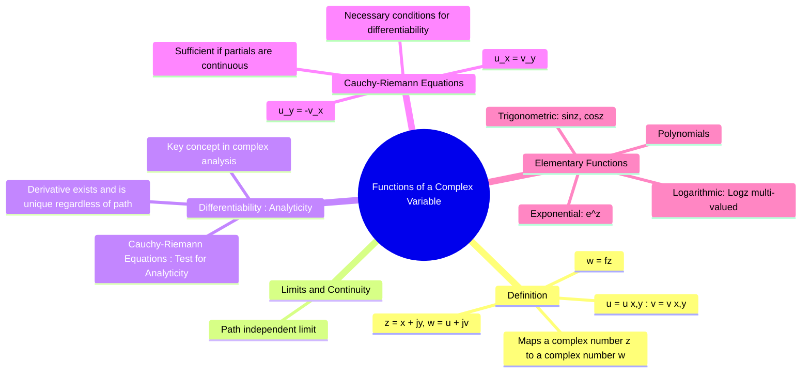

---
tags:
  - complex-analysis
  - complex-functions
  - analytic-functions
  - engineering-math
created: 2025-09-15
aliases:
  - Complex Functions
  - Complex Variable Functions
  - "Example : Check if a Complex Function is Analytic"
subject: "[[Mathematics]]"
parent: "[[Complex Analysis]]"
confidence: 10
---
###### Mind Map

---
### Functions of a Complex Variable
#complex-functions #complex-analysis

> A **function of a complex variable**, denoted $w = f(z)$, is a rule that maps a complex number $z$ from a domain in the complex plane to a complex number $w$ in a range, also in the complex plane. This concept extends the idea of real-valued functions to the complex domain and is the foundation of complex analysis, which provides powerful tools for solving engineering problems in fields like [[Electromagnetic Fields|electromagnetics]], [[Control Systems|control theory]], and fluid dynamics.

#### Definition
Let $z$ be a complex variable, $z = x + jy$. A complex function $f(z)$ can be written as:
$$ w = f(z) = u(x, y) + jv(x, y) $$
where $u(x, y)$ is the real part of the function and $v(x, y)$ is the imaginary part. Both $u$ and $v$ are real-valued functions of the two real variables $x$ and $y$.

*   **Example**: Let $f(z) = z^2$.
    *   $f(z) = (x+jy)^2 = (x^2 - y^2) + j(2xy)$
    *   Here, $u(x, y) = x^2 - y^2$ and $v(x, y) = 2xy$.

---
#### Limits and Continuity
#limits/complex-function #continuity/complex-function

The concepts of limits and continuity are similar to those in real calculus, with one critical difference: the limit must be the same regardless of the path taken to approach the point.

The limit of $f(z)$ as $z$ approaches $z_0$ is $L$, written $\lim_{z \to z_0} f(z) = L$, if the value of $f(z)$ gets arbitrarily close to $L$ for all $z$ sufficiently close to $z_0$, along **any path**. A function is continuous at $z_0$ if $\lim_{z \to z_0} f(z) = f(z_0)$.

---
#### Differentiability and Analyticity
#differentiability/complex-function #analytic-function #holomorphic

This is the central concept that distinguishes complex analysis from real analysis. The derivative of $f(z)$ at $z_0$ is defined as:
$$ f'(z_0) = \lim_{\Delta z \to 0} \frac{f(z_0 + \Delta z) - f(z_0)}{\Delta z} $$
For this limit to exist, it must be the same no matter how $\Delta z$ approaches 0 (e.g., along the real axis, imaginary axis, or any other path). This is a very strong condition.

* **[[Analytic Functions|Analytic Function]]**: A function $f(z)$ is said to be **analytic** (or holomorphic) at a point $z_0$ if it is differentiable not only at $z_0$ but also in a neighborhood around $z_0$. If a function is analytic everywhere in the complex plane, it is called an **entire function**.

---
#### The Cauchy-Riemann (C-R) Equations
#cauchy-riemann-equations

The [[Cauchy-Riemann equations]] provide a necessary test for a function to be differentiable at a point. If $f(z) = u(x, y) + jv(x, y)$ is differentiable, then its real and imaginary parts must satisfy:
$$\boxed{\quad \frac{\partial u}{\partial x} = \frac{\partial v}{\partial y} \quad \text{and} \quad \frac{\partial u}{\partial y} = -\frac{\partial v}{\partial x} \quad}$$
In subscript notation: $u_x = v_y$ and $u_y = -v_x$.

* **Sufficient Condition**: If the partial derivatives ($u_x, u_y, v_x, v_y$) are continuous in a region and satisfy the C-R equations throughout that region, then the function $f(z)$ is [[Analytic Functions|analytic]] in that region.

* **Example (Check if $f(z)=z^2$ is analytic)**:
    * $u(x,y) = x^2 - y^2$
    * $v(x,y) = 2xy$
    * **Derivatives**:
        $u_x = 2x$, $u_y = -2y$
        $v_x = 2y$, $v_y = 2x$
    * **Check C-R Equations**:
        $u_x = 2x = v_y \implies$ Condition 1 is satisfied.
        $u_y = -2y = -v_x \implies$ Condition 2 is satisfied.
    * Since the partial derivatives are continuous polynomials and the C-R equations hold everywhere, $f(z)=z^2$ is an entire function.

---
#### Elementary Complex Functions
#elementary-complex-functions

* **Polynomials**: $P(z) = a_n z^n + \dots + a_1 z + a_0$ are entire functions.
* **Exponential Function**: $e^z = e^{x+jy} = e^x e^{jy} = e^x(\cos y + j \sin y)$. This function is entire and is periodic with period $2\pi j$.
* **Trigonometric Functions**:
    $$\sin(z) = \frac{e^{jz} - e^{-jz}}{2j}, \quad \cos(z) = \frac{e^{jz} + e^{-jz}}{2}$$
    These are entire functions. Unlike their real counterparts, they are unbounded.
* **Logarithmic Function**: $\text{Log}(z) = \ln|z| + j\arg(z)$. This function is **multi-valued** because the argument $\arg(z)$ is multi-valued (can be changed by multiples of $2\pi$). A specific **principal value** is chosen by restricting the angle, e.g., to $(-\pi, \pi]$.

---
### Related Concepts
#complex-analysis/related-concepts

> [[Algebra of Complex Numbers]]

[[Cauchy's Integral Theorem]] & [[Cauchy's Integral Formula]]
[[Taylor Series]] & [[Laurent Series]]
[[Residue Theorem]]
[[Partial Derivatives]]
[[Conformal Mapping]]
