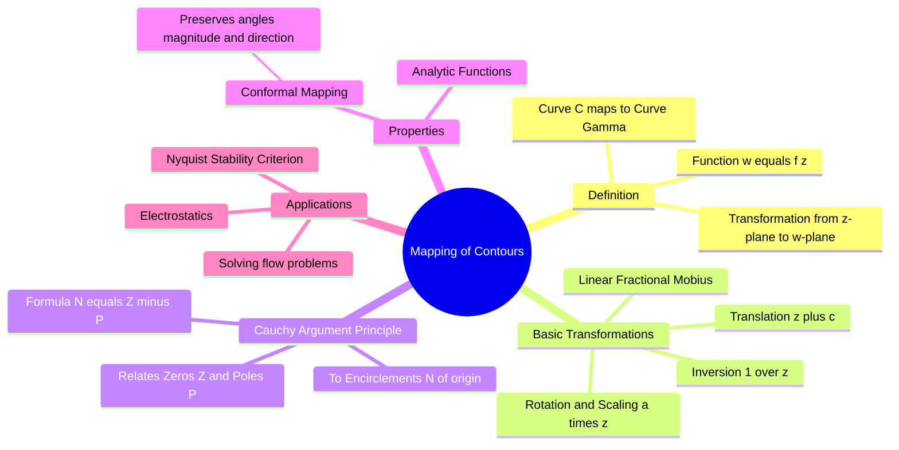

---
tags:
  - mathematics
  - complex-analysis
  - control-system
  - gate
aliases:
  - Conformal Mapping
  - Argument Principle
  - Contour Mapping
subject: "[[Mathematics]]"
parent:
  - Complex Analysis
created: 2026-07-13
---
### Mapping of Contours
#complex-analysis #mapping #control-system

> Mapping of Contours is the process of transforming a curve (contour) from the complex $z$-plane (domain) to the complex $w$-plane (range) using a complex function $w = f(z)$. This concept is the mathematical foundation of the [[Nyquist Stability Criterion]] in [[Control Systems]].

###### Mind Map

---

#### Fundamental Concept
#complex-analysis/mapping

Let a complex variable be $z = x + jy$. A complex function $w = f(z)$ can be written as:
$$w = u + jv = f(x + jy)$$
where $u(x, y)$ is the real part and $v(x, y)$ is the imaginary part.

* **The Mapping:** If a point $z$ moves along a contour $C$ in the $z$-plane, the corresponding point $w = f(z)$ traces out a contour $\Gamma$ in the $w$-plane.
* **Conformal Mapping:** If $f(z)$ is analytic and $f'(z) \neq 0$, the mapping preserves the **angle** (both magnitude and sense) between any two intersecting curves.

> [!warning]- Mapping of Contours (Complex Analysis – GATE)
> **Mapping of contours** means tracking how a curve (contour) in the $z$-plane transforms into a curve in the $w$-plane under a complex function $w=f(z)$.
> 
> **Procedure (standard):**
> 1. Let $z = x + jy$ describe the given contour.
> 2. Write $w = f(z) = u(x,y) + jv(x,y)$.
> 3. Eliminate $x,y$ (or the parameter) to obtain the relation between $u$ and $v$ → this gives the image contour.
> 
> **Key GATE facts:**
> - Straight lines and circles in the $z$-plane often map to **straight lines or circles** (especially under bilinear transformations).
> - If $f'(z)\neq 0$, angles between intersecting contours are **preserved** (conformal mapping).
> - To find image of a **region**, map its **boundary contours**.
> 
> **Quick examples (revision):**
> - $w=z^2$: lines $\theta=\text{const}$ → lines with angle $2\theta$
> - $w=\frac{1}{z}$: circles through origin ↔ straight lines
> - $w=e^z$: vertical lines $x=c$ → circles $|w|=e^c$

---
#### Elementary Transformations
#complex-analysis/transformations

Understanding how basic functions map geometric shapes is crucial:

1.  **Translation ($w = z + c$):**
    *   Shifts the contour $C$ by the vector represented by complex number $c$.
    *   Shape and orientation are preserved.
2.  **Rotation and Magnification ($w = \alpha z$):**
    *   Let $\alpha = |\alpha| e^{j\phi}$.
    *   The contour is **rotated** by angle $\phi$ and **scaled** (magnified) by factor $|\alpha|$.
3.  **Inversion ($w = 1/z$):**
    *   Maps the interior of the unit circle to the exterior, and vice versa.
    *   A line passing through the origin maps to a line passing through the origin.
    *   A circle passing through the origin maps to a straight line not passing through the origin.
4.  **Linear Fractional Transformation (Möbius):**
    $$w = \frac{az + b}{cz + d}$$
    *   Maps circles/lines in the $z$-plane to circles/lines in the $w$-plane.

---
#### Cauchy's Argument Principle
#complex-analysis/argument-principle #cauchys-argument-prinicple 

This is the most important theorem for engineering applications (specifically stability analysis).

Let $f(z)$ be [[Analytic Functions|analytic]] inside and on a simple closed contour $C$, except for a finite number of poles inside $C$. Let $f(z) \neq 0$ on $C$.

If $z$ traverses the contour $C$ in the **Counter-Clockwise (positive)** direction:
The mapping $w = f(z)$ will trace a contour $\Gamma$ in the $w$-plane that encircles the **origin** ($w=0$).

The number of encirclements $N$ of the origin is given by:
$$\boxed{\quad N = Z - P \quad}$$

Where:
*   **$N$**: Number of times $\Gamma$ encircles the origin in the $w$-plane (Counter-Clockwise is positive).
*   **$Z$**: Number of **zeros** of $f(z)$ enclosed by $C$ in the $z$-plane (counted with multiplicity).
*   **$P$**: Number of **poles** of $f(z)$ enclosed by $C$ in the $z$-plane (counted with multiplicity).

**Interpretation:**
The net change in the argument (angle) of $f(z)$ as $z$ traverses $C$ is $2\pi(Z - P)$.

---
#### Application: Nyquist Stability Criterion
#control-system/nyquist

In Control Systems, we map the **Nyquist Contour** (which encloses the entire Right Half Plane) using the Open Loop Transfer Function $G(s)H(s)$.

*   Here, we usually define the contour traversal as **Clockwise**.
*   The mapping is checked for encirclements of the critical point **$(-1, j0)$** (which corresponds to the origin for the characteristic equation $1+GH=0$).
*   The formula is often adjusted for CW traversal:
    $$\boxed{\quad N = P - Z \quad}$$
    Where $N$ is CW encirclements of $(-1, j0)$, $P$ is open-loop unstable poles, and $Z$ is closed-loop unstable poles (zeros of $1+GH$).

---
### Related Concepts
#topic/related-concepts

> [[Nyquist Stability Criterion]] (Direct application of mapping)

[[Principle of Argument]]
[[Complex Analysis]]
[[Analytic Functions]]
[[Residue Theorem]]
[[Polar Plots]]
[[Stability Analysis]]
