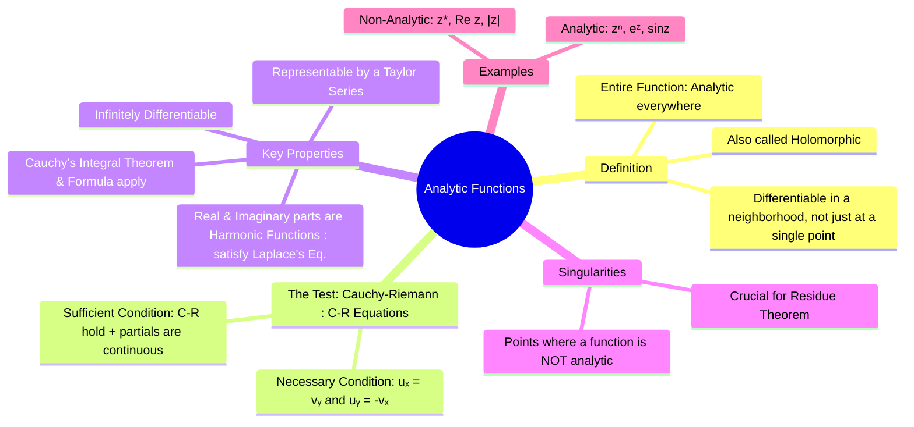

---
tags:
  - complex-analysis
  - analytic-functions
  - cauchy-riemann-equations
  - engineering-math
created: 2025-09-15
aliases:
  - Analytic Function
  - Holomorphic Function
  - Entire Function
subject: "[[Mathematics]]"
parent: "[[Functions of a Complex Variable]]"
---
### Analytic Functions
#analytic-function #holomorphic #cauchy-riemann-equations

> ==An **analytic function** (also called a [[holomorphic function]]) is a function of a complex variable that is differentiable not just at a single point, but in a neighborhood around that point.== This is a much stronger condition than [[Limits, Continuity, and Differentiability#Differentiability|differentiability in real calculus]], and it endows analytic functions with incredibly powerful properties. The concept of analyticity is the cornerstone of complex analysis and is tested primarily through the **[[Cauchy-Riemann equations#Cauchy-Riemann Equations|Cauchy-Riemann equations]]**.

---
#### Definition of Analyticity
#analyticity

* **Analytic at a point**: A function $f(z)$ is said to be analytic at a point $z_0$ if it is differentiable at $z_0$ and at every point in some small disk centered at $z_0$.
* **Analytic in a domain**: A function is analytic in a domain $D$ if it is analytic at every point in $D$.
* **Entire Function**: A function that is analytic everywhere in the complex plane is called an entire function. Examples include polynomials, $e^z$, $\sin(z)$, and $\cos(z)$.

---
#### The [[Cauchy-Riemann Equations|Cauchy-Riemann (C-R) Equations]]
#cauchy-riemann-equations 

The C-R equations are the primary tool for determining whether a function is analytic. They provide a necessary and sufficient condition for differentiability.

For a complex function $f(z) = u(x, y) + jv(x, y)$:
* **Necessary Condition**: For $f(z)$ to be differentiable at a point $z = x+jy$, its real and imaginary parts must satisfy the C-R equations:
    $$\boxed{\quad \frac{\partial u}{\partial x} = \frac{\partial v}{\partial y} \quad \text{and} \quad \frac{\partial u}{\partial y} = -\frac{\partial v}{\partial x} \quad}$$
* **Sufficient Condition**: If the partial derivatives $u_x, u_y, v_x, v_y$ are **continuous** in a region and satisfy the C-R equations, then $f(z)$ is **analytic** in that region.

> [!pyq]- PYQ : 2019
> ![[ee_2019#^q4]]

---
##### Examples

> [!example] Example 1 (Analytic)
> **Q.** Is $f(z) = e^z$ analytic?
> 
> $f(z) = e^{x+jy} = e^x(\cos y + j \sin y) \implies u = e^x \cos y, v = e^x \sin y$.
> $u_x = e^x \cos y$, $u_y = -e^x \sin y$
> $v_x = e^x \sin y$, $v_y = e^x \cos y$
> 
> Check: $u_x = v_y$ (True) and $u_y = -v_x$ (True). The C-R equations hold everywhere and the partials are continuous, so $f(z) = e^z$ is an entire function.

> [!example] Example 2 (Not Analytic)
>  **Q.** Is $f(z) = \text{Re}(z) = x$ analytic?
> 
$f(z) = x + j0 \implies u = x, v = 0$.
> 
> $u_x = 1$, $u_y = 0$
> $v_x = 0$, $v_y = 0$
> 
> Check: $u_x = v_y \implies 1 = 0$ (False). The C-R equations are not satisfied, so $f(z)=\text{Re}(z)$ is nowhere analytic.

---
#### Properties of Analytic Functions

If a function is analytic, it possesses several remarkable properties not found in real analysis:
1.  **Infinitely Differentiable**: An analytic function is infinitely differentiable. If it has a first derivative, it has all higher-order derivatives.
2.  **[[Taylor Series|Taylor Series Representation]]**: Every analytic function can be represented by a Taylor series in the neighborhood of any point where it is analytic.
3.  **[[Cauchy's Integral Theorem]]**: The line integral of an analytic function over a simple closed path is zero. This is a cornerstone of complex integration.
4.  **Harmonic Functions**: The real part ($u$) and imaginary part ($v$) of an analytic function are **harmonic functions**, meaning they both satisfy [[Laplace's Equation]]:
    $$\boxed{\quad \nabla^2 u = \frac{\partial^2 u}{\partial x^2} + \frac{\partial^2 u}{\partial y^2} = 0 \quad}$$
    $$\boxed{\quad \nabla^2 v = \frac{\partial^2 v}{\partial x^2} + \frac{\partial^2 v}{\partial y^2} = 0 \quad}$$
    $u$ and $v$ are called **harmonic conjugates**. This property provides a deep connection between complex analysis and solutions to electrostatics, heat flow, and fluid dynamics problems.

---
#### Singularities
#singularities 

![[Singularities of a Complex Function#^intro]]

---
### Related Concepts
#complex-analysis/related-concepts

> [[Functions of a Complex Variable]]

[[Limits, Continuity, and Differentiability of Complex Functions]]
[[Cauchy's Integral Theorem]] & [[Cauchy's Integral Formula]]
[[Taylor Series]] & [[Laurent Series]]
[[Residue Theorem]]
[[Laplace's Equation]]
[[Conformal Mapping]]