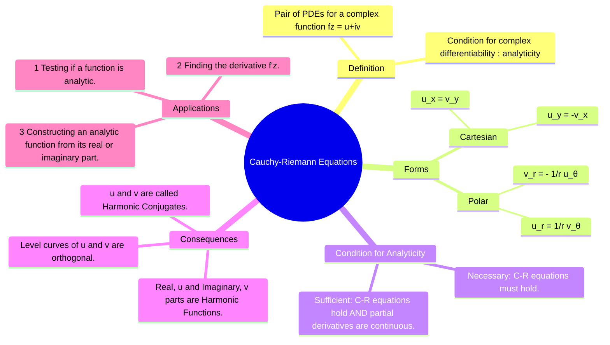

---
tags:
  - complex-analysis
  - calculus
  - analyticity
  - harmonic-functions
  - engineering-math
created: 2025-09-08
aliases:
  - C-R Equations
  - CR Equations
subject: "[[Mathematics]]"
parent:
  - Complex Analysis
formula:
  - "Cauchy-Riemann (CR) Equations (Cartesian Form) (Analytic Function) : $$\\frac{\\partial u}{\\partial x} = \\frac{\\partial v}{\\partial y} \\quad \\text{and} \\quad \\frac{\\partial u}{\\partial y} = -\\frac{\\partial v}{\\partial x}$$"
  - "Cauchy-Riemann (CR) Equations (Polar Form) : $$\\frac{\\partial u}{\\partial r} = \\frac{1}{r}\\frac{\\partial v}{\\partial \\theta} \\quad \\text{and} \\quad \\frac{\\partial v}{\\partial r} = -\\frac{1}{r}\\frac{\\partial u}{\\partial \\theta}$$"
---
### Cauchy-Riemann Equations
#cauchy-riemann-equations #analyticity #complex-analysis

> The Cauchy-Riemann (C-R) equations are a pair of partial differential equations that form a necessary and, with an additional condition, sufficient test for a complex function to be **analytic** (complex differentiable) at a point. They connect the partial derivatives of the real and imaginary parts of the function.

A function $f(z)$ is analytic in a region if it is differentiable at every point in that region.

###### Mind Map

---

#### Cartesian Form
#cr-equations/cartesian

Let a complex function be defined as $f(z) = u(x,y) + i v(x,y)$, where $z = x+iy$. For $f(z)$ to be analytic, the partial derivatives of its real part $u(x,y)$ and imaginary part $v(x,y)$ must satisfy the C-R equations:
$$\boxed{\quad \frac{\partial u}{\partial x} = \frac{\partial v}{\partial y} \quad \text{and} \quad \frac{\partial u}{\partial y} = -\frac{\partial v}{\partial x} \quad}$$
These are often written in subscript notation as $u_x = v_y$ and $u_y = -v_x$.

#### Polar Form
#cr-equations/polar

In polar coordinates, let $z=re^{i\theta}$ and $f(z) = u(r,\theta) + i v(r,\theta)$. The C-R equations are:
$$\boxed{\quad \frac{\partial u}{\partial r} = \frac{1}{r}\frac{\partial v}{\partial \theta} \quad \text{and} \quad \frac{\partial v}{\partial r} = -\frac{1}{r}\frac{\partial u}{\partial \theta} \quad}$$
This form is particularly useful when the function involves powers of $z$ or $\ln(z)$.

---
#### Condition for Analyticity
#analyticity-condition

*   **Necessary Condition**: For a function $f(z)$ to be analytic in a region, it is necessary that the Cauchy-Riemann equations are satisfied at all points in that region.
*   **Sufficient Condition**: A function $f(z)$ is analytic in a region if:
    1.  The four partial derivatives ($u_x, u_y, v_x, v_y$) exist and are continuous.
    2.  The Cauchy-Riemann equations are satisfied.

---
#### Consequences of the C-R Equations
#harmonic-functions #laplaces-equation 

If $f(z) = u+iv$ is analytic, it has profound consequences:
1.  **Harmonic Functions**: Both the real part $u(x,y)$ and the imaginary part $v(x,y)$ satisfy **Laplace's equation**.
    $$\boxed{\quad \nabla^2 u = \frac{\partial^2 u}{\partial x^2} + \frac{\partial^2 u}{\partial y^2} = 0 \quad \text{and} \quad \nabla^2 v = \frac{\partial^2 v}{\partial x^2} + \frac{\partial^2 v}{\partial y^2} = 0 \quad}$$
    Functions that satisfy Laplace's equation are called **harmonic functions**. $u$ and $v$ are known as **conjugate harmonic functions**.
2.  **Finding the Derivative**: If $f(z)$ is analytic, its derivative $f'(z)$ can be calculated using only the partial derivatives:
    $$\boxed{\quad f'(z) = \frac{\partial u}{\partial x} + i \frac{\partial v}{\partial x} = \frac{\partial v}{\partial y} - i \frac{\partial u}{\partial y} \quad}$$

---
#### Application: Finding the Harmonic Conjugate
#application/cr-equations 

A common problem is to find the harmonic conjugate $v(x,y)$ given $u(x,y)$.
1.  Start with the first C-R equation: $\frac{\partial v}{\partial y} = \frac{\partial u}{\partial x}$.
2.  Integrate with respect to $y$: $v(x,y) = \int \frac{\partial u}{\partial x} dy + g(x)$, where $g(x)$ is an arbitrary function of $x$.
3.  Differentiate this result for $v$ with respect to $x$ to find $\frac{\partial v}{\partial x}$.
4.  Use the second C-R equation, $\frac{\partial v}{\partial x} = -\frac{\partial u}{\partial y}$, to solve for $g'(x)$.
5.  Integrate $g'(x)$ to find $g(x)$, which completes the expression for $v(x,y)$.

---
### Related Concepts
#related-concepts

> [[Complex Analysis]] (Parent topic)

[[Poles and Zeros]]
[[Residue Theorem]]
[[Laplacian]] (The operator used in Laplace's Equation)