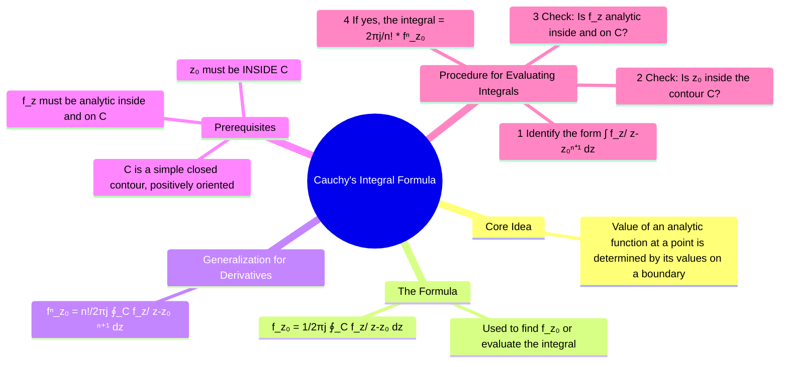

---
tags:
  - complex-analysis
  - complex-integration
  - cauchys-formula
  - analytic-functions
  - engineering-math
created: 2025-09-15
aliases:
  - Cauchy's Formula
  - CIF
  - "Example : Simple Pole : Cauchy's Integral Formula"
  - "Example : Higher-Order Pole : Cauchy's Integral Formula"
  - How to use the Cauchy's Integral Formula for Integral Evaluation?
subject: "[[Mathematics]]"
parent: "[[Contour Integration]]"
confidence: 10
formula:
  - "Cauchy's Integral Formula : $$f(z_0) = \\frac{1}{2\\pi j} \\oint_C \\frac{f(z)}{z-z_0} \\, dz \\implies \\oint_C \\frac{f(z)}{z-z_0} \\, dz = 2\\pi j \\cdot f(z_0)$$"
  - "Cauchy's Integral Formula (Generalized Formula for Derivatives) : $$f^{(n)}(z_0) = \\frac{n!}{2\\pi j} \\oint_C \\frac{f(z)}{(z-z_0)^{n+1}} \\, dz \\implies \\oint_C \\frac{f(z)}{(z-z_0)^{n+1}} \\, dz = \\frac{2\\pi j}{n!} \\cdot f^{(n)}(z_0)$$"
---
###### Mind Map

---
### Cauchy's Integral Formula
#cauchys-integral-formula #complex-integration #analytic-function

> **Cauchy's Integral Formula** is a central result in complex analysis that expresses the value of an [[analytic functions|analytic function]] at any point inside a closed contour in terms of an integral of that function along the contour. It is a remarkable formula that highlights the rigid structure of analytic functions. In practice, it is primarily used as a powerful tool for **evaluating [[Contour Integration|contour integrals]]** where the integrand has a simple [[1. Mathematics/4. Complex Variables/Poles and Zeros|pole]] or a pole of higher order.

#### The Formula for the Function Value
#cauchys-formula

> [!definition] Statement
> Let $f(z)$ be a function that is analytic inside and on a simple closed contour $C$ (traversed counter-clockwise). If $z_0$ is any point **inside** $C$, then the value of the function at $z_0$ is given by: $$\boxed{\quad f(z_0) = \frac{1}{2\pi j} \oint_C \frac{f(z)}{z-z_0} \, dz \quad}$$
> This can be rearranged for the purpose of evaluating integrals: $$\boxed{\quad \oint_C \frac{f(z)}{z-z_0} \, dz = 2\pi j \cdot f(z_0) \quad}$$
^statement

**Key Conditions**:
1. **Analyticity of $f(z)$**: The function in the numerator, $f(z)$, must be analytic everywhere inside the contour.
2. **Location of $z_0$**: The point $z_0$ (which makes the denominator zero) must be strictly **inside** the contour $C$. If $z_0$ is outside $C$, the entire integrand is analytic inside $C$, and the integral is zero by [[Cauchy's Integral Theorem#The Theorem Statement|Cauchy's Integral Theorem]].

---
#### The Generalized Formula for Derivatives
#cauchys-formula-derivatives

This powerful extension allows for the evaluation of integrals with higher-order poles. It states that if a function is analytic, it is also infinitely differentiable, and its derivatives can also be expressed as contour integrals.

$$\boxed{\quad f^{(n)}(z_0) = \frac{n!}{2\pi j} \oint_C \frac{f(z)}{(z-z_0)^{n+1}} \, dz \quad}$$
^generalized-formula

Rearranged for integral evaluation:
$$\boxed{\quad \oint_C \frac{f(z)}{(z-z_0)^{n+1}} \, dz = \frac{2\pi j}{n!} \cdot f^{(n)}(z_0) \quad}$$
Here, $f^{(n)}(z_0)$ is the $n$-th derivative of $f(z)$ evaluated at the point $z_0$.

---
#### How to Use the Formula for Integral Evaluation
#cauchy-integral-formula/use/step-by-step 

1.  **Identify the Form**: Look at the integral $\oint_C g(z) dz$ and try to fit the integrand $g(z)$ into the form $\frac{f(z)}{(z-z_0)^{n+1}}$.
2.  **Locate the Singularity**: Find the point $z_0$ where the denominator is zero.
3.  **Check the Contour**: Determine if $z_0$ lies inside or outside the given contour $C$.
    *   If $z_0$ is **outside** $C$, the integral is **0** (by Cauchy's Integral Theorem).
    *   If $z_0$ is **inside** $C$, proceed to the next step.
4.  **Check Analyticity of $f(z)$**: Identify the numerator function $f(z)$ and verify that it is analytic everywhere inside $C$.
5.  **Apply the Formula**:
    *   If the denominator is $(z-z_0)$ (i.e., $n=0$), the integral is $2\pi j \cdot f(z_0)$.
    *   If the denominator is $(z-z_0)^{n+1}$, calculate the $n$-th derivative $f^{(n)}(z)$. Evaluate it at $z_0$ to get $f^{(n)}(z_0)$. The integral is $\frac{2\pi j}{n!} f^{(n)}(z_0)$.

> [!pyq]- PYQ : 2019
> ![[ee_2019#^q27]]

> [!example] Example (Simple Pole)
> Evaluate $\oint_C \frac{\cos(z)}{z} dz$ where $C$ is the circle $|z|=1$.
> 1. **Form**: $f(z) = \cos(z)$, $z_0=0$, $n=0$.
> 2. **Singularity**: $z_0 = 0$.
> 3. **Contour**: $|z|=1$ is a circle of radius 1 centered at the origin. The point $z_0=0$ is clearly **inside**.
> 4. **Analyticity**: $f(z)=\cos(z)$ is analytic everywhere.
> 5. **Apply Formula**: The integral is $2\pi j \cdot f(z_0) = 2\pi j \cdot \cos(0) = 2\pi j \cdot 1 = 2\pi j$.

> [!example] Example (Higher-Order Pole)
> Evaluate $\oint_C \frac{e^{2z}}{(z+1)^4} dz$ where $C$ is the circle $|z|=2$.
> 1. **Form**: $f(z) = e^{2z}$, $z_0=-1$, $n+1=4 \implies n=3$.
> 2. **Singularity**: $z_0 = -1$.
> 3. **Contour**: $|z|=2$ is a circle of radius 2. The point $z_0=-1$ is **inside**.
> 4. **Analyticity**: $f(z)=e^{2z}$ is analytic everywhere.
> 5. **Apply Formula**: We need the 3rd derivative of $f(z)$.
>     * $f'(z) = 2e^{2z}$
>     * $f''(z) = 4e^{2z}$
>     * $f'''(z) = 8e^{2z}$
 >    * Evaluate at $z_0=-1$: $f'''(-1) = 8e^{-2}$.
 >    * The integral is $\frac{2\pi j}{n!} f^{(n)}(z_0) = \frac{2\pi j}{3!} (8e^{-2}) = \frac{2\pi j}{6} (8e^{-2}) = \frac{8\pi j}{3e^2}$.

---
### Related Concepts
#complex-analysis/related-concepts

> [[Contour Integration]]

[[Cauchy's Integral Theorem]] (The case where the integrand is fully analytic)
[[Residue Theorem]] (A generalization that handles multiple singularities)
[[Analytic Functions]]
