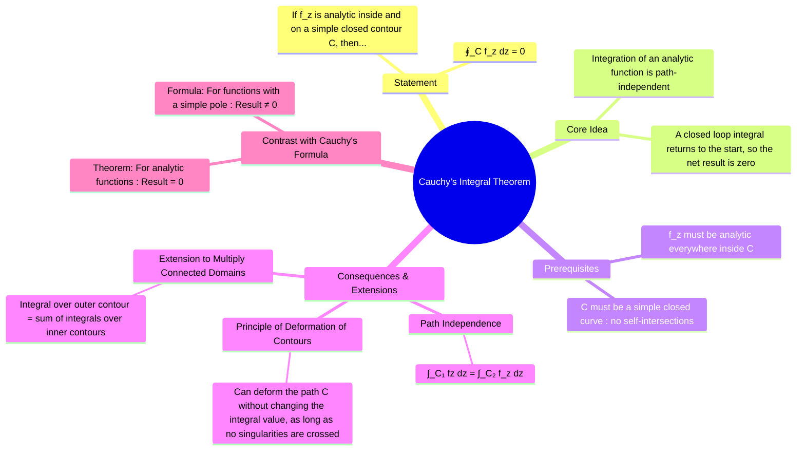

---
tags:
  - complex-analysis
  - complex-integration
  - analytic-functions
  - engineering-math
created: 2025-09-15
aliases:
  - Cauchy's Theorem
  - Cauchy-Goursat Theorem
  - "Example : Cauchy's Integral Theorem"
subject: "[[Mathematics]]"
parent: "[[Contour Integration]]"
confidence: 10
formula:
  - "Cauchy's Integral Theorem : $$\\oint_C f(z) \\, dz = 0$$"
---
### Cauchy's Integral Theorem
#cauchys-integral-theorem #complex-integration #analytic-function

> **Cauchy's Integral Theorem** is a fundamental and profound result in complex analysis. It states that if a function is **[[Analytic Functions|analytic]]** (differentiable everywhere) within a region, its integral along any simple closed path in that region is **zero**. This theorem is the starting point for many powerful results in complex integration, including [[Cauchy's Integral Formula]] and the [[Residue Theorem]].

---
#### The Theorem Statement
#cauchys-integral-theorem/statement 

> [!definition] Theorem Statement
> Let $f(z)$ be a function that is analytic in a simply connected domain $D$. For every simple closed contour $C$ that lies entirely within $D$: $$\boxed{\quad \oint_C f(z) \, dz = 0 \quad}$$
^theorem-statement

**Key Conditions**:
1.  **Analyticity**: The function $f(z)$ must be analytic everywhere *inside* and *on* the contour $C$. If there is even a single point within the contour where the function is not analytic (a singularity), the theorem does not apply.
2.  **Simple Closed Contour**: The path of integration $C$ must be a simple (does not cross itself) and closed loop.

*   **Historical Note**: The theorem is sometimes called the Cauchy-Goursat theorem. Cauchy initially proved it under the stricter condition that the derivative $f'(z)$ was continuous. Goursat later proved that the condition of analyticity alone is sufficient.

---
#### Intuition and Physical Analogy
#cauchys-integral-theorem/intuition-and-physical-analogy 

Think of an [[Analytic Functions|analytic function]] as representing a **[[conservative vector field|conservative force field]]** (like a static electric field or a gravitational field) in two dimensions. The line integral of such a field represents the work done.
* The work done by a conservative force in moving an object from point A to point B is independent of the path taken.
* If you move an object around a closed loop (starting and ending at the same point), the net work done is zero.
Cauchy's Integral Theorem is the mathematical equivalent of this physical principle for analytic functions in the complex plane.

---
#### Consequences and Extensions
#cauchys-integral-theorem/consequences #cauchys-integral-theorem/extensions 

1.  **Path Independence**: If $f(z)$ is analytic in a domain $D$, the integral of $f(z)$ between two points $z_1$ and $z_2$ is independent of the path taken within $D$.
    $$ \int_{C_1} f(z) \, dz = \int_{C_2} f(z) \, dz $$
    where $C_1$ and $C_2$ are two different paths from $z_1$ to $z_2$.

2.  **Principle of Deformation of Contours**: We can deform, shrink, or expand the contour $C$ without changing the value of the integral, provided the contour does not pass over any singularities of $f(z)$ during the deformation.

3.  **Extension to Multiply Connected Domains (Regions with Holes)**:
    If $f(z)$ is analytic in a region between two simple closed contours $C_1$ and $C_2$ (where $C_2$ is inside $C_1$), then the integral over the outer contour is equal to the integral over the inner contour (assuming the same orientation).
    $$ \oint_{C_1} f(z) \, dz = \oint_{C_2} f(z) \, dz $$
    This is extremely useful for evaluating integrals around complicated singularities by deforming the contour into a simpler shape (like a circle) around the singularity.

---
> [!Example]
> #cauchys-integral-theorem/example 
> 
> Evaluate $\oint_C e^{z^2} dz$ where $C$ is the unit circle $|z|=1$.
> *   **Function**: $f(z) = e^{z^2}$.
> *   **Analyticity**: The exponential function and polynomial functions are analytic everywhere in the complex plane. Therefore, their composition, $e^{z^2}$, is also analytic everywhere (it is an entire function).
> *   **Contour**: The unit circle is a simple closed contour.
> *   **Conclusion**: Since $f(z)$ is analytic everywhere inside and on the contour $C$, by Cauchy's Integral Theorem, the integral must be zero.
> $$\oint_C e^{z^2} dz = 0$$
> 
> No calculation is needed. This demonstrates the power of the theorem.

---
### Related Concepts
#complex-analysis/related-concepts

> [[Contour Integration]]

[[Cauchy's Integral Formula]] (Applies when the integrand is NOT analytic at a point inside C)
[[Residue Theorem]] (A generalization for multiple singularities)
[[Analytic Functions]]
[[Green's Theorem]]
[[Limits, Continuity, and Differentiability of Complex Functions]]
