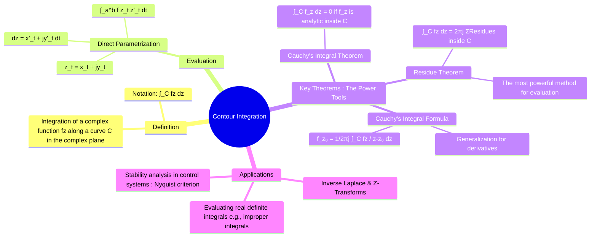

---
tags:
  - complex-analysis
  - complex-integration
  - line-integrals
  - cauchys-theorem
  - residue-theorem
  - engineering-math
created: 2025-09-15
aliases:
  - Complex Integration
  - Line Integral in the Complex Plane
  - "Example : Contour Integration"
subject: "[[Mathematics]]"
parent:
  - Complex Analysis
confidence: 10
---
###### Mind Map

---
### Contour Integration
#contour-integration #complex-integration #residue-theorem

> **Contour Integration** is the process of evaluating integrals of [[Functions of a Complex Variable|complex functions]] along curves (contours) in the complex plane. While it can be done by direct [[parameterize|parametrization]], its true power comes from a set of profound theorems—**[[Cauchy's Integral Theorem]]**, **[[Cauchy's Integral Formula]]**, and the **[[Residue Theorem]]**. These theorems often allow for the near-instantaneous evaluation of complex integrals and, remarkably, can be used to solve difficult real-valued integrals that are intractable with standard calculus methods.

#### Definition and Direct Evaluation
A contour integral of a complex function $f(z)$ along a path $C$ is denoted:
$$ \int_C f(z) \, dz $$
The most direct way to evaluate this is by **parametrization**:
1.  **Parametrize the Contour**: Represent the curve $C$ by a complex function of a real variable $t$, such as $z(t) = x(t) + jy(t)$, for $a \le t \le b$.
2.  **Find $dz$**: Differentiate $z(t)$ to find $dz = z'(t) \, dt$.
3.  **Substitute and Integrate**: Substitute $z(t)$ and $dz$ into the integral and evaluate the resulting real integral.
    $$\boxed{\quad \int_C f(z) \, dz = \int_a^b f(z(t)) z'(t) \, dt \quad}$$

> [!example]
> Evaluate $\oint_C \frac{1}{z} dz$ where $C$ is the unit circle $|z|=1$, traversed counter-clockwise.
> 1.  **Parametrize**: $z(t) = e^{jt} = \cos t + j\sin t$, for $0 \le t \le 2\pi$.
> 2.  **Find $dz$**: $dz = je^{jt} \, dt$.
> 3.  **Substitute**:$$ \oint_C \frac{1}{z} dz = \int_0^{2\pi} \frac{1}{e^{jt}} (je^{jt} \, dt) = \int_0^{2\pi} j \, dt = [jt]_0^{2\pi} = 2\pi j $$
> 
> This is a classic result that is fundamental to the [[Residue Theorem]].

---
#### The Three Major Theorems
These theorems provide powerful shortcuts that bypass direct parametrization.

##### 1. Cauchy's Integral Theorem
#cauchys-integral-theorem

This is a cornerstone of complex analysis.

![[Cauchy's Integral Theorem#^theorem-statement]]

* **Intuition**: The integral of an analytic function is path-independent. Integrating around a closed loop brings you back to the start, so the net change (the integral) is zero.

##### 2. Cauchy's Integral Formula
#cauchys-integral-formula

This remarkable formula allows you to find the value of an [[analytic functions|analytic function]] at any point inside a contour just by knowing its values on the boundary.

![[Cauchy's Integral Formula#^statement]]

A generalization also exists for derivatives:

![[Cauchy's Integral Formula#^generalized-formula]]

##### 3. The Residue Theorem
#residue-theorem

This is the most powerful tool for evaluating contour integrals. It generalizes [[Cauchy's Integral Formula]] to functions that have multiple [[Singularities of a Complex Function|singularities]] inside the contour.

![[Residue Theorem#^theorem-statement]]

---
#### Applications
#contour-integration/applications 

1. **Evaluating Real Improper Integrals**: Many real integrals of the form $\int_{-\infty}^{\infty} f(x) \, dx$ can be solved by closing a contour in the complex plane and using the [[Residue Theorem]].
2. **Inverse Laplace and Z-Transforms**: The formal definitions for the [[Inverse Laplace Transform using Partial Fraction Expansion|inverse Laplace transform]] (Bromwich integral) and [[Inverse Z-Transform|inverse Z-transform]] are contour integrals.
3. **Stability Analysis**: The [[Nyquist stability criterion]] in control theory uses a contour integral (the [[Principle of Argument|argument principle]], a consequence of the [[Residue Theorem]]) to determine the stability of a closed-loop system.

---
### Related Concepts
#complex-analysis/related-concepts

> [[Cauchy's Integral Theorem]] & [[Cauchy's Integral Formula]] 

[[Taylor Series]]
[[Laurent Series]]
[[Residue Theorem]]
[[Functions of a Complex Variable]]
[[Analytic Functions]]
