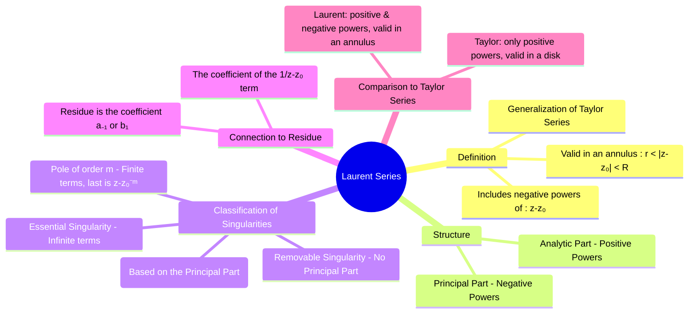

---
tags:
  - complex-analysis
  - calculus
  - series-expansion
  - singularities
  - residue-theory
created: 2025-09-08
aliases:
  - Laurent Expansion
  - "Example : Laurent Series"
subject: "[[Mathematics]]"
parent:
  - Complex Analysis
formula:
  - "Laurent Series : $$f(z) = \\sum_{n=-\\infty}^{\\infty} a_n (z-z_0)^n$$"
  - "Laurent Series (The Analytic Part) : $$\\sum_{n=0}^{\\infty} a_n (z-z_0)^n = a_0 + a_1(z-z_0) + a_2(z-z_0)^2 + \\dots$$"
  - "Laurent Series (The Principal Part) : $$\\sum_{n=1}^{\\infty} a_{-n} (z-z_0)^{-n} = \\frac{a_{-1}}{z-z_0} + \\frac{a_{-2}}{(z-z_0)^2} + \\frac{a_{-3}}{(z-z_0)^3} + \\dots$$"
---
### Laurent Series
#laurent-series #complex-analysis #singularities

> The Laurent series is a powerful generalization of the [[taylor series]] for [[Functions of a Complex Variable|complex functions]]. While a Taylor series can only represent a function in a [[disk]] where it is analytic, a Laurent series can represent a function in an **[[annulus]]** (a ring-shaped region), even if the function has a singularity at the center of the annulus. The inclusion of negative power terms is what makes this possible.

The Laurent series is the fundamental tool for [[Singularities of a Complex Function#Classification of Isolated Singularities|classifying isolated singularities]] and is the theoretical basis for the [[residue theorem]].

---
#### Definition and Form
#laurent-series/definition

If a function $f(z)$ is analytic in the [[annulus]] $r < |z - z_0| < R$, then it can be uniquely represented by the Laurent series:
$$f(z) = \sum_{n=-\infty}^{\infty} a_n (z-z_0)^n$$
This series consists of two parts:
1.  **The Analytic Part**: The terms with non-negative powers of $(z-z_0)$.
    $$\sum_{n=0}^{\infty} a_n (z-z_0)^n = a_0 + a_1(z-z_0) + a_2(z-z_0)^2 + \dots$$
2.  **The Principal Part**: The terms with negative powers of $(z-z_0)$.
    $$\sum_{n=1}^{\infty} a_{-n} (z-z_0)^{-n} = \frac{a_{-1}}{z-z_0} + \frac{a_{-2}}{(z-z_0)^2} + \frac{a_{-3}}{(z-z_0)^3} + \dots$$

---
#### Classification of Singularities using the Principal Part
#singularities #poles #essential-singularity

The **principal part** of the Laurent series is a diagnostic tool that perfectly describes the nature of an [[Singularities of a Complex Function|isolated singularity]] at $z_0$.

1.  **Removable Singularity**: The principal part is zero (all negative-power coefficients are zero). The function can be made analytic at $z_0$ by defining its value appropriately.
    * Example: $f(z) = \frac{\sin(z)}{z} = \frac{1}{z}\left(z - \frac{z^3}{3!} + \dots\right) = 1 - \frac{z^2}{3!} + \dots$ (No principal part).

2.  **Pole**: The principal part has a finite number of non-zero terms.
    * If the last non-zero term is $\frac{a_{-m}}{(z-z_0)^m}$, then $z_0$ is a **pole of order m**.
    * If $m=1$, it is a **simple pole**.
    * Example: $f(z) = \frac{e^z}{z^2} = \frac{1}{z^2}\left(1 + z + \frac{z^2}{2!} + \dots\right) = \frac{1}{z^2} + \frac{1}{z} + \frac{1}{2} + \dots$. The principal part is $\frac{1}{z^2} + \frac{1}{z}$. The highest negative power is 2, so this is a pole of order 2.

3.  **Essential Singularity**: The principal part has an infinite number of non-zero terms. The function's behavior near an essential singularity is very complex (it takes on all possible complex values, with at most one exception).
    * Example: $f(z) = e^{1/z} = 1 + \frac{1}{z} + \frac{1}{2!z^2} + \frac{1}{3!z^3} + \dots$. The principal part has infinite terms.

---
#### Residue and the Laurent Series
#residue-theorem #residue-calculation

This is the most important connection for integral calculus. The residue of a function $f(z)$ at an [[Singularities of a Complex Function|isolated singularity]] $z_0$ is defined as the coefficient of the $\frac{1}{z-z_0}$ term in its Laurent series expansion.
$$\boxed{\quad \text{Res}(f, z_0) = a_{-1} \quad}$$
Finding the Laurent series expansion is a direct way to compute the residue. For functions where a known [[taylor series]] can be used, this is often very quick.

> [!Example]
> Find the residue of $f(z) = \frac{\sin(z)}{z^4}$ at $z=0$.
> We use the [[Taylor Series#Maclaurin Series (Special Case)|maclaurin series]] for $\sin(z)$: $$\begin{align}f(z) &= \frac{1}{z^4} \left( z - \frac{z^3}{3!} + \frac{z^5}{5!} - \dots \right) \\ &= \frac{1}{z^3} - \frac{1}{6z} + \frac{z}{120} - \dots \end{align}$$
> The principal part is $\frac{1}{z^3} - \frac{1}{6z}$. The coefficient of the $\frac{1}{z}$ term is $-\frac{1}{6}$.
> Therefore, $\text{Res}(f, 0) = -1/6$.

---
### Related Concepts
#related-concepts

> [[Taylor Series]] (A special case of the Laurent series where the principal part is zero)

[[Poles and Zeros]]
[[Residue Theorem]] (Directly uses the residue, $a_{-1}$, from the Laurent series)
[[Complex Analysis]] (Parent topic)