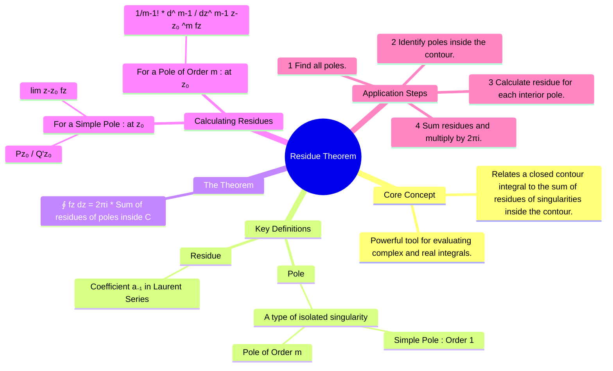

---
tags:
  - complex-analysis
  - calculus
  - integration
  - engineering-math
created: 2025-09-08
aliases:
  - Cauchy's Residue Theorem
  - Residue Integration
  - Residue Theorem
subject: "[[Mathematics]]"
parent:
  - Complex Analysis
confidence: 9
formula:
  - "Residue Theorem : $$\\oint_C f(z) dz = 2\\pi i \\sum_{k=1}^{n} \\text{Res}(f, z_k)$$"
  - "Calculating Residues (pole of order 1) : $$\\text{Res}(f, z_0) = \\lim_{z \\to z_0} (z-z_0)f(z)$$"
  - "Calculating Residues (pole of order m) : $$\\text{Res}(f, z_0) = \\frac{1}{(m-1)!} \\lim_{z \\to z_0} \\frac{d^{m-1}}{dz^{m-1}} \\left[ (z-z_0)^m f(z) \\right]$$"
  - "Calculating Residues (pole of order 1) : 🔥 If $f(z)$ can be written as a ratio $f(z) = \\frac{P(z)}{Q(z)}$, where $P(z_0) \\neq 0$ and $Q(z_0)=0$ but $Q'(z_0) \\neq 0$ $$\\text{Res}(f, z_0) = \\frac{P(z_0)}{Q'(z_0)}$$"
---
###### Mind Map

---
### Residue Theorem
#residue-theorem #complex-integration #cauchy

> The Residue Theorem, also known as Cauchy's Residue Theorem, provides a powerful and often simple method for evaluating [[Contour Integration|complex contour integrals]]. ==It connects the value of a closed [[Line Integrals|line integral]] of an [[Analytic Functions|analytic function]] to the properties of its singular points (poles) located *inside* the contour of integration.==

> [!prerequisite]
> **Singularities and Residues**
> 
> * **Pole**: An isolated singular point $z_0$ where the function $f(z)$ goes to infinity. A pole can be a **simple pole** (order 1) or a **pole of order m**.
> 
> > See [[Singularities of a Complex Function#2. Pole]]
> 
> * **Residue**: The coefficient of the $\frac{1}{z-z_0}$ term (the $a_{-1}$ term) in the **[[Laurent series]] expansion** of $f(z)$ around the pole $z_0$. The residue is the only part of the series that contributes to the integral around a small loop enclosing $z_0$.
> 
> > See [[Residues#Definition via Laurent Series]]

---
#### Statement of the Residue Theorem
#residue-theorem/statement

> [!definition] Theorem Statement
> Let $f(z)$ be a function that is [[Analytic Functions|analytic]] inside and on a simple closed contour $C$, except for a finite number of poles $z_1, z_2, ..., z_n$ located inside $C$. Then, the integral of $f(z)$ taken counter-clockwise around $C$ is given by: $$\boxed{\quad \oint_C f(z) dz = 2\pi i \sum_{k=1}^{n} \text{Res}(f, z_k) \quad}$$
> where $\text{Res}(f, z_k)$ is the residue of the function $f(z)$ at the pole $z_k$.
^theorem-statement

---
#### Methods for Calculating Residues
![[Residues#Methods for Calculating Residues]]

#### Steps for Applying the Theorem
#residue-theorem/step-by-step 

1. **Find the Poles**: Identify all [[Singularities of a Complex Function|singular points]] of the function $f(z)$ by finding the roots of the denominator.
2. **Locate the Poles**: Determine which of the poles lie *inside* the given closed contour $C$. Ignore any poles outside the contour.
3. **[[#Methods for Calculating Residues|Calculate the Residues]]**: For each pole inside the contour, calculate its residue using the appropriate formula (simple pole or pole of order m).
4. **Sum and Multiply**: Sum up all the calculated residues and multiply the result by $2\pi i$ to get the value of the integral.

---
### Related Concepts
#residue-theorem/related-concepts

> [[Complex Analysis]] (The parent subject)

[[Poles and Zeros]]
[[Laurent Series]] (The theoretical basis for residues)
[[Cauchy's Integral Formula]] (A related theorem, can be seen as a special case of the residue theorem)
[[Indeterminate Forms (L'Hôpital's Rule)|L'Hopital's Rule]] (Used in one of the residue calculation methods)