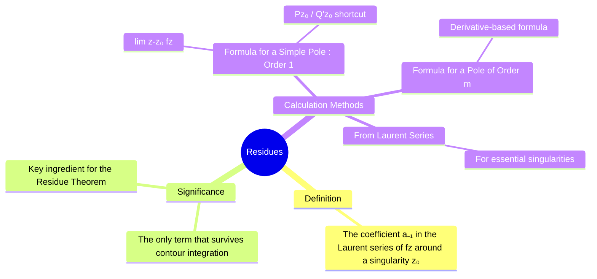

---
tags:
  - complex-analysis
  - complex-integration
  - residue-theorem
  - laurent-series
  - engineering-math
created: 2025-09-15
aliases:
  - Residue
  - Residue Calculation
  - Calculating Residues
  - "Example : Find Residue"
  - "Example : Find Residue at Double Pole"
subject: "[[Mathematics]]"
parent: "[[Singularities of a Complex Function]]"
confidence: 10
---
###### Mind Map

---
### Residues
#residues #complex-analysis #laurent-series

> ==The **residue** of a complex function at an [[Singularities of a Complex Function|isolated singularity]] is a specific complex number that quantifies the behavior of the function around that singularity. It is defined as the coefficient of the $(z-z_0)^{-1}$ term in the [[Laurent series]] expansion.== The concept of the residue is of paramount importance because it provides a simple and powerful way to evaluate contour integrals via the [[residue theorem]].

#### Definition via Laurent Series
#laurent-series #residue-definition

The **residue** of a function $f(z)$ at an isolated singular point $z_0$, denoted $\text{Res}(f, z_0)$, is the coefficient $a_{-1}$ in the [[laurent series#Residue and the Laurent Series|laurent series]] expansion of $f(z)$ around $z_0$:
$$ f(z) = \sum_{n=-\infty}^{\infty} a_n (z-z_0)^n = \dots + \frac{a_{-2}}{(z-z_0)^2} + \frac{\mathbf{a_{-1}}}{z-z_0} + a_0 + a_1(z-z_0) + \dots $$
$$\boxed{\quad \text{Res}(f, z_0) = a_{-1} \quad}$$
**Why is $a_{-1}$ special?** When integrating $f(z)$ around a closed contour enclosing $z_0$, the integral of every other term $(z-z_0)^n$ is zero, except for the $a_{-1}$ term:
$$ \oint_C \frac{a_{-1}}{z-z_0} dz = a_{-1} \oint_C \frac{1}{z-z_0} dz = a_{-1} (2\pi j) $$
This direct link between the residue and the integral is the basis of the [[Residue Theorem]].

---
#### Methods for Calculating Residues
#residue-calculation

While the [[Laurent series]] provides the definition, it is often impractical for calculation. The following formulas are used to find residues at poles.

##### Case 1: Simple Pole (Pole of Order 1)
If $z_0$ is a simple pole of $f(z)$, the residue can be calculated in two ways:
1.  **Standard Formula**:
    $$\boxed{\quad \text{Res}(f, z_0) = \lim_{z \to z_0} (z-z_0) f(z) \quad}$$
2.  **Quotient Rule Shortcut**: If $f(z)$ can be written as a quotient $f(z) = \frac{P(z)}{Q(z)}$, where $P(z_0) \neq 0$ and $Q(z)$ has a simple zero at $z_0$ (i.e., $Q(z_0)=0$ and $Q'(z_0) \neq 0$), then:
    $$\boxed{\quad \text{Res}(f, z_0) = \frac{P(z_0)}{Q'(z_0)} \quad}$$
    This formula is often much faster than the limit formula.

> [!example]
> Find the residue of $f(z) = \frac{z}{z^2+1}$ at $z=j$.
> The function has simple poles at $z=j$ and $z=-j$. Let's find the residue at $z_0=j$.
> * **Method 1**: $f(z) = \frac{z}{(z-j)(z+j)}$.
> $$\text{Res}(f, j) = \lim_{z \to j} (z-j)\frac{z}{(z-j)(z+j)} = \lim_{z \to j} \frac{z}{z+j} = \frac{j}{2j} = \frac{1}{2}$$
> * **Method 2**: $P(z) = z$, $Q(z) = z^2+1 \implies Q'(z) = 2z$.
>$$\text{Res}(f, j) = \frac{P(j)}{Q'(j)} = \frac{j}{2j} = \frac{1}{2}$$

---
##### Case 2: Pole of Order $m$
If $z_0$ is a pole of order $m$, the residue is calculated using the following formula involving derivatives:
$$\boxed{\quad \text{Res}(f, z_0) = \frac{1}{(m-1)!} \lim_{z \to z_0} \frac{d^{m-1}}{dz^{m-1}} \left[ (z-z_0)^m f(z) \right] \quad}$$

> [!example]
> Find the residue of $f(z) = \frac{1}{z(z-1)^2}$ at the double pole $z_0=1$.
> Here, $m=2$.
> $$\begin{align} \text{Res}(f, 1) &= \frac{1}{(2-1)!} \lim_{z \to 1} \frac{d}{dz} \left[ (z-1)^2 \frac{1}{z(z-1)^2} \right] \\ &= \lim_{z \to 1} \frac{d}{dz} \left[ \frac{1}{z} \right] = \lim_{z \to 1} \left[ -\frac{1}{z^2} \right] = -1 \end{align}$$

> [!pyq]- PYQ : 2018
> ![[ee_2018#^q35]]

---
##### Case 3: Essential Singularity
There is no simple formula. The residue must be found by writing out the **Laurent series expansion** and identifying the coefficient $a_{-1}$.

---
### Related Concepts
#complex-analysis/related-concepts

> [[Residue Theorem]] (The primary application)

[[Singularities of a Complex Function]] (Prerequisite for understanding where to find residues)
[[Taylor Series]]  & [[Laurent Series]] (The theoretical foundation)
[[Contour Integration]]
