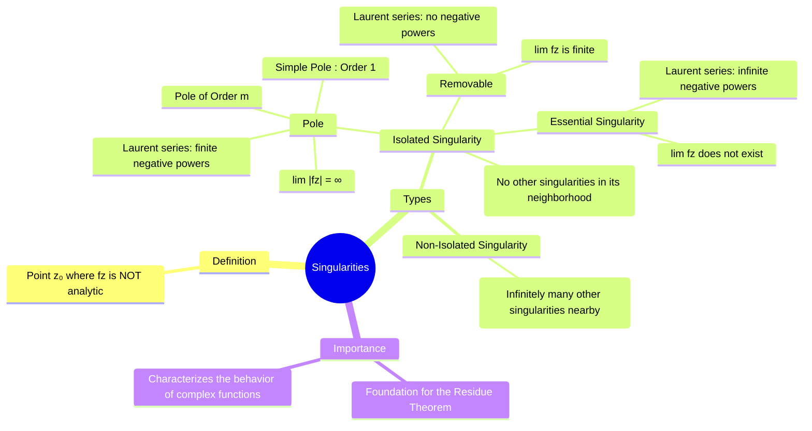

---
tags:
  - complex-analysis
  - complex-functions
  - singularities
  - poles
  - residue-theorem
  - engineering-math
created: 2025-09-15
aliases:
  - Singularities
  - Singular Point
  - Complex Singularities
  - Classification of Isolated Singularities
  - "Example : Removable Singularity : Singularities of a Complex Function"
  - "Example : Pole : Singularities of a Complex Function"
  - "Example : Essential Singularity : Singularities of a Complex Function"
subject: "[[Mathematics]]"
parent: "[[Analytic Functions]]"
---
### Singularities of a Complex Function
#singularities #poles #essential-singularity #complex-analysis

> ==A **singularity** of a complex function $f(z)$ is a point $z_0$ at which the function fails to be [[Analytic Functions|analytic]].== The behavior of a function near its singularities is a central theme of complex analysis. Understanding and classifying these points is the crucial prerequisite for using the [[residue theorem]] to evaluate contour integrals.
^intro

###### Mind Map

---

#### Isolated vs. Non-Isolated Singularities
#isolated-singularity #non-isolated-singularity

A singularity $z_0$ is said to be **isolated** if there exists a "deleted neighborhood" (a small disk around $z_0$ with $z_0$ itself removed) in which $f(z)$ is analytic. GATE problems almost exclusively deal with isolated singularities.

*   **Isolated**: $f(z) = \frac{1}{(z-1)(z-2)}$ has isolated singularities at $z=1$ and $z=2$.
*   **Non-Isolated**: $f(z) = \csc(1/z)$ has a non-isolated singularity at $z=0$.

> [!pyq]- PYQ : 2019
> ![[ee_2019#^q4]]

---
#### Classification of Isolated Singularities
#isolated-singularity/classification

Isolated singularities are classified into three types based on the behavior of the function as $z$ approaches the singular point $z_0$.

##### 1. Removable Singularity
#removable-singularity 

A singularity $z_0$ is **removable** if the function can be made analytic at that point by defining or redefining its value appropriately.
*   **Test**: The limit $\lim_{z \to z_0} f(z)$ exists and is **finite**.
*   **[[Laurent Series]]**: The series expansion around $z_0$ has no negative power terms (i.e., it's a [[taylor series]]).
*   **Example**: $f(z) = \frac{\sin(z)}{z}$ at $z_0=0$.
    *   By L'Hôpital's rule, $\lim_{z \to 0} \frac{\sin(z)}{z} = \lim_{z \to 0} \frac{\cos(z)}{1} = 1$.
    *   Since the limit is finite, the singularity is removable.

---
##### 2. Pole
#poles 

A singularity $z_0$ is a **pole** if the function "blows up" to infinity at that point.
*   **Test**: The limit $\lim_{z \to z_0} |f(z)| = \infty$.
*   **Laurent Series**: The series has a finite number of negative power terms.
*   **Order of a Pole**: A point $z_0$ is a pole of order **m** if:
    $$\boxed{\quad \lim_{z \to z_0} (z-z_0)^m f(z) = L \quad}$$
    where $L$ is a finite, non-zero complex number.
    *   **Simple Pole**: A pole of order $m=1$. This is the most common case.
    *   **Double Pole**: A pole of order $m=2$.

*   **Example**: Classify the singularity of $f(z) = \frac{e^z}{(z-1)^3}$ at $z_0=1$.
    *   Clearly, as $z \to 1$, the denominator goes to zero and the numerator is finite ($e^1$), so $|f(z)| \to \infty$. It is a pole.
    *   Let's check the order with $m=3$:
        $\lim_{z \to 1} (z-1)^3 f(z) = \lim_{z \to 1} (z-1)^3 \frac{e^z}{(z-1)^3} = \lim_{z \to 1} e^z = e$.
    *   Since the limit is finite and non-zero, $z_0=1$ is a **pole of order 3**.

---
##### 3. Essential Singularity
#essential-singularity 

A singularity $z_0$ is **essential** if it is neither removable nor a pole.
*   **Test**: The limit $\lim_{z \to z_0} f(z)$ does not exist (neither finite nor infinite). The function's behavior near the point is wild and chaotic.
*   **Laurent Series**: The series has an infinite number of negative power terms.
*   **Example**: $f(z) = e^{1/z}$ at $z_0=0$.
    *   The Laurent series is $1 + \frac{1}{z} + \frac{1}{2!z^2} + \frac{1}{3!z^3} + \dots$, which has infinite negative power terms.
    *   If we approach $z=0$ along the positive real axis ($z=x$), $\lim_{x \to 0^+} e^{1/x} = \infty$.
    *   If we approach along the negative real axis ($z=-x$), $\lim_{x \to 0^+} e^{-1/x} = 0$.
    *   Since the limit depends on the path, it does not exist. This is an essential singularity.

---
### Related Concepts
#complex-analysis/related-concepts

> [[Analytic Functions]]

[[Residue Theorem]] (The main application of classifying singularities)
[[Taylor Series]] & [[Laurent Series]] (The theoretical basis for classification)
[[Contour Integration]]
[[Functions of a Complex Variable]]