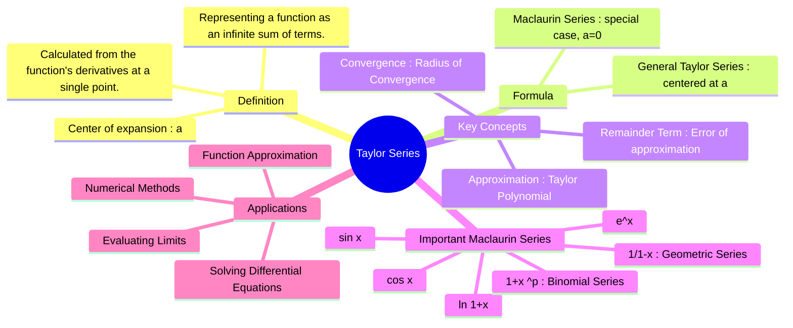

---
tags:
  - calculus
  - series-expansion
  - approximation
  - engineering-math
created: 2025-09-08
aliases:
  - Taylor Expansion
  - Taylor Series Expansion
  - Maclaurin Series
  - "Video : Taylor Series (3Blue1Brown)"
  - Taylor Polynomial
subject: "[[Mathematics]]"
parent:
  - Calculus
confidence: 9
youtube:
  - 3d6DsjIBzJ4
formula:
  - "Taylor Series : $$f(x) = \\sum_{n=0}^{\\infty} \\frac{f^{(n)}(a)}{n!}(x-a)^n = f(a) + \\frac{f'(a)}{1!}(x-a) + \\frac{f''(a)}{2!}(x-a)^2 + \\frac{f'''(a)}{3!}(x-a)^3 + \\dots$$"
  - "Maclaurin Series : $$f(x) = \\sum_{n=0}^{\\infty} \\frac{f^{(n)}(0)}{n!}x^n = f(0) + f'(0)x + \\frac{f''(0)}{2!}x^2 + \\frac{f'''(0)}{3!}x^3 + \\dots$$"
  - "Exponential Function (Taylor Series/Maclaurin Series) : $$e^x = 1 + x + \\frac{x^2}{2!} + \\frac{x^3}{3!} + \\dots = \\sum_{n=0}^{\\infty} \\frac{x^n}{n!}$$"
  - "Sine Function (Taylor Series/Maclaurin Series) : $$\\sin(x) = x - \\frac{x^3}{3!} + \\frac{x^5}{5!} - \\dots = \\sum_{n=0}^{\\infty} (-1)^n \\frac{x^{2n+1}}{(2n+1)!}$$"
  - "Cosine Function (Taylor Series/Maclaurin Series) : $$\\cos(x) = 1 - \\frac{x^2}{2!} + \\frac{x^4}{4!} - \\dots = \\sum_{n=0}^{\\infty} (-1)^n \\frac{x^{2n}}{(2n)!}$$"
---
###### Mind Map

---
### Taylor Series
#taylor-series #function-approximation #series-expansion

> The Taylor series is a representation of a function as an infinite sum of terms, calculated from the values of the function's derivatives at a single point. It is one of the most powerful tools in mathematics, allowing for the approximation of complex functions with simpler polynomial functions.

If a function $f(x)$ is infinitely differentiable at a point $x=a$, its Taylor series expansion around $x=a$ is given by:
$$\boxed{\quad f(x) = \sum_{n=0}^{\infty} \frac{f^{(n)}(a)}{n!}(x-a)^n \quad}$$
$$f(x) = f(a) + \frac{f'(a)}{1!}(x-a) + \frac{f''(a)}{2!}(x-a)^2 + \frac{f'''(a)}{3!}(x-a)^3 + \dots$$
where $f^{(n)}(a)$ is the $n$-th derivative of $f$ evaluated at the point $a$.

#### Maclaurin Series (Special Case)
#maclaurin-series

A Maclaurin series is simply a Taylor series centered at the origin, i.e., when $a=0$.
$$\boxed{\quad f(x) = \sum_{n=0}^{\infty} \frac{f^{(n)}(0)}{n!}x^n \quad}$$
$$f(x) = f(0) + f'(0)x + \frac{f''(0)}{2!}x^2 + \frac{f'''(0)}{3!}x^3 + \dots$$

---
#### Standard Maclaurin Series Expansions
#maclaurin-series/standard-expansions

These are frequently used in GATE for evaluating limits, integrals, and approximations.
1.  **Exponential Function**:
    $$\boxed{\quad e^x = 1 + x + \frac{x^2}{2!} + \frac{x^3}{3!} + \dots = \sum_{n=0}^{\infty} \frac{x^n}{n!} \quad} \quad (\text{for all } x)$$
    > [!related]
    > [[State Transition Matrix (STM)#2. Infinite Series Expansion|Matrix Exponential Expansion]]
2.  **Sine Function**:
    $$\boxed{\quad \sin(x) = x - \frac{x^3}{3!} + \frac{x^5}{5!} - \dots = \sum_{n=0}^{\infty} (-1)^n \frac{x^{2n+1}}{(2n+1)!} \quad} \quad (\text{for all } x)$$
3.  **Cosine Function**:
    $$\boxed{\quad \cos(x) = 1 - \frac{x^2}{2!} + \frac{x^4}{4!} - \dots = \sum_{n=0}^{\infty} (-1)^n \frac{x^{2n}}{(2n)!} \quad} \quad (\text{for all } x)$$
4.  **Natural Logarithm**:
    $$\boxed{\quad \ln(1+x) = x - \frac{x^2}{2} + \frac{x^3}{3} - \dots = \sum_{n=1}^{\infty} (-1)^{n-1} \frac{x^n}{n} \quad} \quad (\text{for } |x|<1)$$
5.  **Geometric Series**:
    $$\boxed{\quad \frac{1}{1-x} = 1 + x + x^2 + x^3 + \dots = \sum_{n=0}^{\infty} x^n \quad} \quad (\text{for } |x|<1)$$
6.  **Binomial Series**: For any real number $p$:
    $$\boxed{\quad (1+x)^p = 1 + px + \frac{p(p-1)}{2!}x^2 + \frac{p(p-1)(p-2)}{3!}x^3 + \dots \quad} \quad (\text{for } |x|<1)$$

---
#### Taylor Polynomial and Remainder
#taylor-polynomial #approximation-error

Truncating the Taylor series after the $(x-a)^n$ term gives the **$n$-th degree Taylor polynomial**, $T_n(x)$, which is a polynomial approximation of the function $f(x)$ near $x=a$.
The error in this approximation is given by the **remainder term**, $R_n(x) = f(x) - T_n(x)$. **Lagrange's form of the remainder** is:
$$R_n(x) = \frac{f^{(n+1)}(c)}{(n+1)!}(x-a)^{n+1}$$
for some number $c$ between $a$ and $x$.

#### Applications
#taylor-series/applications

1.  **Evaluating Limits**: Series expansions are extremely useful for solving indeterminate forms (e.g., $0/0$), often simplifying the problem more quickly than [[Indeterminate Forms (L'Hôpital's Rule)|L'Hôpital's Rule]].
2.  **Function Approximation**: Approximating complex non-linear functions with simpler, computationally efficient polynomials. This is fundamental in calculators and computer software.
3.  **Solving Differential Equations**: Finding series solutions for differential equations that cannot be solved by other methods.
4.  **Numerical Methods**: The basis for many numerical techniques, including methods for root finding and integration.

---
### Related Concepts
#related-concepts

> [[Limits, Continuity, and Differentiability]]
> [[Limits, Continuity, and Differentiability of Complex Functions]]

[[Differentiation]]
[[Linearization]]
[[Indeterminate Forms (L'Hôpital's Rule)|L'Hopital's Rule]]
[[Mean Value Theorems]] (Used to derive the remainder term)
[[Complex Analysis]] (Taylor series is extended to complex functions as the foundation for analytic functions)
[[Geometric Series and its derivatives]]