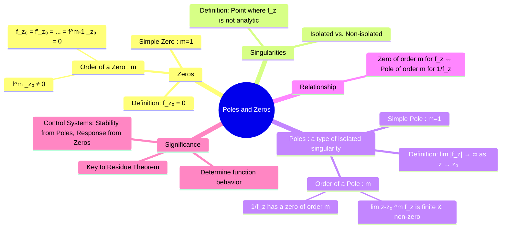

---
tags:
  - complex-analysis
  - calculus
  - poles
  - zeros
  - singularities
  - engineering-math
created: 2025-09-08
aliases:
  - Poles
  - Zeros of a function
  - Singularities
subject: "[[Mathematics]]"
parent:
  - Complex Analysis
confidence: 9
---
###### Mind Map

---
### Poles and Zeros
#poles-and-zeros #complex-analysis

> In complex analysis, zeros and poles are fundamental concepts that describe the behavior of a function $f(z)$. A **zero** is a point where the function becomes zero. A **pole** is a type of singularity where the function's magnitude goes to infinity. Understanding the location and order of poles and zeros is essential for evaluating complex integrals via the [[Residue Theorem]] and for analyzing the stability of systems in control theory.

#### Zeros of a Complex Function
#zeros 

A point $z_0$ in the domain of a function $f(z)$ is a **zero** if $f(z_0) = 0$.

* **Order of a Zero**: A function $f(z)$ has a **zero of order m** at $z=z_0$ if the function and its first $m-1$ derivatives are zero at $z_0$, but the $m$-th derivative is non-zero.
    $$f(z_0) = f'(z_0) = \dots = f^{(m-1)}(z_0) = 0, \quad \text{but} \quad f^{(m)}(z_0) \neq 0$$
    A zero of order 1 is called a **simple zero**.
    Alternatively, $f(z)$ has a zero of order $m$ at $z_0$ if it can be written as $f(z) = (z-z_0)^m g(z)$, where $g(z)$ is analytic and non-zero at $z_0$.

---
#### Singularities and Poles
#singularities #poles

A **singularity** is a point where a function is not [[analytic functions|analytic]]. A pole is a specific type of **isolated singularity**.

* **Pole**: An isolated singularity $z_0$ is a **pole** if the magnitude of the function approaches infinity as $z$ approaches $z_0$.
    $$\lim_{z \to z_0} |f(z)| = \infty$$
* **Order of a Pole**: A function $f(z)$ has a **pole of order m** at $z=z_0$ if the function $g(z) = \frac{1}{f(z)}$ has a zero of order $m$ at $z=z_0$.
    A pole of order 1 is called a **simple pole**.
    A practical test for the order of a pole is to find the smallest integer $m \geq 1$ such that the following limit is a finite, non-zero constant:
    $$\boxed{\quad \lim_{z \to z_0} (z-z_0)^m f(z) = \text{finite and non-zero} \quad}$$

---
#### Relationship between Poles and Zeros

There is a direct reciprocal relationship:
> If a function $f(z)$ has a zero of order $m$ at $z=z_0$, then the function $g(z) = 1/f(z)$ has a pole of order $m$ at $z=z_0$.

---
#### Application to Transfer Functions
#control-systems #transfer-function

In [[Control Systems]] and [[Signals & Systems]], the concepts of poles and zeros are used to analyze a system's behavior via its **transfer function**, $H(s) = \frac{N(s)}{D(s)}$.
* **Zeros**: The roots of the numerator polynomial, $N(s) = 0$. These are the complex frequencies where the system's response is zero.
* **Poles**: The roots of the denominator polynomial, $D(s) = 0$. These are the roots of the system's characteristic equation.

The locations of these poles and zeros in the s-plane determine everything about the system:
* **Poles**: The location of the [[closed-loop poles]] determines the system's **stability** and the nature of its **transient response** (e.g., exponential decay, oscillations).
* **Zeros**: The zeros affect the **amplitude** and **phase** of the system's frequency response and can create nulls or notches at specific frequencies.

---
### Related Concepts
#related-concepts

> [[Complex Analysis]] (Parent topic)

[[Residue Theorem]] (Relies on finding the residues at the poles)
[[Laurent Series]] (The structure of the Laurent series defines the type of singularity)
[[System Stability]] (Determined by the location of the poles)
[[The Transfer Function H(s)]]