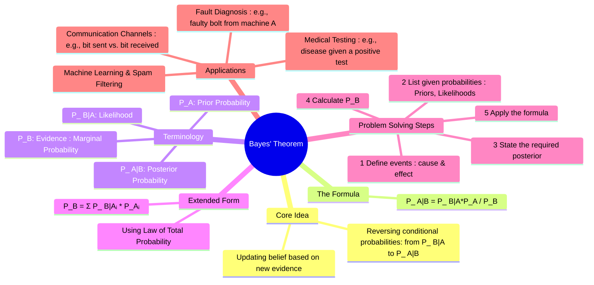

---
tags:
  - probability
  - statistics
  - bayesian-inference
  - conditional-probability
  - engineering-math
created: 2025-09-08
aliases:
  - Bayes' Rule
  - Bayesian Theorem
subject: "[[Mathematics]]"
parent:
  - Probability and Statistics
confidence: 9
---
###### Mind Map

---
### Bayes' Theorem
#bayes-theorem #conditional-probability #bayesian-inference

> Bayes' theorem is a fundamental theorem in probability theory that describes how to update the probability of a hypothesis based on new evidence. It provides a way to "reverse" conditional probabilities; if we know the probability of an effect given a cause, Bayes' theorem lets us find the probability of that cause given the effect.

It is the mathematical foundation of Bayesian inference.

#### Statement of the Theorem
#bayes-theorem/formula

For any two events A and B, where $P(B) \neq 0$, Bayes' theorem is stated as:
$$\boxed{\quad P(A|B) = \frac{P(B|A) P(A)}{P(B)} \quad}$$
Where:
*   **$P(A|B)$ (Posterior Probability)**: The probability of hypothesis A being true, *after* observing the evidence B. This is what we typically want to find.
*   **$P(B|A)$ (Likelihood)**: The probability of observing evidence B, *given* that hypothesis A is true.
*   **$P(A)$ (Prior Probability)**: The initial probability of hypothesis A being true, *before* considering any new evidence.
*   **$P(B)$ (Evidence or Marginal Probability)**: The total probability of observing the evidence B, regardless of the hypothesis.

---
#### Extended Form (using the Law of Total Probability)
#law-of-total-probability

In most practical problems, the denominator $P(B)$ is not given directly. It is calculated using the [[Law of Total Probability]]. If $A_1, A_2, ..., A_n$ are a set of mutually exclusive and exhaustive events (i.e., they partition the sample space), then the probability of event B is:
$$P(B) = \sum_{i=1}^{n} P(B|A_i)P(A_i)$$
Substituting this into Bayes' theorem gives the most common form used for calculations:
$$\boxed{\quad P(A_k|B) = \frac{P(B|A_k)P(A_k)}{\sum_{i=1}^{n} P(B|A_i)P(A_i)} \quad}$$

---
#### Steps to Solve GATE Problems
#bayes-theorem/problem-solving

GATE problems involving Bayes' theorem often involve scenarios like manufacturing defects, communication channels, etc.
1.  **Define Events**: Identify the "causes" (hypotheses, $A_i$) and the "effect" (evidence, $B$).
    *   *Example Cause*: The bolt was manufactured by Machine A ($A_1$), B ($A_2$), or C ($A_3$).
    *   *Example Effect*: The selected bolt is defective ($B$).
2.  **List Probabilities**: Write down all probabilities given in the problem statement.
    *   **Priors ($P(A_i)$)**: The probability of each cause. (e.g., $P(A_1)=0.25$, the probability of selecting a bolt from Machine A).
    *   **Likelihoods ($P(B|A_i)$)**: The probability of the effect given each cause. (e.g., $P(B|A_1)=0.05$, the probability of a bolt being defective *given* it came from Machine A).
3.  **State the Goal**: Clearly write the posterior probability you need to find.
    *   (e.g., "Find the probability the defective bolt came from Machine A", which is $P(A_1|B)$).
4.  **Calculate the Denominator ($P(B)$)**: Use the Law of Total Probability with the values from Step 2.
    *   $P(B) = P(B|A_1)P(A_1) + P(B|A_2)P(A_2) + P(B|A_3)P(A_3)$.
5.  **Apply the Formula**: Substitute the numerator and denominator into the Bayes' formula to find the answer.

---
### Related Concepts
#related-concepts

> [[Probability and Statistics]] (Parent topic)

[[Conditional Probability]] (The foundation upon which Bayes' theorem is built)
[[Law of Total Probability]] (Essential for calculating the evidence term)
[[Random Variables]]