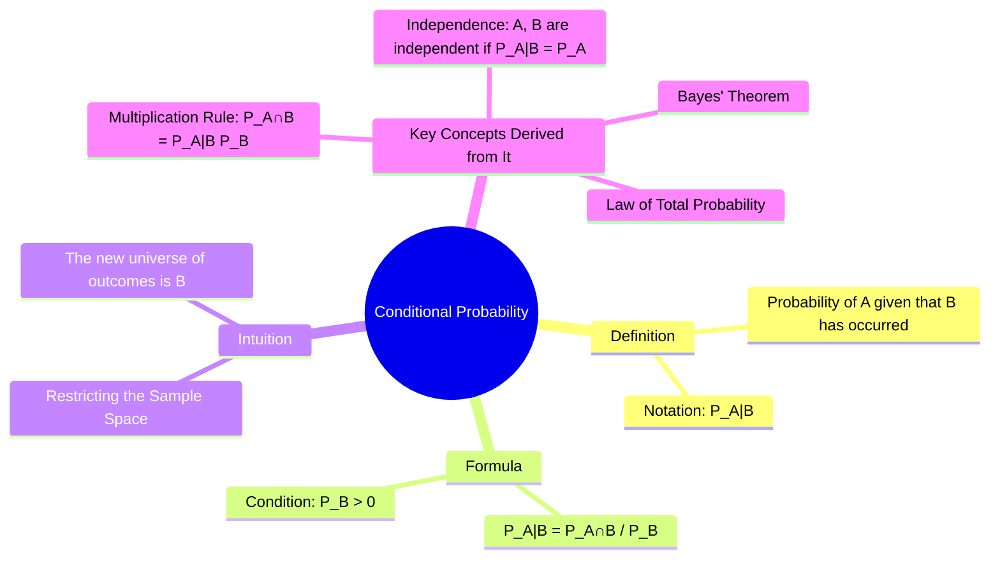

---
tags:
  - probability-theory
  - conditional-probability
  - random-variables
  - engineering-math
created: 2025-09-15
aliases:
  - Conditional Probability
  - "Example : Conditional Probability"
subject: "[[Mathematics]]"
parent: Probability and Statistics
---
### Conditional Probability
#conditional-probability #probability-theory

> **Conditional Probability** is the probability of an event occurring, given that another event has already occurred. It is a fundamental concept that allows us to update our beliefs or predictions in light of new information. The notation for the conditional probability of event A given event B is $P(A|B)$, read as "the probability of A given B".

###### Mind Map

---

#### Definition and Formula
The conditional probability of event $A$ given that event $B$ has occurred is defined as the ratio of the probability of their intersection to the probability of the conditioning event $B$.
$$\boxed{\quad P(A|B) = \frac{P(A \cap B)}{P(B)} \quad}$$
This formula is valid only if $P(B) > 0$.

*   $P(A \cap B)$ is the probability that **both** A and B occur.
*   $P(B)$ is the probability that B occurs.

---
#### Intuitive Interpretation: Restricting the Sample Space
The core idea of conditional probability is that the occurrence of event $B$ **restricts the original sample space** $S$ to a new, smaller sample space, which is just the set of outcomes in $B$. We are no longer interested in all possible outcomes, only those where $B$ is true. The conditional probability $P(A|B)$ is then the fraction of this *new* sample space $B$ that also corresponds to event $A$.

![[Conditional Probability Venn Diagram.png]]
*(In the new sample space B, the only outcomes where A can also occur are those in the intersection A∩B. Thus, the probability is (A∩B) / B).*

---
#### The Multiplication Rule
#multiplication-rule

By rearranging the definition of conditional probability, we get the **General Multiplication Rule**, which is used to find the probability of the intersection of two events.
$$\boxed{\quad P(A \cap B) = P(A|B) \cdot P(B) = P(B|A) \cdot P(A) \quad}$$
This is one of the most useful formulas in probability. It states that the probability of A and B both happening is the probability of B happening, multiplied by the probability of A happening *given that B has already happened*.

---
#### Independence
#independent-events

Conditional probability provides the formal definition of [[Independence of Events|independent events]]. Two events $A$ and $B$ are independent if the occurrence of one does not affect the probability of the other.
Mathematically, $A$ and $B$ are independent if and only if:
$$\boxed{\quad P(A|B) = P(A) \quad}$$
If this is true, the multiplication rule simplifies to the well-known formula for independent events: $P(A \cap B) = P(A) \cdot P(B)$.

---
#### Example
#conditional-probability/example

A box contains 5 red balls and 5 blue balls. Two balls are drawn without replacement. What is the probability that both balls are red?

* Let $R_1$ be the event that the first ball is red.
* Let $R_2$ be the event that the second ball is red.
We want to find $P(R_1 \cap R_2)$.

Using the multiplication rule: $P(R_1 \cap R_2) = P(R_2|R_1) \cdot P(R_1)$.

1. **$P(R_1)$**: The probability of drawing a red ball first.
    $P(R_1) = \frac{5}{10} = \frac{1}{2}$.
2. **$P(R_2|R_1)$**: The probability of drawing a second red ball, *given that the first was red*. After the first draw, there are now 9 balls left, and only 4 of them are red.
    $P(R_2|R_1) = \frac{4}{9}$.
3. **Result**:
    $P(R_1 \cap R_2) = \frac{4}{9} \cdot \frac{1}{2} = \frac{4}{18} = \frac{2}{9}$.

---
### Related Concepts
#probability-theory/related-concepts

> [[Bayes' Theorem]] (Directly uses conditional probability)

[[Law of Total Probability]]
[[Independence of Events]]
[[Axioms of Probability]]
[[Random Variables]]