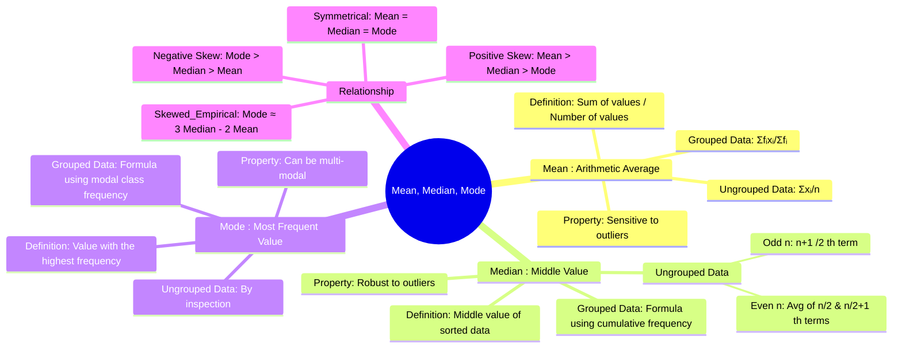

---
tags:
  - probability-theory
  - statistics
  - central-tendency
  - engineering-math
created: 2025-09-15
aliases:
  - Measures of Central Tendency
  - Average
  - Mean (Arithmetic Mean) for Grouped Data (Frequency Distribution)
  - Mean (Arithmetic Mean)
  - Median
  - Mode
  - Karl Pearson's Empirical Formula
  - Zero-Mean Process
subject: "[[Mathematics]]"
parent:
  - Probability and Statistics
confidence: 10
formula:
  - "Mean (for Ungrouped Data) : $$\\bar{x} = \\frac{\\sum_{i=1}^{n} x_i}{n} = \\frac{x_1 + x_2 + \\dots + x_n}{n}$$"
  - "Mean (for Grouped Data (Frequency Distribution)) : $$\\bar{x} = \\frac{\\sum_{i=1}^{n} f_i x_i}{\\sum_{i=1}^{n} f_i} = \\frac{f_1 x_1 + f_2 x_2 + \\dots + f_n x_n}{N}$$"
  - "Relationship between Mean, Median and Mode (Symmetrical Distribution) : $$\\text{Mean} = \\text{Median} = \\text{Mode}$$"
  - "Median (for Ungrouped Data) : If $n$ is **even**, the median is the average of the $\\left(\\frac{n}{2}\\right)^{th}$ and $\\left(\\frac{n}{2} + 1\\right)^{th}$ values."
  - "Median (for Ungrouped Data) : If the number of observations ($n$) is **odd**, the median is the $\\left(\\frac{n+1}{2}\\right)^{th}$ value."
  - "Median (for Grouped Data (Continuous Series)) : $$\\text{Median} = L + \\left( \\frac{N/2 - C}{f} \\right) \\times h$$"
  - "Mode (for Grouped Data (Continuous Series)) : $$\\text{Mode} = L + \\left( \\frac{f_1 - f_0}{2f_1 - f_0 - f_2} \\right) \\times h$$"
  - "Mode (for Ungrouped Data) : The mode is found by simple inspection. A dataset can have one mode (unimodal), two modes (bimodal), or more (multimodal). It may also have no mode."
  - "Relationship between Mean, Median and Mode (Positively Skewed (Right Skew)) : $$\\text{Mean} > \\text{Median} > \\text{Mode}$$"
  - "Relationship between Mean, Median and Mode (Negatively Skewed (Left Skew)) : $$\\text{Mode} > \\text{Median} > \\text{Mean}$$"
  - "Relationship between Mean, Median and Mode (Karl Pearson's Empirical Formula) : $$\\text{Mode} \\approx 3 \\cdot \\text{Median} - 2 \\cdot \\text{Mean}$$ $$\\text{(For moderately skewed distributions, the following approximate relationship holds.)}$$"
define:
  - 'Mean (Arithmetic Mean) : The mean is the most common measure of central tendency, often simply called the "average". It is calculated by summing all the values in a dataset and dividing by the number of values.'
  - "Median : The median is the middle value of a dataset that has been sorted in ascending or descending order. It effectively divides the dataset into two equal halves."
  - "Mode : The mode is the value that appears most frequently in a dataset."
---
###### Mind Map

---
### Mean, Median, and Mode
#central-tendency #statistics #mean #median #mode

> ==**Mean, Median, and Mode** are the three primary **measures of central tendency** in statistics.== They provide a single value that represents the center or typical value of a dataset. Understanding their calculation, properties, and the relationship between them is fundamental for interpreting data distributions.

![[Mean Median Mode.png]]

---
#### Mean (Arithmetic Mean)
#mean #average

The mean is the most common measure of central tendency, ==often simply called the "average"==. ==It is calculated by summing all the values in a dataset and dividing by the number of values.==

* **==For Ungrouped Data==**:
    $$\boxed{\quad \bar{x} = \frac{\sum_{i=1}^{n} x_i}{n} = \frac{x_1 + x_2 + \dots + x_n}{n} \quad}$$
* **==For Grouped Data (Frequency Distribution)==**:
    $$\boxed{\quad \bar{x} = \frac{\sum_{i=1}^{n} f_i x_i}{\sum_{i=1}^{n} f_i} = \frac{f_1 x_1 + f_2 x_2 + \dots + f_n x_n}{N} \quad}$$
    ==where $f_i$ is the frequency of the value $x_i$, and $N = \sum f_i$ is the total number of observations.==

> [!Hint] Property
> The mean is highly sensitive to **outliers** (extreme values), which can pull the mean towards them.

> [!concept] Zero-Mean Process
> A **zero-mean** random process is one where the expected value (mean) is identically zero: $E[X] = \mu = 0$. 
> 
> When visualizing this in the context of electrical signals, a zero-mean process represents a purely AC signal that contains no [[DC offset]].
> 
> > [!pyq]- PYQ : 2019
> > ![[ee_2019#^q5]]

---
#### Median
#median

==The median is the middle value of a dataset that has been sorted in ascending or descending order.== It effectively divides the dataset into two equal halves.

* **==For Ungrouped Data==**:
    1. Sort the data.
    2. ==If the number of observations ($n$) is **odd**, the median is the $\left(\frac{n+1}{2}\right)^{th}$ value.==
    3. ==If $n$ is **even**, the median is the average of the $\left(\frac{n}{2}\right)^{th}$ and $\left(\frac{n}{2} + 1\right)^{th}$ values.==

* **==For Grouped Data (Continuous Series)==**:
    $$\boxed{\quad \text{Median} = L + \left( \frac{N/2 - C}{f} \right) \times h \quad}$$
    where:
    * ==$L$: Lower boundary of the median class.==
    * ==$N$: Total frequency.==
    * ==$C$: Cumulative frequency of the class preceding the median class.==
    * ==$f$: Frequency of the median class.==
    * ==$h$: Width of the median class.==

> [!Hint] Property
> The median is **robust** and is not affected by outliers, making it a better measure of central tendency for skewed data.

---
#### Mode
#mode

==The mode is the value that appears most frequently in a dataset.==

* **==For Ungrouped Data==**: The mode is found by simple inspection. ==A dataset can have one mode (unimodal), two modes (bimodal), or more (multimodal). It may also have no mode.==
* **==For Grouped Data (Continuous Series)==**:
    $$\boxed{\quad \text{Mode} = L + \left( \frac{f_1 - f_0}{2f_1 - f_0 - f_2} \right) \times h \quad}$$
    where:
    * ==$L$: Lower boundary of the modal class.==
    * ==$f_1$: Frequency of the modal class.==
    * ==$f_0$: Frequency of the class preceding the modal class.==
    * ==$f_2$: Frequency of the class succeeding the modal class.==
    * ==$h$: Width of the modal class.==

> [!Hint] Property
> The mode is useful for categorical data and for identifying the most common outcome.

---
#### Relationship Between Mean, Median, and Mode
#skewness #empirical-relationship

The relative positions of the mean, median, and mode describe the skewness of a distribution.

![[mean median mode relationship.png]]

1. **Symmetrical Distribution**: The distribution is symmetric (e.g., a [[Normal Distribution]]).
    $$\text{Mean} = \text{Median} = \text{Mode}$$
2. **Positively Skewed (Right Skew)**: The distribution has a long tail to the right. Outliers pull the mean to the right.
    $$\text{Mean} > \text{Median} > \text{Mode}$$
3. **Negatively Skewed (Left Skew)**: The distribution has a long tail to the left. Outliers pull the mean to the left.
    $$\text{Mode} > \text{Median} > \text{Mean}$$

> [!memory] Karl Pearson's Empirical Formula
> For moderately skewed distributions, the following approximate relationship holds: $$\boxed{\quad \text{Mode} \approx 3 \cdot \text{Median} - 2 \cdot \text{Mean} \quad}$$

---
### Related Concepts
#statistics/related-concepts

> [[Probability and Statistics]]

[[Standard Deviation and Variance]]
[[Probability Distributions]]
[[Random Variables]]