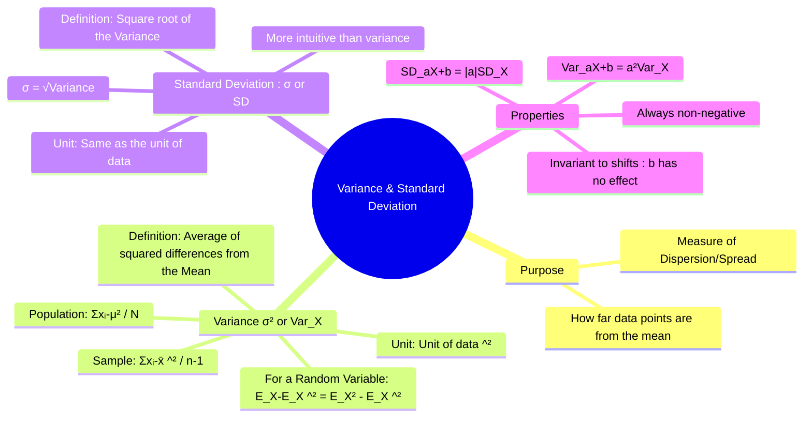

---
tags:
  - probability-theory
  - statistics
  - dispersion
  - engineering-math
created: 2025-09-15
aliases:
  - Variance
  - Standard Deviation
  - SD
  - "Unbiased Estimate : Bessel's correction"
subject: "[[Mathematics]]"
parent:
  - Probability and Statistics
confidence: 10
formula:
  - "Standard Deviation : $$\\sigma = \\sqrt{\\text{Variance}}$$"
  - "Variance (for Population of size N) : $$\\sigma^2 = \\frac{\\sum_{i=1}^{N} (x_i - \\mu)^2}{N}$$"
  - "Variance (for Sample of size n) : $$s^2 = \\frac{\\sum_{i=1}^{n} (x_i - \\bar{x})^2}{n-1}$$"
  - "Variance (for a Discrete Random Variable X) : $$\\text{Var}(X) = \\sigma^2 = E[(X - E[X])^2] = E[X^2] - (E[X])^2$$"
---
###### Mind Map

---
### Standard Deviation and Variance
#variance #standard-deviation #dispersion #statistics

> ==**Variance** and **Standard Deviation** are the most common measures of **dispersion** or **spread** in a dataset.== While [[Mean, Median, Mode|measures of central tendency]] describe the center of the data, measures of dispersion describe how far the data points are scattered from this center. ==A low standard deviation indicates that the data points tend to be close to the mean, while a high standard deviation indicates that they are spread out over a wider range.==

#### Variance ($\sigma^2$ or Var(X))
#variance

==**Variance** is defined as the average of the squared differences from the mean.== Squaring the differences ensures that negative deviations do not cancel out positive ones and gives more weight to larger deviations.

*   ==**For a Population** (size N, mean $\mu$)==:
    $$\boxed{\quad \sigma^2 = \frac{\sum_{i=1}^{N} (x_i - \mu)^2}{N} \quad}$$
*   ==**For a Sample** (size n, mean $\bar{x}$)==:
    $$\boxed{\quad s^2 = \frac{\sum_{i=1}^{n} (x_i - \bar{x})^2}{n-1} \quad}$$
> [!memory] Note
> ==We divide by $n-1$ for a sample to get an unbiased estimate of the population variance. This is known as Bessel's correction.==

*   ==**For a Discrete Random Variable X**:==
    ==The variance is the [[Expected Value]] of the squared deviation from the mean $E[X]$.== A convenient computational formula is: $$\boxed{\quad \text{Var}(X) = \sigma^2 = E[(X - E[X])^2] = E[X^2] - (E[X])^2 \quad}$$

> [!formula] Variance of a Zero-Mean Process
> If the process has a **zero-mean** ($E[X] = 0$), the variance simplifies exactly to the **mean-square** value:
> $$\text{Var}(X) = E[X^2]$$
> Consequently, the **standard deviation** $\sigma$ becomes equivalent to the **Root-Mean-Square (RMS)** value of the zero-mean signal:
> $$\sigma = \sqrt{E[X^2]}$$

> [!examtip] Drawback
> The unit of variance is the square of the unit of the original data (e.g., volts²), which is not intuitive.

> [!memory] Points to Note
> **Population variance** uses $N$ because all data is known.
> **Sample variance** uses $n-1$ to remove bias when estimating the population variance.
> **Variance of a random variable** is defined using expected value because it is a theoretical quantity.

---
#### Standard Deviation ($\sigma$ or SD(X))
#standard-deviation

==The **Standard Deviation** is simply the **square root of the variance**.== It is the preferred measure of spread because it ==is in the same units as the original data==, making it much easier to interpret.

$$\boxed{\quad \sigma = \sqrt{\text{Variance}} \quad}$$

> [!pyq]- PYQ : 2019
> ![[ee_2019#^q5]]

**Interpretation**: The standard deviation represents a "typical" or "standard" distance of a data point from the mean. ==For a [[Normal Distribution]]:==

![[Standard Normal Distribution.png]]

* ==~68% of data falls within 1 standard deviation of the mean ($\mu \pm \sigma$).==
* ~95% of data falls within 2 standard deviations of the mean ($\mu \pm 2\sigma$).
* ~99.7% of data falls within 3 standard deviations of the mean ($\mu \pm 3\sigma$).

---
#### Properties of Variance and Standard Deviation
#variance-properties

Let $X$ be a random variable and $a, b$ be constants.
1.  **Non-negativity**: $\text{Var}(X) \ge 0$ and $\sigma_X \ge 0$.
2.  **Effect of a Shift**: ==Adding a constant to every data point shifts the mean but does not change the spread.==
    $$\text{Var}(X+b) = \text{Var}(X)$$
    $$\sigma_{X+b} = \sigma_X$$
3.  **Effect of Scaling**: ==Multiplying every data point by a constant scales the spread.==
    $$\boxed{\quad \text{Var}(aX) = a^2 \text{Var}(X) \quad}$$
    $$\boxed{\quad \sigma_{aX} = |a| \sigma_X \quad}$$
4.  **==Combined Effect==**:
    $$\text{Var}(aX+b) = a^2 \text{Var}(X)$$
    $$\sigma_{aX+b} = |a| \sigma_X$$
5.  **==Variance of Sum of Independent Variables==**: For independent random variables $X$ and $Y$:
    $$\text{Var}(X+Y) = \text{Var}(X) + \text{Var}(Y)$$
    $$\text{Var}(X-Y) = \text{Var}(X) + \text{Var}(Y)$$

> [!memory] Note
> The variances add even for subtraction

---
### Related Concepts
#statistics/related-concepts

> [[Mean, Median, Mode]]

[[Expected Value]]
[[Probability Distributions]]
[[Random Variables]]
[[Covariance and Correlation]]
[[Probability and Statistics]]
