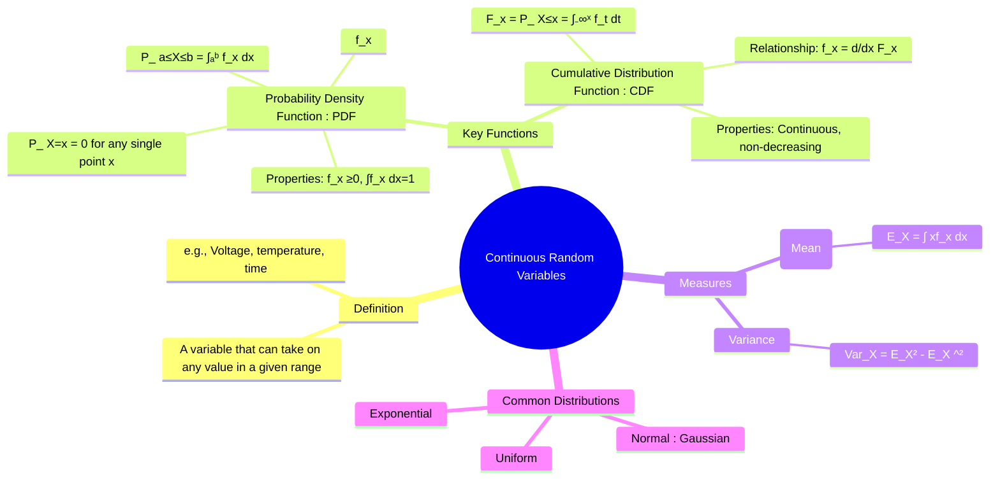

---
tags:
  - probability-theory
  - random-variables
  - continuous-probability
  - engineering-math
created: 2025-09-15
aliases:
  - Continuous RV
subject: "[[Mathematics]]"
parent:
  - Random Variables
---
### Continuous Random Variables
#continuous-random-variable #pdf #cdf

> A **Continuous Random Variable** is a [[Random Variables|random variable]] that can take on any value within a given range or interval. Unlike discrete variables, the number of possible outcomes is uncountably infinite. Continuous random variables are used to model measurements such as time, voltage, current, temperature, or length.

###### Mind Map

---

#### Probability Density Function (PDF)
#probability-density-function #pdf

For a continuous random variable, the probability of it taking on any single specific value is zero, i.e., $P(X=x)=0$. Instead of a PMF, we use a **Probability Density Function (PDF)**, denoted $f(x)$ or $f_X(x)$, to describe the likelihood of the variable falling within a certain range.

![[Continuous Random Variables.png]]

The probability that $X$ lies in the interval $[a, b]$ is the **area under the PDF curve** from $a$ to $b$.
$$\boxed{\quad P(a \le X \le b) = \int_a^b f(x) \, dx \quad}$$
The PDF must satisfy two properties:
1.  **Non-negativity**: $f(x) \ge 0$ for all $x$.
2.  **Normalization**: The total area under the curve must be 1.
    $$\boxed{\quad \int_{-\infty}^{\infty} f(x) \, dx = 1 \quad}$$
*Note: For a continuous variable, $P(a \le X \le b) = P(a < X \le b) = P(a \le X < b) = P(a < X < b)$ because the probability at a single point is zero.*

---
#### Cumulative Distribution Function (CDF)
#cumulative-distribution-function #cdf

The **Cumulative Distribution Function (CDF)**, $F(x)$, has the same definition as for discrete variables: it gives the probability that the random variable $X$ is less than or equal to a specific value $x$. For continuous variables, it is the integral of the PDF.

![[resources/r/Cumulative Distribution Function (CDF).png]]
$$\boxed{\quad F(x) = P(X \le x) = \int_{-\infty}^x f(t) \, dt \quad}$$
**Properties of the CDF for a Continuous RV**:
1.  **Continuous Function**: The graph of the CDF is a continuous, non-decreasing curve.
2.  **Range**: $0 \le F(x) \le 1$.
3.  **Limits**: $\lim_{x \to -\infty} F(x) = 0$ and $\lim_{x \to \infty} F(x) = 1$.
4.  **Relationship to PDF**: The PDF is the derivative of the CDF.
    $$\boxed{\quad f(x) = \frac{d}{dx} F(x) \quad}$$
The CDF can be used to find the probability of an interval:
$$ P(a < X \le b) = F(b) - F(a) $$

---
#### Expected Value (Mean)
#expected-value #mean

The **Expected Value** (or mean) of a continuous random variable $X$, denoted $E[X]$ or $\mu_X$, is the integral of $x$ weighted by the [[Probability Density Function (PDF)|PDF]] $f(x)$.
$$\boxed{\quad E[X] = \mu_X = \int_{-\infty}^{\infty} x \cdot f(x) \, dx \quad}$$
The expectation of a function of a random variable, $g(X)$, is:
$$ E[g(X)] = \int_{-\infty}^{\infty} g(x) \cdot f(x) \, dx $$

---
#### Variance and Standard Deviation
#variance #standard-deviation

The **Variance**, denoted $\text{Var}(X)$ or $\sigma_X^2$, measures the spread of the distribution.
$$\text{Var}(X) = E[(X-\mu_X)^2] = \int_{-\infty}^{\infty} (x-\mu_X)^2 \cdot f(x) \, dx$$
The convenient computational formula is:
$$\boxed{\quad \text{Var}(X) = E[X^2] - (E[X])^2 \quad}$$
where $E[X^2] = \int_{-\infty}^{\infty} x^2 \cdot f(x) \, dx$.

The **Standard Deviation**, $\sigma_X$, is the square root of the variance:
$$\sigma_X = \sqrt{\text{Var}(X)}$$

---
#### Common Continuous Probability Distributions

1. **[[Uniform Distribution]]**: All outcomes in a range are equally likely.
2. **[[Exponential Distribution]]**: Models the time between events in a Poisson process.
3. **[[Normal Distribution|Normal (Gaussian) Distribution]]**: The ubiquitous "bell curve" that models a vast number of natural phenomena.

---
### Related Concepts
#random-variables/related-concepts

> [[Random Variables]]

[[Discrete Random Variables]]
[[Probability Distributions]]
[[Standard Deviation and Variance]]
[[Integration]]
