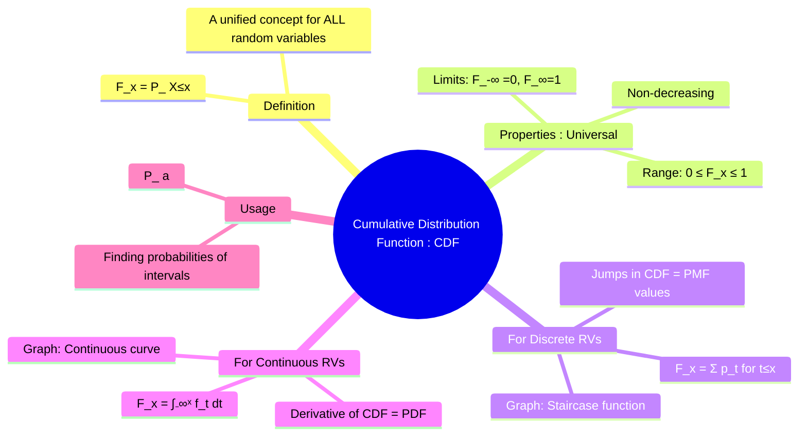

---
tags:
  - probability-theory
  - random-variables
  - cdf
  - engineering-math
created: 2025-09-15
aliases:
  - CDF
  - Distribution Function
subject: "[[Mathematics]]"
parent: "[[Random Variables]]"
confidence: 10
formula:
  - "Relationship between CDF (F(x)) and PDF (f(t)) : $$F(x) = \\int_{-\\infty}^x f(t) \\, dt$$"
---
###### Mind Map

---
### Cumulative Distribution Function (CDF)
#cumulative-distribution-function #cdf

> The **Cumulative Distribution Function (CDF)**, denoted $F(x)$, is a fundamental concept that completely describes the probability distribution of any random variable, whether it is **[[Discrete Random Variables|discrete]]** or **[[Continuous Random Variables|continuous]]**. It provides the cumulative probability that a random variable $X$ will take on a value less than or equal to a specific value $x$.

![[Cumulative Distribution Function (CDF) 1.png]]

---
#### Definition
#cdf/definition 

For any random variable $X$, the CDF $F(x)$ is defined as:
$$\boxed{\quad F(x) = P(X \le x) \quad}$$

---
#### Properties of the CDF
#cdf/properties 

Every valid CDF, regardless of the type of random variable, must satisfy the following four properties:
1.  **Range**: The value of the CDF is always between 0 and 1.
    $$0 \le F(x) \le 1$$
2.  **Non-decreasing**: As $x$ increases, the cumulative probability can only increase or stay the same.
    $$ \text{If } a < b, \text{ then } F(a) \le F(b) $$
3.  **Limit to the Left**: The limit of the CDF as $x$ approaches negative infinity is 0.
    $$ \lim_{x \to -\infty} F(x) = 0 $$
4.  **Limit to the Right**: The limit of the CDF as $x$ approaches positive infinity is 1.
    $$ \lim_{x \to \infty} F(x) = 1 $$

---
#### CDF for Different Types of Random Variables
#cdf/different-types-of-random-variables

##### For a Discrete Random Variable
#cdf/discrete-random-variable

The CDF is found by summing the probabilities from the [[Probability Mass Function (PMF)|PMF]] for all values up to $x$.
$$\boxed{\quad F(x) = \sum_{t \le x} p(t) \quad}$$
*   **Graph**: The graph of a discrete CDF is a **staircase function**. It is constant between possible values and has a "jump" at each value the variable can take. The height of the jump at a point $x_i$ is equal to the PMF value, $P(X=x_i)$.

##### For a Continuous Random Variable
#cdf/continuous-random-variable

The CDF is found by integrating the [[Probability Density Function (PDF)|PDF]] from negative infinity up to $x$.
$$\boxed{\quad F(x) = \int_{-\infty}^x f(t) \, dt \quad}$$
*   **Graph**: The graph of a continuous CDF is a **continuous, non-decreasing curve**.
*   The relationship with the PDF is fundamental: the PDF is the derivative of the CDF.
    $$f(x) = \frac{d}{dx} F(x)$$

---
#### Using the CDF to Find Probabilities
#cdf/to-find-probabilities

The CDF is extremely useful for calculating the probability that a random variable falls within a specific interval.
For any random variable $X$:
$$\boxed{\quad P(a < X \le b) = F(b) - F(a) \quad}$$
Other useful relations include:
*   $P(X > a) = 1 - P(X \le a) = 1 - F(a)$
*   $P(X < a) = \lim_{x \to a^-} F(x)$

---
### Related Concepts
#cdf/related-concepts 

> [[Random Variables]]

[[Discrete Random Variables]]
[[Continuous Random Variables]]
[[Probability Mass Function (PMF)]]
[[Probability Density Function (PDF)]]
[[Transformation of Variables]]