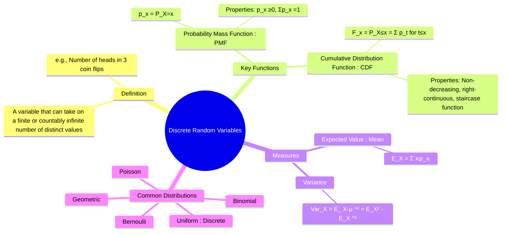

---
tags:
  - probability-theory
  - random-variables
  - discrete-probability
  - engineering-math
created: 2025-09-15
aliases:
  - Discrete RV
subject: "[[Mathematics]]"
parent:
  - Random Variables
---
### Discrete Random Variables
#discrete-random-variable #pmf #cdf

> A **Discrete Random Variable** is a [[Random Variables|random variable]] that can take on only a finite or countably infinite number of distinct values. It is used to model outcomes of a random experiment that can be counted, such as the number of defective items in a batch, the number of heads in a series of coin flips, or the number of calls arriving at a call center in an hour.

###### Mind Map

---

#### Probability Mass Function (PMF)
#probability-mass-function #pmf

The **Probability Mass Function (PMF)**, denoted $p(x)$ or $P_X(x)$, gives the probability that the discrete random variable $X$ is exactly equal to some specific value $x$.
$$\boxed{\quad p(x) = P(X=x) \quad}$$
The PMF must satisfy two properties:
1.  **Non-negativity**: $p(x) \ge 0$ for all possible values of $x$.
2.  **Normalization**: The sum of the probabilities over all possible values must be 1.
    $$\boxed{\quad \sum_{\text{all } x} p(x) = 1 \quad}$$

*   **Example**: For a single fair die roll, the random variable $X$ is the outcome. The PMF is $p(x) = 1/6$ for $x \in \{1, 2, 3, 4, 5, 6\}$.

---
#### Cumulative Distribution Function (CDF)
#cumulative-distribution-function #cdf

The **Cumulative Distribution Function (CDF)**, denoted $F(x)$ or $F_X(x)$, gives the probability that the random variable $X$ takes on a value less than or equal to a specific value $x$.
$$\boxed{\quad F(x) = P(X \le x) = \sum_{t \le x} p(t) \quad}$$
**Properties of the CDF for a Discrete RV**:
1.  **Staircase Function**: The graph of the CDF is a step function (staircase) that is constant between the possible values of $X$ and jumps up at each value. The height of the jump at $x$ is equal to the PMF value, $p(x)$.
2.  **Range**: $0 \le F(x) \le 1$.
3.  **Limits**: $\lim_{x \to -\infty} F(x) = 0$ and $\lim_{x \to \infty} F(x) = 1$.
4.  **Non-decreasing**: If $a < b$, then $F(a) \le F(b)$.

The CDF can be used to find the probability of an interval:
$$ P(a < X \le b) = F(b) - F(a) $$

---
#### Expected Value (Mean)
#expected-value #mean

The **Expected Value** (or mean) of a discrete random variable $X$, denoted $E[X]$ or $\mu_X$, is the weighted average of its possible values, where the weights are their respective probabilities.
$$\boxed{\quad E[X] = \mu_X = \sum_{\text{all } x} x \cdot p(x) \quad}$$
The expectation of a function of a random variable, $g(X)$, is:
$$ E[g(X)] = \sum_{\text{all } x} g(x) \cdot p(x) $$

---
#### Variance and Standard Deviation
#variance #standard-deviation

The **Variance**, denoted $\text{Var}(X)$ or $\sigma_X^2$, measures the spread of the distribution around its mean.
$$\text{Var}(X) = E[(X-\mu_X)^2] = \sum_{\text{all } x} (x-\mu_X)^2 \cdot p(x)$$
A more convenient computational formula is:
$$\boxed{\quad \text{Var}(X) = E[X^2] - (E[X])^2 \quad}$$
where $E[X^2] = \sum_{\text{all } x} x^2 \cdot p(x)$.

The **Standard Deviation**, $\sigma_X$, is the square root of the variance:
$$\sigma_X = \sqrt{\text{Var}(X)}$$

---
#### Common Discrete Probability Distributions
* **[[Bernoulli Distribution]]**: The outcome of a single trial (success/failure).
* **[[Binomial Distribution]]**: The number of successes in a fixed number of independent Bernoulli trials.
* **[[Poisson Distribution]]**: The number of events occurring in a fixed interval of time or space.
* **[[Geometric Distribution]]**: The number of trials until the first success.
* **[[Discrete Uniform Distribution]]**: All outcomes have an equal probability.

---
### Related Concepts
#random-variables/related-concepts

> [[Random Variables]]

[[Continuous Random Variables]]
[[Probability Distributions]]
[[Standard Deviation and Variance]]
[[Axioms of Probability]]