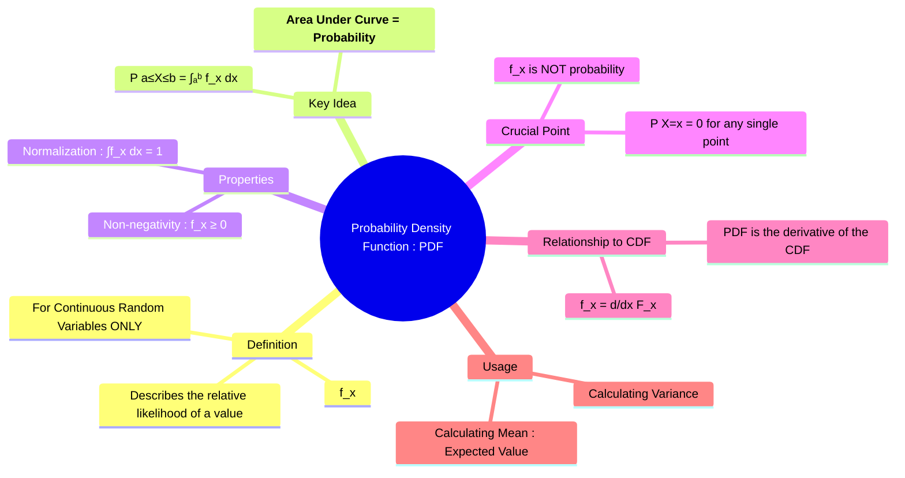

---
tags:
  - probability-theory
  - random-variables
  - continuous-probability
  - pdf
  - engineering-math
created: 2025-09-15
aliases:
  - PDF
  - Density Function
subject: "[[Mathematics]]"
parent: "[[Continuous Random Variables]]"
confidence: 10
formula:
  - "Relationship between PDF (f(x)) and CDF (F(x)) : $$f(x) = \\frac{d}{dx} F(x)$$"
---
###### Mind Map

---
### Probability Density Function (PDF)
#probability-density-function #pdf #continuous-probability

> The **Probability Density Function (PDF)** is the function that describes the probability distribution of a **[[Continuous Random Variables|continuous random variable]]**. Unlike a [[Probability Mass Function (PMF)|PMF]] which gives the probability at a point, the PDF gives the **probability density**. The probability of the variable falling within a particular range is found by integrating the PDF over that range, which corresponds to the **area under the curve**.

![[Probability Density Function (PDF).png]]

---
#### Definition
#pdf/definition 

For a continuous random variable $X$, its PDF, $f(x)$, is a function such that the probability of $X$ falling in the interval $[a,b]$ is given by the integral:
$$\boxed{\quad P(a \le X \le b) = \int_a^b f(x) \, dx \quad}$$

> [!fail] Crucial Point
> The value of the PDF at a single point, $f(x)$, is **not** a probability. It is a measure of probability density. For any continuous random variable, the probability of it taking on any exact value is zero:
> $$ P(X=c) = \int_c^c f(x) \, dx = 0 $$

---
#### Properties of the PDF
#pdf/properties #properties/pdf 

A function can be a valid PDF if and only if it satisfies two conditions:
1.  **Non-negativity**: The density must be non-negative everywhere.
    $$\boxed{\quad f(x) \ge 0 \quad \text{for all } x}$$
> [!notes] Note
> Unlike probability, the value of $f(x)$ can be greater than 1, as it is a density, not a direct probability).

2.  **Normalization**: The total area under the PDF curve over all possible values must equal 1, representing the total probability of the sample space.
    $$\boxed{\quad \int_{-\infty}^{\infty} f(x) \, dx = 1 \quad}$$
> See [[ee_2022#^q54]]

---
#### Relationship with the Cumulative Distribution Function (CDF)
#relationship/pdf-and-cdf 

The PDF and the [[Cumulative Distribution Function (CDF)|Cumulative Distribution Function (CDF)]] are intrinsically linked through calculus.
*   The **CDF**, $F(x)$, is the integral of the PDF from $-\infty$ to $x$.
    $$F(x) = P(X \le x) = \int_{-\infty}^x f(t) \, dt$$
*   Conversely, the **PDF** is the derivative of the CDF.
    $$\boxed{\quad f(x) = \frac{d}{dx} F(x) \quad}$$
Graphically, the value of the PDF at a point is the slope of the CDF at that point.

---
#### Usage in Calculating Mean and Variance

The PDF is essential for calculating the statistical properties of a continuous random variable.
*   **Mean (Expected Value)**: The PDF acts as the weighting function in the continuous version of a weighted average.
    $$E[X] = \int_{-\infty}^{\infty} x \cdot f(x) \, dx$$
*   **Variance**:
    $$\text{Var}(X) = \int_{-\infty}^{\infty} (x - E[X])^2 \cdot f(x) \, dx$$

---
### Related Concepts
#probability-theory/related-concepts

> [[Continuous Random Variables]]

[[Cumulative Distribution Function (CDF)]]
[[Probability Mass Function (PMF)]] (The discrete analogue of the PDF)
[[Transformation of Variables]]
[[Probability Distributions]]
[[Expected Value]]
[[Standard Deviation and Variance|Variance]]
