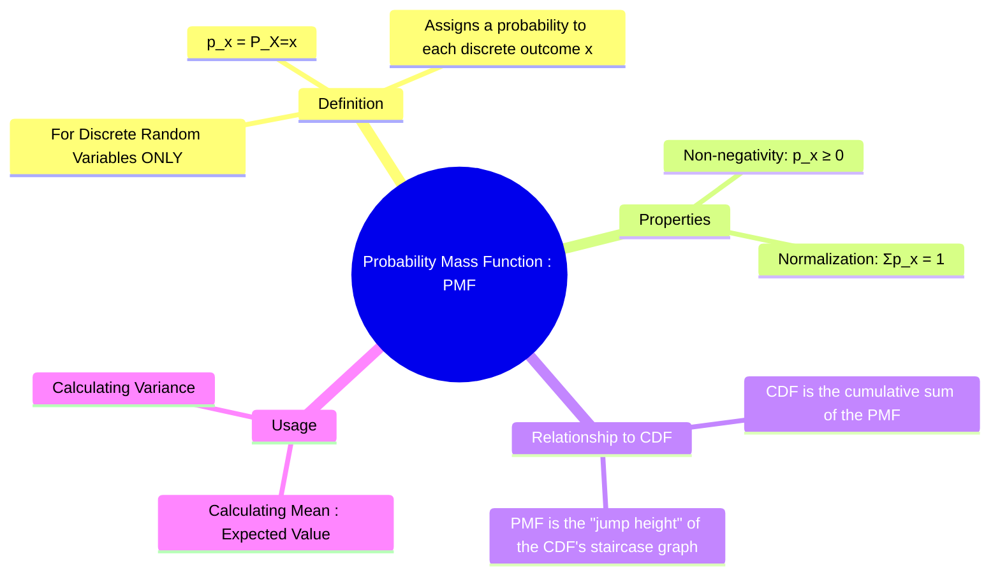

---
tags:
  - probability-theory
  - random-variables
  - discrete-probability
  - pmf
  - engineering-math
created: 2025-09-15
aliases:
  - PMF
  - "Example : Fair Coin Toss : Probability Mass Function (PMF)"
subject: "[[Mathematics]]"
parent: "[[Discrete Random Variables]]"
confidence: 10
---
###### Mind Map

---
### Probability Mass Function (PMF)
#probability-mass-function #pmf #discrete-probability

> The **Probability Mass Function (PMF)** is the function that describes the probability distribution of a **[[Discrete Random Variables|discrete random variable]]**. It assigns a specific probability to each possible value that the random variable can take. The term "mass" is used because it represents the concentration of probability (mass) at distinct, discrete points.

#### Definition
For a discrete random variable $X$, the PMF, denoted $p(x)$ or $P_X(x)$, is defined as the probability that $X$ is exactly equal to the value $x$.
$$\boxed{\quad p(x) = P(X=x) \quad}$$

---
#### Properties of the PMF
A function can be a valid PMF if and only if it satisfies two fundamental properties derived from the [[Axioms of Probability|axioms of probability]]:
1.  **Non-negativity**: The probability for any value must be non-negative.
    $$\boxed{\quad p(x) \ge 0 \quad \text{for all } x}$$
2.  **Normalization**: The sum of the probabilities over all possible values of $X$ must equal 1.
    $$\boxed{\quad \sum_{\text{all } x} p(x) = 1 \quad}$$

---
#### Example: Fair Coin Toss
Let a random variable $X$ be the number of heads in two tosses of a fair coin.
*   **Sample Space**: {HH, HT, TH, TT}
*   **Possible values for X**: {0, 1, 2}
*   **PMF Calculation**:
    *   $p(0) = P(X=0) = P(\{TT\}) = 1/4$
    *   $p(1) = P(X=1) = P(\{HT, TH\}) = 2/4 = 1/2$
    *   $p(2) = P(X=2) = P(\{HH\}) = 1/4$
*   **Check Properties**:
    *   All $p(x)$ values (1/4, 1/2, 1/4) are $\ge 0$.
    *   $\sum p(x) = p(0) + p(1) + p(2) = 1/4 + 1/2 + 1/4 = 1$.
    The PMF is valid.

---
#### Relationship with the Cumulative Distribution Function (CDF)
#pmf-cdf-relationship
The PMF and the [[Cumulative Distribution Function (CDF)|Cumulative Distribution Function (CDF)]] provide equivalent information about a discrete distribution.
*   The **CDF**, $F(x)$, is the cumulative sum of the PMF for all values less than or equal to $x$.
    $$F(x) = P(X \le x) = \sum_{t \le x} p(t)$$
*   The **PMF**, $p(x)$, is the size of the jump in the CDF's staircase graph at the point $x$.
    $$p(x) = F(x) - F(x^-)$$
    where $F(x^-)$ is the limit of the CDF as we approach $x$ from the left.

---
#### Usage in Calculating Mean and Variance
The PMF is the core component needed to calculate the statistical properties of a discrete random variable.
*   **Mean (Expected Value)**:
    $$E[X] = \sum_{\text{all } x} x \cdot p(x)$$
*   **Variance**:
    $$\text{Var}(X) = \sum_{\text{all } x} (x - E[X])^2 \cdot p(x)$$

---
### Related Concepts
#probability-theory/related-concepts

> [[Discrete Random Variables]]

[[Cumulative Distribution Function (CDF)]]
[[Probability Density Function (PDF)]] (The continuous analogue of the PMF)
[[Probability Distributions]]
[[Expected Value]]
[[Variance]]