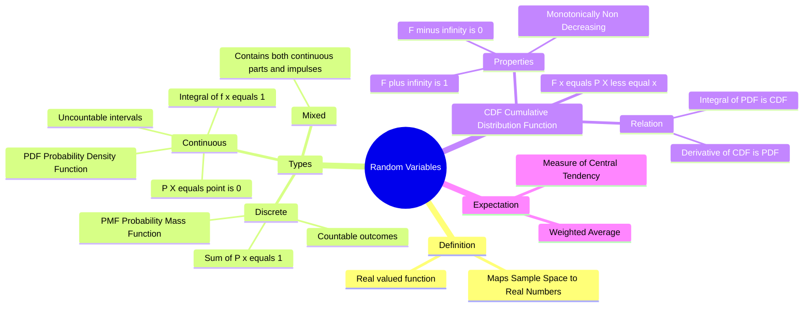

---
tags:
  - mathematics
  - probability
  - statistics
  - gate
  - random-variables
aliases:
  - RV
  - Discrete vs Continuous Random Variables
  - Probability Functions (PMF, PDF, CDF)
  - Random Variable
subject: "[[Mathematics]]"
parent:
  - Probability and Statistics
---
### Random Variables
#probability/random-variables #statistics

> A **Random Variable (RV)** is not a variable in the algebraic sense, nor is it random itself. It is a **[[deterministic function]]** that maps each outcome of a random experiment (Sample Space $\Omega$) to a real number ($\mathbb{R}$). It quantifies the qualitative outcomes of a random process.

###### Mind Map

---

#### Definition and Notation
#random-variables/definition

Let $\Omega$ be the sample space of a random experiment. A random variable $X$ is a function:
$$X: \Omega \to \mathbb{R}$$

*   **Notation:** Capital letters (e.g., $X, Y, Z$) denote the random variable. Small letters (e.g., $x, y, z$) denote the specific values the RV can take.
*   **Example:** Tossing two coins. $\Omega = \{HH, HT, TH, TT\}$.
    Let $X$ be the number of Heads.
    $X(HH) = 2, X(HT) = 1, X(TH) = 1, X(TT) = 0$.

---
#### Types of Random Variables
#random-variables/types

**A. Discrete Random Variable:**
Takes on a countable number of distinct values (finite or countably infinite).
*   *Examples:* Number of defects, Number of phone calls, Outcome of a die roll.
*   Described by **[[Probability Mass Function (PMF)]]**.

**B. Continuous Random Variable:**
Takes on an infinite number of values within a continuous interval.
*   *Examples:* Voltage noise, Time delay, Height, Temperature.
*   Described by **[[Probability Density Function (PDF)]]**.

**C. Mixed Random Variable:**
Contains both discrete jumps and continuous intervals.
*   *Example:* Waiting time at a traffic light (Probability of 0 wait if green, continuous wait time if red).

---
#### Probability Functions (PMF vs PDF)
#pmf #pdf

| Feature | Discrete (PMF) | Continuous (PDF) |
| :--- | :--- | :--- |
| **Notation** | $P(X=x)$ or $p_X(x)$ | $f_X(x)$ |
| **Definition** | Probability that $X$ takes the specific value $x$. | Probability density at $x$. **Value can be > 1**. |
| **Point Prob** | $P(X=c) \ge 0$ | $\boxed{P(X=c) = 0}$ (Area of a line is 0) |
| **Normalization** | $\sum_{all \ x} P(X=x) = 1$ | $\int_{-\infty}^{\infty} f_X(x) \, dx = 1$ |
| **Interval Prob** | Sum of specific values in interval | $\int_{a}^{b} f_X(x) \, dx = P(a < X < b)$ |

> **GATE Insight:** For a continuous RV, $P(a \le X \le b) = P(a < X < b)$. The inclusion or exclusion of endpoints does not change the probability because the probability at a single point is zero.

---
#### Cumulative Distribution Function (CDF)
#cdf

The CDF applies to both discrete and continuous variables and defines the probability that $X$ will take a value less than or equal to $x$.

$$\boxed{\quad F_X(x) = P(X \le x) \quad}$$

**Properties of CDF:**
1.  $0 \le F_X(x) \le 1$.
2.  **Monotonically Non-Decreasing:** If $a < b$, then $F_X(a) \le F_X(b)$.
3.  **Limits:**
    $$\lim_{x \to -\infty} F_X(x) = 0 \quad \text{and} \quad \lim_{x \to \infty} F_X(x) = 1$$
4.  **Right Continuous:** $\lim_{h \to 0^+} F(x+h) = F(x)$.

**Relationship with PDF/PMF:**
*   **Continuous:**
    *   $f_X(x) = \frac{d}{dx} F_X(x)$ (PDF is the derivative of CDF).
    *   $F_X(x) = \int_{-\infty}^{x} f_X(t) dt$.
*   **Discrete:**
    *   CDF is a **Staircase Function**.
    *   The height of the step at $x$ is equal to $P(X=x)$.

---
#### Expectations and Moments (Overview)
#statistics/moments

The expected value (Mean) is the weighted average of the RV.

*   **Discrete:** $E[X] = \sum x \cdot P(X=x)$
*   **Continuous:** $E[X] = \int_{-\infty}^{\infty} x \cdot f_X(x) dx$

Common Moments:
1.  **First Moment:** Mean ($\mu = E[X]$).
2.  **Second Central Moment:** Variance ($\sigma^2 = E[(X-\mu)^2] = E[X^2] - (E[X])^2$).

---
### Related Concepts
#topic/related-concepts

> [[Probability Distributions]] (Binomial, Poisson, Normal, etc.)
> [[Bernoulli Distribution]]
> [[Binomial Distribution]]
> [[Poisson Distribution]]
> [[Normal Distribution]]
> [[Geometric Distribution]]
> [[Discrete Uniform Distribution]]

[[Expected Value]]
[[Mean, Median, Mode]]
[[Standard Deviation and Variance]]
[[Conditional Probability]]
