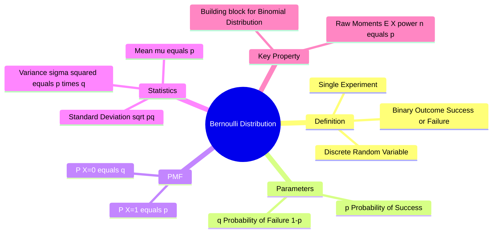

---
tags:
  - mathematics
  - probability
  - statistics
  - discrete-distribution
  - gate
aliases:
  - Bernoulli Trial
  - Bernoulli Process
subject: "[[Mathematics]]"
parent:
  - Probability Distributions
confidence: 10
---
###### Mind Map

---
### Bernoulli Distribution
#probability/distributions #discrete-distribution

> The **Bernoulli Distribution** is the simplest discrete probability distribution. It represents the probability of a **single trial** (Bernoulli Trial) with exactly two possible outcomes: **Success** ($1$) and **Failure** ($0$). It serves as the fundamental building block for the [[Binomial Distribution|Binomial]] and [[Geometric distribution|Geometric distributions]].

#### Probability Mass Function (PMF)
#pmf

Let $X$ be a random variable representing the outcome of a Bernoulli trial.
*   $P(X=1) = p$ (Probability of Success)
*   $P(X=0) = q = 1 - p$ (Probability of Failure)

The PMF can be written compactly as:
$$\boxed{\quad P(X=k) = p^k (1-p)^{1-k} \quad \text{for } k \in \{0, 1\} \quad}$$

---
#### Key Statistics (Moments)
#statistics/moments #gate/high-yield

##### 1. Mean (Expected Value)
$$E[X] = \sum x P(x) = 0 \cdot (1-p) + 1 \cdot p$$
$$\boxed{\quad \mu = E[X] = p \quad}$$

##### 2. Variance
First, calculate $E[X^2]$. Since $0^2=0$ and $1^2=1$, $E[X^2] = 0^2(q) + 1^2(p) = p$.
$$\text{Var}(X) = E[X^2] - (E[X])^2 = p - p^2 = p(1-p)$$
$$\boxed{\quad \sigma^2 = pq = p(1-p) \quad}$$

##### 3. Standard Deviation
$$\boxed{\quad \sigma = \sqrt{pq} \quad}$$

> [!warning] Important Property
> For a Bernoulli variable, all raw moments are equal to $p$.
> $$\boxed{\quad E[X^n] = p \quad \text{for all } n \ge 1 \quad}$$
> (Because $1$ raised to any power is still $1$).

---
#### Relation to Other Distributions
#probability/relationships

1.  **[[Binomial Distribution]]:**
    If you perform $n$ independent Bernoulli trials and sum the results, the resulting random variable follows a Binomial Distribution $B(n, p)$.
    *   Bernoulli is simply **Binomial with $n=1$**.
2.  **Discrete Uniform:**
    If $p = 0.5$ (a fair coin), the Bernoulli distribution becomes a special case of the Discrete Uniform distribution over $\{0, 1\}$.

---
#### Maximum Variance
#bernoulli/maximum-variance

The variance of a Bernoulli distribution ($\text{Var} = p - p^2$) is maximized when the outcome is most uncertain.
Differentiating with respect to $p$:
$$\frac{d}{dp}(p - p^2) = 1 - 2p = 0 \implies p = 0.5$$
*   **Max Variance:** $0.25$ (at $p=0.5$).
*   **Min Variance:** $0$ (at $p=0$ or $p=1$, deterministic).

---
### Related Concepts
#topic/related-concepts

> [[Binomial Distribution]] (The sum of n Bernoulli trials)

[[Geometric Distribution]] (Trials until first success)
[[Probability Mass Function (PMF)]]
[[Discrete Uniform Distribution]]
[[Expected Value]]
[[Mean, Median, Mode]]
[[Standard Deviation and Variance]]
