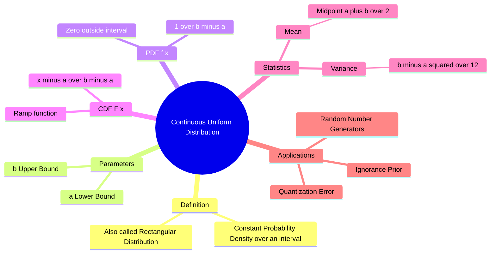

---
tags:
  - mathematics
  - probability
  - statistics
  - continuous-distribution
  - gate
aliases:
  - Rectangular Distribution
  - Uniform Distribution (Continuous)
  - U(a,b)
subject: "[[Mathematics]]"
parent:
  - Probability Distributions
confidence: 10
---
###### Mind Map

---
### Continuous Uniform Distribution
#probability/distributions #continuous-distribution

> The **Continuous Uniform Distribution**, often called the **Rectangular Distribution**, describes a continuous random variable where all intervals of the same length within the support $[a, b]$ are equally probable. It represents a state of "maximum ignorance" about the location of a value within a defined range.

#### Probability Density Function (PDF)
#pdf #rectangular-distribution

Let $X$ be a random variable uniformly distributed over the interval $[a, b]$. The PDF is constant over this interval. Since the total area under the PDF must be 1, the height of the rectangle is $\frac{1}{b-a}$.

$$\boxed{\quad f_X(x) = \begin{cases} \frac{1}{b-a} & a \le x \le b \\ 0 & \text{otherwise} \end{cases} \quad}$$

*   **Notation:** $X \sim U(a, b)$ or $X \sim \text{Unif}(a, b)$.
*   **Standard Uniform Distribution:** If $a=0$ and $b=1$, then $f(x) = 1$ for $0 \le x \le 1$.

---
#### Cumulative Distribution Function (CDF)
#cdf

The CDF is the integral of the PDF. Geometrically, it forms a **ramp** function.

$$F_X(x) = P(X \le x) = \int_{-\infty}^{x} f(t) dt$$

$$\boxed{\quad F_X(x) = \begin{cases} 0 & x < a \\ \frac{x - a}{b - a} & a \le x \le b \\ 1 & x > b \end{cases} \quad}$$

*   **Calculation Tip:** The probability of $X$ falling in a sub-interval $[c, d]$ (where $a \le c < d \le b$) is simply the ratio of lengths:
    $$P(c < X < d) = \frac{d - c}{b - a}$$

---
#### Key Statistics (Moments)
#statistics/moments #gate/high-yield

**1. Mean (Expected Value):**
Since the distribution is symmetric, the mean is simply the midpoint of the interval.
$$E[X] = \int_a^b x \cdot \frac{1}{b-a} dx = \frac{1}{b-a} \left[ \frac{x^2}{2} \right]_a^b = \frac{b^2 - a^2}{2(b-a)} = \frac{(b-a)(b+a)}{2(b-a)}$$
$$\boxed{\quad \mu = \frac{a + b}{2} \quad}$$

**2. Variance:**
This formula is extremely important for **Signal Processing** (Quantization Noise) and GATE.
$$E[X^2] = \int_a^b x^2 \frac{1}{b-a} dx = \frac{b^3 - a^3}{3(b-a)} = \frac{a^2 + ab + b^2}{3}$$
$$\text{Var}(X) = E[X^2] - (E[X])^2 = \frac{a^2 + ab + b^2}{3} - \left(\frac{a+b}{2}\right)^2$$
After simplification:
$$\boxed{\quad \sigma^2 = \frac{(b - a)^2}{12} \quad}$$

**3. Moment Generating Function (MGF):**
$$M_X(t) = E[e^{tX}] = \frac{e^{tb} - e^{ta}}{t(b-a)} \quad (t \neq 0)$$

---
#### Engineering Application: Quantization Error

In Digital Signal Processing (Analog-to-Digital Converters), the **Quantization Error** (rounding error) is modeled as a uniform random variable.
*   If the step size is $\Delta$ (Least Significant Bit), the error is uniform in $[-\Delta/2, +\Delta/2]$.
*   Width of interval: $b - a = \Delta$.
*   **Mean Error:** $0$.
*   **Quantization Noise Power (Variance):** $\frac{\Delta^2}{12}$.

---
#### Comparison: Discrete vs. Continuous Variance
A common point of confusion:
*   **Discrete** Uniform ($n$ points): $\sigma^2 = \frac{n^2 - 1}{12}$.
*   **Continuous** Uniform (width $w$): $\sigma^2 = \frac{w^2}{12}$.

---
### Related Concepts
#topic/related-concepts

> [[Discrete Uniform Distribution]] (Discrete analogue)

[[Probability Density Function (PDF)]]
[[Cumulative Distribution Function (CDF)]]
[[Mean and Variance]]
[[Expected Value]]
[[Pulse Code Modulation (PCM)]] (Application of Uniform distribution logic in Quantization)