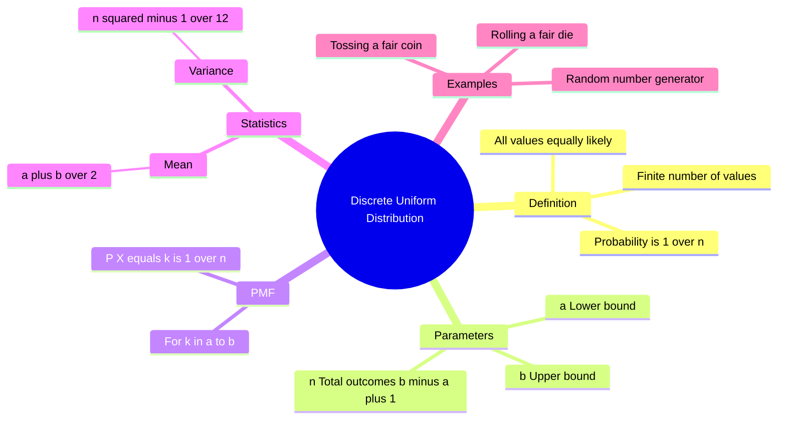

---
tags:
  - mathematics
  - probability
  - statistics
  - discrete-distribution
  - gate
aliases:
  - Uniform Distribution (Discrete)
  - Rectangular Distribution (Discrete)
subject: "[[Mathematics]]"
parent:
  - Probability Distributions
confidence: 10
---
###### Mind Map

---
### Discrete Uniform Distribution
#probability/distributions #discrete-distribution

> The **Discrete Uniform Distribution** is the simplest discrete probability distribution where a finite number of values are **equally likely** to be observed. It represents a process where every outcome has the same probability of occurrence (e.g., "pure chance").

#### Probability Mass Function (PMF)
#pmf #uniform

Let the random variable $X$ assume $n$ discrete values $\{x_1, x_2, \dots, x_n\}$ with equal probability.
Usually, these values are consecutive integers from $a$ to $b$.
The total number of outcomes is $n = b - a + 1$.

The PMF is given by:
$$\boxed{\quad P(X = k) = \frac{1}{n} \quad \text{for } k = a, a+1, \dots, b \quad}$$
*   For any value outside the range $[a, b]$, $P(X=k) = 0$.

---
#### Cumulative Distribution Function (CDF)
#cdf

The CDF is a step function that increases linearly at each integer step.
$$F(k) = P(X \le k) = \sum_{i=a}^{k} \frac{1}{n} = \frac{k - a + 1}{n}$$

---
#### Key Statistics (Moments)
#statistics/moments #gate/high-yield

For a discrete uniform distribution on consecutive integers from $a$ to $b$ (where $n = b - a + 1$):

**1. Mean (Expected Value):**
The mean is simply the midpoint of the range.
$$\boxed{\quad E[X] = \mu = \frac{a + b}{2} \quad}$$

**2. Variance:**
The variance formula is specific and often tested in GATE because it looks similar to, but distinct from, the continuous case.
$$\boxed{\quad \text{Var}(X) = \sigma^2 = \frac{n^2 - 1}{12} \quad}$$
or written in terms of endpoints:
$$\text{Var}(X) = \frac{(b - a + 1)^2 - 1}{12}$$

*   *Derivation Note:* This comes from the sum of squares of the first $n$ integers: $\sum k^2 = \frac{n(n+1)(2n+1)}{6}$.

---
#### Classic Example: Rolling a Die

Consider a standard fair 6-sided die.
*   $a = 1, b = 6$.
*   Total outcomes $n = 6 - 1 + 1 = 6$.
*   **PMF:** $P(X=k) = 1/6$ for $k \in \{1, \dots, 6\}$.
*   **Mean:** $\mu = \frac{1+6}{2} = 3.5$.
*   **Variance:** $\sigma^2 = \frac{6^2 - 1}{12} = \frac{35}{12} \approx 2.916$.

---
#### Continuous vs. Discrete Uniform
#comparison

| Feature | Discrete Uniform $U(a, b)$ | Continuous Uniform $U(a, b)$ |
| :--- | :--- | :--- |
| **Domain** | Integers $a, \dots, b$ | Real numbers interval $[a, b]$ |
| **Probability** | $1/n$ (mass at points) | $1/(b-a)$ (density over interval) |
| **Mean** | $(a+b)/2$ | $(a+b)/2$ |
| **Variance** | $\frac{(b-a+1)^2 - 1}{12}$ | $\frac{(b-a)^2}{12}$ |

---
### Related Concepts
#topic/related-concepts

> [[Continuous Uniform Distribution]] (The continuous analogue)

[[Probability Mass Function (PMF)]]
[[Expected Value]]
[[Mean, Median, Mode]]
[[Standard Deviation and Variance|Variance]]
[[Bernoulli Distribution]] (Special case of Uniform if outcomes are 0 and 1 with p=0.5)
[[Random Variables]]

