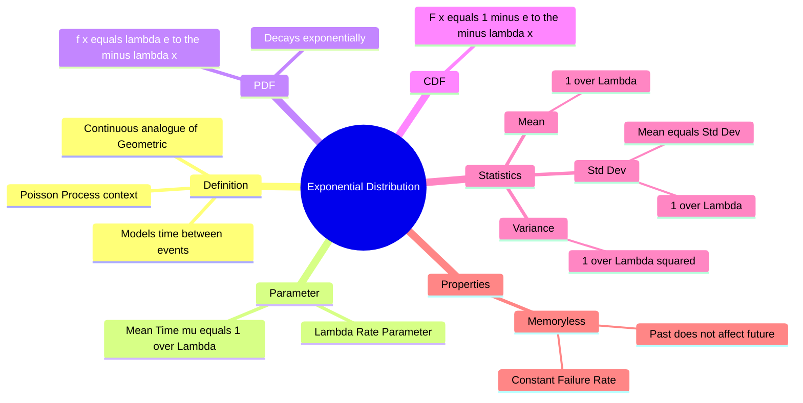

---
tags:
  - mathematics
  - probability
  - statistics
  - continuous-distribution
  - gate
aliases:
  - Negative Exponential Distribution
  - Waiting Time Distribution (Continuous)
subject: "[[Mathematics]]"
parent: Probability Distributions
---
### Exponential Distribution
#probability/distributions #continuous-distribution

> The **Exponential Distribution** is a continuous probability distribution that describes the time between events in a Poisson point process, i.e., a process in which events occur continuously and independently at a constant average rate. It is widely used in reliability engineering, queuing theory, and physics.

###### Mind Map

---

#### Probability Density Function (PDF)
#pdf #exponential

Let $X$ be a random variable representing the time until the next event (or lifetime of a component).
Let $\lambda$ be the **rate parameter** (number of events per unit time, $\lambda > 0$).

The PDF is given by:
$$\boxed{\quad f_X(x) = \begin{cases} \lambda e^{-\lambda x} & x \ge 0 \\ 0 & x < 0 \end{cases} \quad}$$

*   **Shape:** The curve starts at $\lambda$ at $x=0$ and decays asymptotically to zero as $x \to \infty$. It is highly skewed to the right.

---
#### Cumulative Distribution Function (CDF)
#cdf

The probability that the event occurs *before* or at time $x$ is:
$$F_X(x) = P(X \le x) = \int_{0}^{x} \lambda e^{-\lambda t} dt$$

$$\boxed{\quad F_X(x) = 1 - e^{-\lambda x} \quad \text{for } x \ge 0 \quad}$$

**Survival Function (Reliability):**
The probability that the event occurs *after* time $x$ (or the component survives past time $x$):
$$\boxed{\quad P(X > x) = 1 - F_X(x) = e^{-\lambda x} \quad}$$

---
#### Key Statistics (Moments)
#statistics/moments #gate/high-yield

**1. Mean (Expected Value):**
The mean is the inverse of the rate parameter.
$$\mu = E[X] = \int_{0}^{\infty} x \lambda e^{-\lambda x} dx$$
$$\boxed{\quad \mu = \frac{1}{\lambda} \quad}$$
*   *Interpretation:* If events occur at a rate of $\lambda = 2$ per hour, the average waiting time is $1/2$ hour.

**2. Variance:**
$$\boxed{\quad \text{Var}(X) = \frac{1}{\lambda^2} \quad}$$

**3. Standard Deviation:**
$$\boxed{\quad \sigma = \frac{1}{\lambda} \quad}$$

> **Unique Property:** For the Exponential Distribution, the **Mean is equal to the Standard Deviation** ($\mu = \sigma$). This is a quick test to identify exponential data.

---
#### The Memoryless Property
#probability/memoryless

The Exponential distribution is the **only continuous distribution** that possesses the memoryless property (analogous to the discrete Geometric distribution).
$$P(X > s + t \mid X > s) = P(X > t)$$

*   **Interpretation:** The probability that a component lasts for an additional $t$ seconds, given that it has already survived $s$ seconds, is the same as the probability that a brand-new component lasts $t$ seconds.
*   **Implication:** The component does not "age" or suffer from wear-and-tear. It has a **Constant Failure Rate**.

---
#### Relation to Poisson Process
#probability/relationships

There is a fundamental duality between the Poisson and Exponential distributions:
*   **Poisson Distribution:** Models the **number of events** ($N$) in a fixed time interval $t$ (Parameter: rate $\lambda$).
*   **Exponential Distribution:** Models the **time interval** ($T$) between consecutive events.

If the number of events follows a Poisson process with rate $\lambda$, the inter-arrival times are independent and exponentially distributed with rate $\lambda$.

---
#### GATE Problem Solving Tips
1.  **Identify Parameter:** Be careful distinguishing between the **Rate** ($\lambda$) and the **Mean** ($\mu$ or $\theta$).
    *   If question says "Mean life is 100 hours" $\rightarrow \lambda = 1/100 = 0.01$.
    *   If question says "Failures occur at 5 per hour" $\rightarrow \lambda = 5$.
2.  **Probability Calculation:**
    *   "Probability it fails within 5 hours": $1 - e^{-5\lambda}$.
    *   "Probability it lasts more than 5 hours": $e^{-5\lambda}$.
    *   "Probability it lasts between 5 and 10 hours": $P(5 < X < 10) = e^{-5\lambda} - e^{-10\lambda}$.

---
### Related Concepts
#topic/related-concepts

> [[Geometric Distribution]] (The discrete analogue)

[[Poisson Distribution]] (Describes the count of events for which Exponential describes the time)
[[Probability Density Function (PDF)]]
[[Cumulative Distribution Function (CDF)]]
[[Reliability Engineering]] (Exponential is the baseline model for reliability)
[[Gamma Distribution]] (Generalization: Sum of $n$ independent exponential variables)
