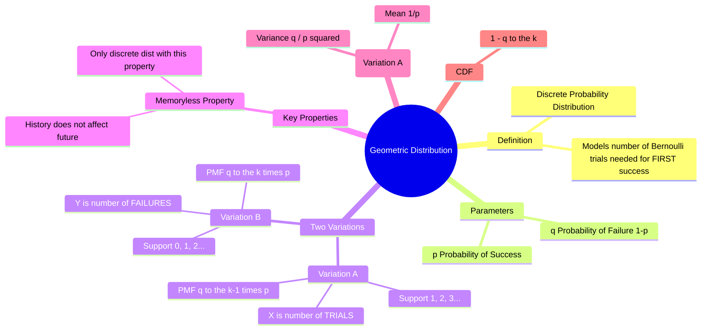

---
tags:
  - mathematics
  - probability
  - statistics
  - discrete-distribution
  - gate
created: 2026-07-13
aliases:
  - Waiting Time Distribution
  - Shifted Geometric Distribution
  - "Example : Geometric Distribution"
subject: "[[Mathematics]]"
parent:
  - Probability Distributions
---
### Geometric Distribution
#probability/distributions #discrete-distribution

> The **Geometric Distribution** models the number of independent [[Bernoulli Distribution|Bernoulli trials]] required to achieve the **first success**. It is the discrete analogue of the [[Exponential Distribution]] and represents the "waiting time" for an event to occur in a discrete process.

###### Mind Map

---

#### Definitions and PMF
#geometric-distribution/pmf

There are two common conventions for the Geometric Distribution. In GATE, the question context usually clarifies which to use (typically "number of trials").

Let:
*   $p$ = Probability of success in a single trial.
*   $q = 1-p$ = Probability of failure.

**Convention A: $X$ = Number of trials to get the first success**
(Support: $k \in \{1, 2, 3, \dots\}$)
This counts the success itself. The sequence is $F, F, \dots, F, S$.
$$\boxed{\quad P(X = k) = q^{k-1}p = (1-p)^{k-1}p \quad}$$

**Convention B: $Y$ = Number of failures *before* the first success**
(Support: $k \in \{0, 1, 2, \dots\}$)
This excludes the success trial.
$$\boxed{\quad P(Y = k) = q^{k}p = (1-p)^{k}p \quad}$$

---
#### Cumulative Distribution Function (CDF)
#geometric-distribution/cdf

For Convention A ($X =$ trials), the probability that the first success occurs on or before the $k$-th trial is:
$$\boxed{\quad P(X \le k) = 1 - q^k \quad}$$
*   This implies $P(X > k) = q^k$ (Probability that the first $k$ trials are all failures).

---
#### Key Statistics (Moments)
#geometric-distribution/moments

These formulas are high-yield for GATE. (Focusing on Convention A: Trials).

| Statistic                 | Formula (Trials $X$)                                                    | Formula (Failures $Y$)                 |
| :------------------------ | :---------------------------------------------------------------------- | :------------------------------------- |
| **Mean (Expected Value)** | $$\boxed{\quad E[X] = \frac{1}{p} \quad}$$                              | $$E[Y] = \frac{1-p}{p} = \frac{q}{p}$$ |
| **Variance**              | $$\boxed{\quad \text{Var}(X) = \frac{1-p}{p^2} = \frac{q}{p^2} \quad}$$ | $$\text{Var}(Y) = \frac{q}{p^2}$$      |
| **Mode**                  | $$1$$                                                                   | $$0$$                                  |

> [!success] Intuition for Mean
> If the probability of success is $p = 1/5$ (0.2), you generally expect to wait 5 trials ($1/0.2$) to see a success.

---
#### The Memoryless Property
#probability/memoryless

The Geometric Distribution is the **only discrete distribution** that possesses the Memoryless Property.
Given that the first success has not occurred by trial $m$, the probability that we wait an *additional* $n$ trials is the same as the probability of waiting $n$ trials from the start.

$$\boxed{\quad P(X > m + n \mid X > m) = P(X > n) \quad}$$

*   **Interpretation:** "The coin has no memory." If you have flipped 10 tails in a row, the probability that the *next* flip is a head is still just $p$. The previous failures do not make a success "due".

---
#### Example Problem
**Problem:** A basketball player makes a free throw with probability $p = 0.4$. What is the probability that their first basket occurs on the 4th shot?
**Solution:**
Here $X$ is the number of trials. $k=4$.
$p = 0.4$, $q = 0.6$.
$$P(X=4) = q^{4-1}p = (0.6)^3 (0.4) = (0.216)(0.4) = 0.0864$$

---
### Related Concepts
#topic/related-concepts

> [[Binomial Distribution]] (Fixed number of trials, counting successes)

[[Bernoulli Distribution]] (Single trial)
[[Poisson Distribution]] (Limiting case for rare events)
[[Exponential Distribution]] (Continuous analogue of Geometric, also memoryless)
[[Negative Binomial Distribution]] (Generalization: Waiting for the $r$-th success)
[[Geometric Series and its derivatives]]
