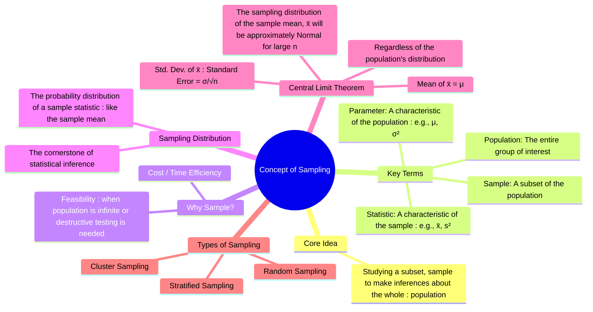

---
tags:
  - statistics
  - sampling-theory
  - estimation
  - inference
  - engineering-math
created: 2025-09-15
aliases:
  - Sampling
  - Statistical Sampling
subject: "[[Mathematics]]"
parent:
  - Probability and Statistics
---
### Concept of Sampling
#sampling-theory #statistical-inference #central-limit-theorem

> **Sampling** is the fundamental statistical process of selecting a subset of individuals or data points (a **sample**) from a larger group (the **population**) to draw conclusions about the characteristics of the entire population. It is the bridge between probability theory and practical statistics, allowing us to make reasoned inferences about a whole group without having to measure every single member of it.

---

#### Key Terminology

* **Population**: The complete set of all items or individuals that you are interested in studying.
* **Sample**: A subset of the population from which data is actually collected.
* **Parameter**: A numerical characteristic of the **population**. These are typically unknown and what we want to estimate.
    * Examples: Population Mean ($\mu$), Population Variance ($\sigma^2$).
* **Statistic**: A numerical characteristic of the **sample**. This is calculated from the sample data and is used to estimate the population parameter.
    * Examples: Sample Mean ($\bar{x}$), Sample Variance ($s^2$).

**The Goal**: To use the known sample statistic to make an educated guess or inference about the unknown population parameter.

---
#### Sampling Distribution
#sampling-distribution #standard-error

This is the most crucial concept in sampling theory.
> The **sampling distribution** of a statistic is the probability distribution of that statistic, obtained by considering all possible samples of a given size ($n$) from the population.

For example, imagine taking every possible sample of size 30 from a large population, calculating the mean ($\bar{x}$) for each sample, and then making a histogram of all those means. That histogram would approximate the **sampling distribution of the sample mean**.

---
#### The Central Limit Theorem (CLT)
#central-limit-theorem

The [[Central Limit Theorem]] is the magical result that makes sampling so powerful. It describes the shape, center, and spread of the sampling distribution of the sample mean.

> **Theorem**: For a population with a mean $\mu$ and a finite variance $\sigma^2$, the sampling distribution of the sample mean ($\bar{x}$) will be **approximately Normal** for a sufficiently large sample size ($n$, typically $n \ge 30$), regardless of the shape of the original population distribution.

Furthermore, the CLT gives us the parameters of this Normal distribution:
1.  **Mean of the Sample Means**: The mean of the sampling distribution is equal to the population mean.
    $$\boxed{\quad \mu_{\bar{x}} = \mu \quad}$$
2.  **Standard Deviation of the Sample Means (Standard Error)**: The standard deviation of the sampling distribution is the population standard deviation divided by the square root of the sample size. This is called the **Standard Error of the Mean (SEM)**.
    $$\boxed{\quad \sigma_{\bar{x}} = \frac{\sigma}{\sqrt{n}} \quad}$$

**Implication**: The CLT allows us to use the properties of the [[Probability Distributions - Normal (Gaussian) Distribution|Normal distribution]] to make probability statements about the sample mean, which is the basis for constructing confidence intervals and performing hypothesis tests. The standard error formula also shows that as our sample size ($n$) increases, the sample means will cluster more tightly around the true population mean, making our estimate more precise.

---
#### Applications

* **Quality Control**: Instead of testing every product coming off an assembly line (which might be destructive or too costly), a sample is tested to infer the quality of the entire batch.
* **Surveys and Polling**: A sample of the population is surveyed to estimate the opinions or characteristics of the entire population.
* **Signal Processing**: A continuous signal is sampled at discrete time intervals to represent and process it digitally.

---
### Related Concepts
#statistics/related-concepts

> [[Central Limit Theorem]]

[[Confidence Intervals]]
[[Hypothesis Testing]]
[[Normal Distribution]]
[[Mean, Median, Mode]]
[[Standard Deviation and Variance]]
