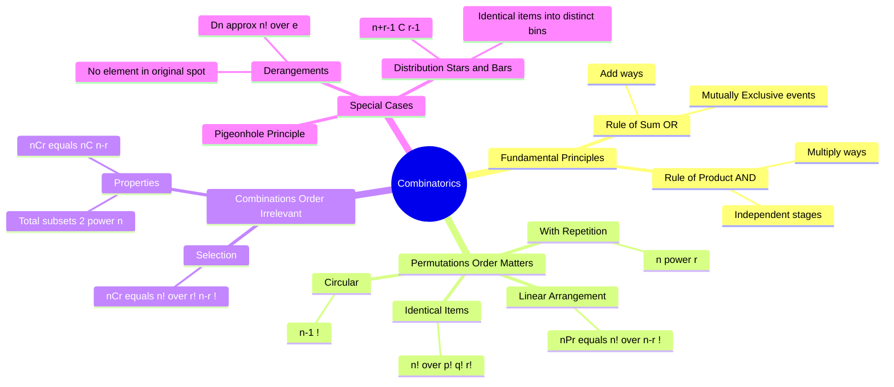

---
tags:
  - mathematics
  - probability
  - discrete-math
  - gate
  - combinatorics
aliases:
  - Permutations and Combinations
  - Counting Principles
  - P and C
subject: "[[Mathematics]]"
parent:
  - Probability and Statistics
confidence: 10
---

---
### Combinatorics (Permutations & Combinations)
#mathematics/combinatorics #discrete-math

> **Combinatorics** is the branch of mathematics dealing with counting, arrangement, and combination of objects. It forms the backbone of **Classical Probability**. The key is determining whether **Order Matters** (Permutation) or **Order Does Not Matter** (Combination).

#### Fundamental Principles of Counting
#combinatorics/principles

**A. Rule of Product (The Multiplication Principle - "AND"):**
If a task can be broken into a sequence of $k$ independent stages, where stage 1 can be done in $n_1$ ways, stage 2 in $n_2$ ways, etc., then the total number of ways to complete the task is:
$$\boxed{\quad N = n_1 \times n_2 \times \dots \times n_k \quad}$$
*   *Keyword:* **AND** (Event A occurs AND Event B occurs).

**B. Rule of Sum (The Addition Principle - "OR"):**
If a task can be done in $n_1$ ways by method A, or in $n_2$ ways by method B, and the methods are **mutually exclusive** (cannot happen simultaneously), the total ways are:
$$\boxed{\quad N = n_1 + n_2 \quad}$$
*   *Keyword:* **OR** (Event A occurs OR Event B occurs).

---
#### Permutations (Arrangement - Order Matters)
#combinatorics/permutations

An ordered arrangement of $r$ objects taken from a set of $n$ distinct objects.

**A. Linear Permutation (No Repetition):**
$$\boxed{\quad ^nP_r = P(n, r) = \frac{n!}{(n-r)!} \quad}$$
*   Arranging $n$ objects in $n$ places: $^nP_n = n!$.

**B. Permutation with Repetition Allowed:**
Arranging $r$ objects from $n$, where each object can be chosen multiple times:
$$\boxed{\quad N = n^r \quad}$$

**C. Permutations with Identical Objects (Multiset):**
The number of permutations of $n$ objects where $p$ are of one kind, $q$ of another kind, and $r$ of a third kind:
$$\boxed{\quad N = \frac{n!}{p! q! r!} \quad}$$
*   *Example:* Arranging letters of "MISSISSIPPI" ($M=1, I=4, S=4, P=2$). $N = \frac{11!}{1!4!4!2!}$.

**D. Circular Permutations:**
Arranging $n$ distinct objects around a circle. Since rotations are considered identical, we fix one position.
$$\boxed{\quad N = (n-1)! \quad}$$
*   **Necklace/Garland Case:** If clockwise and anti-clockwise arrangements are indistinguishable (can flip the necklace), $N = \frac{(n-1)!}{2}$.

---
#### Combinations (Selection - Order Doesn't Matter)
#combinatorics/combinations

An unordered selection of $r$ objects taken from a set of $n$ distinct objects.

**Formula:**
$$\boxed{\quad ^nC_r = C(n, r) = \binom{n}{r} = \frac{n!}{r!(n-r)!} \quad}$$

**Relationship:** $^nP_r = ^nC_r \times r!$ (Select then Arrange).

**Important Properties:**
1.  **Symmetry:** $\boxed{^nC_r = ^nC_{n-r}}$
2.  **Pascal's Identity:** $^nC_r + ^nC_{r-1} = ^{n+1}C_r$
3.  **Sum of Coefficients:** $\sum_{r=0}^n {^nC_r} = 2^n$ (Total number of subsets of a set with $n$ elements).
4.  **Handshake Problem:** Number of handshakes among $n$ people: $^nC_2 = \frac{n(n-1)}{2}$.

---
#### Distribution Problems (Grouping)
#combinatorics/distribution

**A. Distinct Objects into Distinct Boxes:**
Number of ways to distribute $n$ distinct items into $k$ distinct boxes (any box can hold any number):
$$\boxed{\quad N = k^n \quad}$$

**B. Identical Objects into Distinct Boxes (Stars and Bars):**
Number of non-negative integer solutions to $x_1 + x_2 + \dots + x_k = n$ (distributing $n$ identical items into $k$ distinct bins):
$$\boxed{\quad N = ^{n+k-1}C_{k-1} \quad}$$
*   *Positive Solutions:* If each box must have at least one item: $^{n-1}C_{k-1}$.

---
#### Derangements
#combinatorics/derangements

A permutation of elements where **no** element appears in its original position.
Notation: $D_n$ or $!n$.

$$\boxed{\quad D_n = n! \left( 1 - \frac{1}{1!} + \frac{1}{2!} - \frac{1}{3!} + \dots + (-1)^n \frac{1}{n!} \right) \quad}$$

**Common Values:**
*   $D_1 = 0$
*   $D_2 = 1$
*   $D_3 = 2$
*   $D_4 = 9$
*   $D_5 = 44$

---
#### Pigeonhole Principle
#combinatorics/pigeonhole

If $n+1$ pigeons occupy $n$ holes, then at least one hole must contain 2 or more pigeons.
**Generalized:** If $N$ objects are placed into $k$ boxes, then at least one box contains $\lceil N/k \rceil$ objects.

---
### Related Concepts
#topic/related-concepts

> [[Axioms of Probability|Probability Axioms]] (Calculated as Favorable Outcomes / Total Outcomes)

[[Binomial Distribution]] (Based on Bernoulli trials and Combinations)
[[Set Theory]] (Cardinality of Power Sets)
[[Bernoulli Distribution]]
