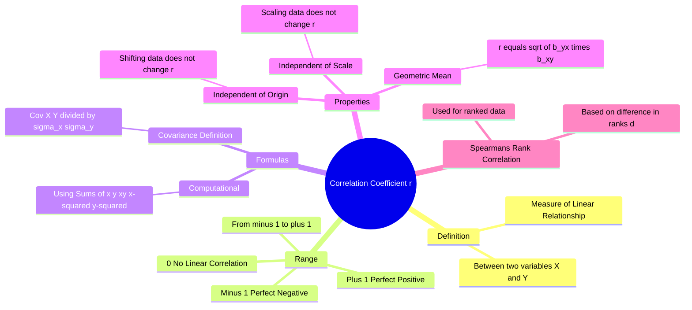

---
tags:
  - mathematics
  - statistics
  - probability
  - gate
  - data-analysis
aliases:
  - Pearson's Correlation Coefficient
  - Karl Pearson's Coefficient
  - r value
subject: "[[Mathematics]]"
parent: "Probability and Statistics"
confidence: 10
---

---
### Correlation Coefficient ($r$)
#statistics/correlation #data-analysis

> The **Correlation Coefficient** (specifically **Karl Pearson's** coefficient) is a statistical measure that calculates the strength and direction of the linear relationship between two variables. It quantifies how much one variable changes when the other changes.

#### 1. Mathematical Definition
#correlation/formula

The population correlation coefficient is denoted by $\rho$, and the sample coefficient by $r$.
Defined as the ratio of the covariance to the product of standard deviations:

$$\boxed{\quad r = \frac{\text{Cov}(X, Y)}{\sigma_X \sigma_Y} \quad}$$

Where:
*   $\text{Cov}(X, Y) = \frac{1}{n}\sum(x_i - \bar{x})(y_i - \bar{y}) = E[XY] - E[X]E[Y]$
*   $\sigma_X = \sqrt{\frac{1}{n}\sum(x_i - \bar{x})^2}$
*   $\sigma_Y = \sqrt{\frac{1}{n}\sum(y_i - \bar{y})^2}$

#### 2. Computational Formula (For Problem Solving)
#gate/formula

When calculating $r$ from raw data tables in GATE, use this expanded form to avoid rounding errors associated with calculating means first:

$$\boxed{\quad r = \frac{n \sum xy - (\sum x)(\sum y)}{\sqrt{[n \sum x^2 - (\sum x)^2][n \sum y^2 - (\sum y)^2]}} \quad}$$

#### 3. Properties of Correlation Coefficient
#correlation/properties

1.  **Range:** The value of $r$ always lies between -1 and +1.
    $$\boxed{\quad -1 \le r \le +1 \quad}$$
2.  **Independence of Origin and Scale:**
    If we transform variables $x$ and $y$ to $u$ and $v$ such that:
    $$u = \frac{x - a}{h}, \qquad v = \frac{y - b}{k}$$
    Then:
    $$\boxed{\quad r_{xy} = r_{uv} \quad}$$
    *(Note: This holds provided $h$ and $k$ have the same sign. If signs differ, $r_{xy} = -r_{uv}$).* This property makes calculation easier by allowing data simplification.
3.  **Relation to Regression:**
    $r$ is the **Geometric Mean** of the two regression coefficients ($b_{yx}$ and $b_{xy}$).
    $$\boxed{\quad r = \pm \sqrt{b_{yx} \cdot b_{xy}} \quad}$$
    *(The sign of $r$ is the common sign of the regression coefficients).*
4.  **Symmetry:** $r_{xy} = r_{yx}$.

#### 4. Interpretation of Values
#correlation/interpretation

*   **$r = +1$:** Perfect Positive Correlation. Points lie exactly on a line with positive slope.
*   **$r = -1$:** Perfect Negative Correlation. Points lie exactly on a line with negative slope.
*   **$r = 0$:** **No Linear Correlation**. Variables are uncorrelated linearly.
    *   *Warning:* $r=0$ does **not** imply independence. The variables could have a strong non-linear relationship (e.g., $Y = X^2$ over a symmetric interval might yield $r=0$).
*   **$0 < |r| < 1$:** The closer $|r|$ is to 1, the stronger the linear relationship.

#### 5. Spearman's Rank Correlation ($r_s$)
#correlation/rank

If data is given as **Ranks** rather than values, or if the data is qualitative, use Spearman's formula:

$$\boxed{\quad r_s = 1 - \frac{6 \sum d_i^2}{n(n^2 - 1)} \quad}$$

Where:
*   $d_i = \text{Rank}(x_i) - \text{Rank}(y_i)$ (Difference in ranks).
*   $n$ = Number of pairs.

---
### Related Concepts
#topic/related-concepts

> [[Linear Regression]] (Uses correlation to derive lines of best fit)

[[Covariance]] (The numerator of the correlation formula)
[[Standard Deviation and Variance|Standard Deviation]] (The denominator components)
[[Independence of Random Variables]] (Independence implies Correlation is 0)
[[Mean, Median, Mode]]
