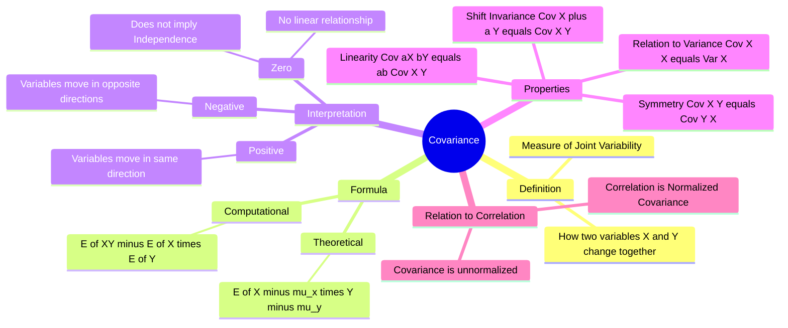

---
tags:
  - mathematics
  - statistics
  - probability
  - gate
  - joint-distribution
aliases:
  - Cov(X,Y)
  - Joint Variability
subject: "[[Mathematics]]"
parent: "Probability and Statistics"
confidence: 10
---

---
### Covariance
#statistics/covariance #joint-probability

> **Covariance** is a measure of the joint variability of two random variables. It indicates the direction of the linear relationship between variables. Unlike correlation, covariance is **scale-dependent**, meaning its magnitude depends on the units of the variables.

#### Mathematical Definition
#covariance/formula

For two random variables $X$ and $Y$ with means $\mu_X = E[X]$ and $\mu_Y = E[Y]$, the covariance is defined as:

$$\text{Cov}(X, Y) = E[(X - \mu_X)(Y - \mu_Y)]$$

**Computational Formula (Best for GATE):**
Expanding the expectation yields the most frequently used formula for calculations:
$$\boxed{\quad \text{Cov}(X, Y) = E[XY] - E[X]E[Y] \quad}$$

*   For discrete variables: $E[XY] = \sum \sum x_i y_j P(X=x_i, Y=y_j)$.

---
#### Interpretation of Signs
#covariance/interpretation

*   **Positive Covariance ($\text{Cov} > 0$):** $X$ and $Y$ tend to move in the same direction. (High values of $X$ correspond to high values of $Y$).
*   **Negative Covariance ($\text{Cov} < 0$):** $X$ and $Y$ tend to move in opposite directions. (High values of $X$ correspond to low values of $Y$).
*   **Zero Covariance ($\text{Cov} = 0$):** There is no **linear** relationship between $X$ and $Y$. They are said to be **Uncorrelated**.

> [!warning] Crucial Distinction
> - **Independence $\implies$ Zero Covariance:** If $X$ and $Y$ are independent, $E[XY] = E[X]E[Y]$, so $\text{Cov}(X,Y) = 0$.
> - **Zero Covariance $\centernot\implies$ Independence:** Variables can have zero covariance but still be dependent (e.g., via a non-linear relationship like $Y=X^2$ over a symmetric interval).

---
#### Key Properties
#covariance/properties

These algebraic properties are essential for solving variance/expectation problems in GATE.

1.  **Relation to Variance:**
    $$\text{Cov}(X, X) = \text{Var}(X)$$
2.  **Symmetry:**
    $$\text{Cov}(X, Y) = \text{Cov}(Y, X)$$
3.  **Scale and Shift (Linearity):**
    If $a, b, c, d$ are constants:
    $$\boxed{\quad \text{Cov}(aX + c, bY + d) = ab \cdot \text{Cov}(X, Y) \quad}$$
    *   *Note:* Adding constants ($c, d$) shifts the mean but does not affect variability or covariance. Multiplying by scalars ($a, b$) scales the covariance.
4.  **Distributive Property:**
    $$\text{Cov}(X+Y, Z) = \text{Cov}(X, Z) + \text{Cov}(Y, Z)$$

---
#### Variance of a Sum
#variance/sum

The variance of a linear combination of random variables depends on their covariance.
$$\boxed{\quad \text{Var}(aX + bY) = a^2\text{Var}(X) + b^2\text{Var}(Y) + 2ab \cdot \text{Cov}(X, Y) \quad}$$

*   If $X$ and $Y$ are **Independent** (or uncorrelated), the covariance term vanishes:
    $$\text{Var}(X \pm Y) = \text{Var}(X) + \text{Var}(Y)$$

---
#### Relationship to Correlation Coefficient
#correlation

Covariance gives the *direction* of the relationship but not the *strength*, because it is not normalized (it depends on units). The **Correlation Coefficient ($r$)** is the normalized version:

$$r = \frac{\text{Cov}(X, Y)}{\sigma_X \sigma_Y}$$
Therefore:
$$\boxed{\quad \text{Cov}(X, Y) = r \cdot \sigma_X \cdot \sigma_Y \quad}$$

---
### Related Concepts
#topic/related-concepts

> [[Correlation Coefficient]] (Normalized Covariance)

[[Mean, Median, Mode]]
[[Standard Deviation and Variance]]
[[Independence of Random Variables]]
[[Linear Regression]] (Slope $b_{yx}$ is proportional to Covariance)
[[Matrices]] (Covariance Matrix in multivariate distributions)
[[Expected Value]]
