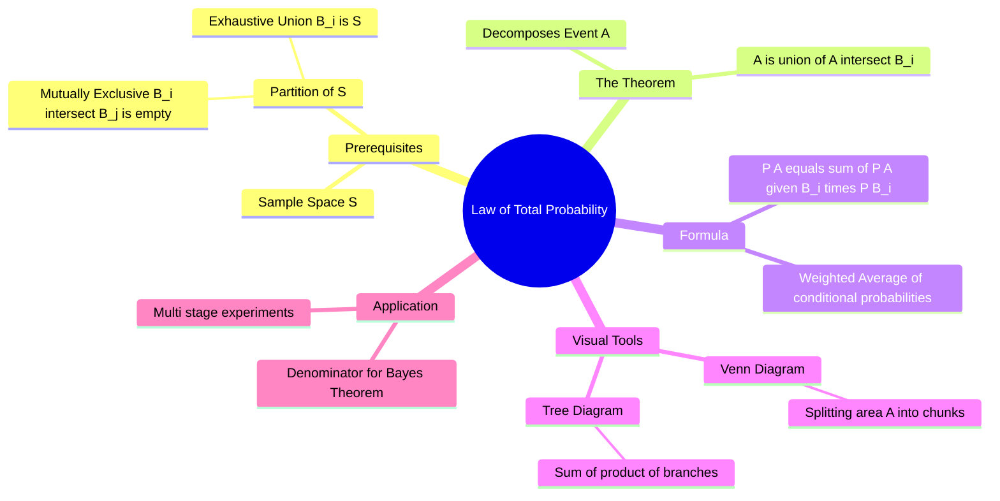

---
tags:
  - mathematics
  - probability
  - statistics
  - gate
  - bayes-theorem
aliases:
  - Total Probability Theorem
  - Partition Rule
subject: "[[Mathematics]]"
parent: Probability and Statistics
confidence: 10
---

---
### Law of Total Probability
#probability/theorems #total-probability

> The **Law of Total Probability** provides a method to calculate the probability of an event $A$ by breaking the sample space into distinct, non-overlapping scenarios (partitions). It expresses the total probability of an outcome which can be realized via several distinct events.

#### The Concept of Partition
#probability/partition

To apply this law, the sample space $S$ must be divided into a set of events $B_1, B_2, \dots, B_n$ that form a **Partition**.
A set of events forms a partition if they are:
1.  **Mutually Exclusive:** No two events can happen at the same time ($B_i \cap B_j = \emptyset$ for $i \neq j$).
2.  **Exhaustive:** One of them *must* happen ($\bigcup_{i=1}^n B_i = S$).

---
#### The Theorem Statement
#probability/formula

If an event $A$ can occur in conjunction with any one of the mutually exclusive and exhaustive events $B_1, B_2, \dots, B_n$, then the probability of $A$ is the sum of the probabilities of $A$ occurring with each $B_i$.

Using the **Multiplication Rule** ($P(A \cap B) = P(A|B)P(B)$), the theorem is stated as:

$$\boxed{\quad P(A) = \sum_{i=1}^{n} P(A \cap B_i) = \sum_{i=1}^{n} P(A | B_i) P(B_i) \quad}$$

**Expansion:**
$$P(A) = P(A|B_1)P(B_1) + P(A|B_2)P(B_2) + \dots + P(A|B_n)P(B_n)$$

---
#### Visual Interpretation (Tree Diagram Method)
#gate/problem-solving

In GATE problems, it is often easiest to visualize this as a **Tree Diagram**.
*   **Stage 1:** Branches represent the partition events $B_1, B_2, \dots$ with probabilities $P(B_i)$.
*   **Stage 2:** Sub-branches represent the event $A$ occurring given the specific path, with probabilities $P(A|B_i)$.

**Calculation:** Multiply probabilities along each branch to get $P(A \cap B_i)$, then **SUM** all the branch results to get $P(A)$.

---

#### Example: Factory Production

**Problem:**
A factory uses three machines $B_1, B_2, B_3$ to produce items.
*   $B_1$ produces 20% of items, Defect rate = 1%.
*   $B_2$ produces 30% of items, Defect rate = 2%.
*   $B_3$ produces 50% of items, Defect rate = 3%.
What is the probability that a randomly selected item is Defective ($A$)?

**Solution:**
1.  **Define Partition ($B_i$):**
    $P(B_1) = 0.2, \quad P(B_2) = 0.3, \quad P(B_3) = 0.5$.
2.  **Define Conditionals ($A|B_i$):**
    $P(A|B_1) = 0.01, \quad P(A|B_2) = 0.02, \quad P(A|B_3) = 0.03$.
3.  **Apply Theorem:**
    $$P(A) = (0.01)(0.2) + (0.02)(0.3) + (0.03)(0.5)$$
    $$P(A) = 0.002 + 0.006 + 0.015 = 0.023$$
    Total Probability of Defect is 2.3%.

---
#### Relationship to Bayes' Theorem

The Law of Total Probability is the **denominator** in Bayes' Theorem.
$$P(B_k | A) = \frac{P(A|B_k)P(B_k)}{\textbf{P(A)}} = \frac{P(A|B_k)P(B_k)}{\sum P(A|B_i)P(B_i)}$$

---
### Related Concepts
#topic/related-concepts

> [[Bayes' Theorem]] (The inverse problem: Finding $P(B|A)$)

[[Conditional Probability]]
[[Multiplication Theorem of Probability]]
[[Mutually Exclusive Events]]
[[Set Theory]] (Partitions)
